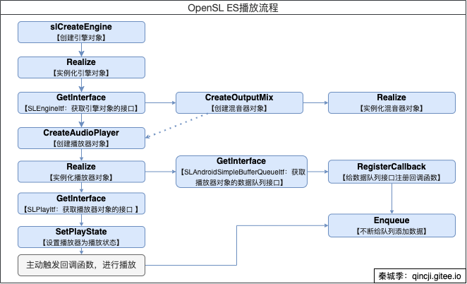

#OpenSL ES播放PCM

## 简述
OpenSL ES全称 Open Sound Library for Embedded Systems，即嵌入式系统的开放音频库。是无授权费、跨平台、硬件加速的C语言音频API，用于2D和3D音频。

## API基本介绍
我们可以从[Android官网](https://developer.android.google.cn/ndk/guides/audio/opensl/opensl-prog-notes?hl=zh_cn)中了解到一些基本的API介绍。

### 对象和接口
- 对象：`SLObjectItf`，理解成只有存储能力的JavaBean，没有调用其他函数（方法）的途径。所有对象的名称使用这个，而创建的对象都需要调用`Realize`进行初始化。
- 接口：`SLEngineItf`，接口是跟每一个`SLObjectItf`进行绑定，可以有多个，拥有调用其他函数（方法）的途径。获取的流程如下：
````text
流程图
                    +----------------------------+
                    |  创建SLObjectItf（实例化过程） |
                    +----------------------------+
                                |
                                V              
                    +----------------------------+
                    |       Realize（初始化过程）   |
                    +----------------------------+ 
                                |
                                V              
                    +-----------------------------+
                    |  获取GetInterface（绑定过程）  |
                    +-----------------------------+
````

### 重要接口
- `SLEngineItf`：OpenSL ES引擎接口，全局唯一。用于创建混音器对象，播放器对象等。
- `SLPlayItf`：播放器接口。用于获取播放状态，设置播放状态等。
- `SLAndroidSimpleBufferQueueItf`：数据队列接口。

## 播放流程


通过上图可知：
- 只有接口拥有调用其他函数的功能；即：`SLEngineItf`调用了`CreateOutputMix`和`CreateAudioPlayer`。
- 一个对象可以生成（绑定）多个接口；即："播放器对象"生成了`SLPlayItf`和`SLAndroidSimpleBufferQueueItf`。

## 代码实现
有个比较关键的点是：OpenEL SE 不支持浮点类型的值，所以需要转换成整形再使用。本文数据来源的形式是通过读取本地Sdcard文件来完成的。如果是想通过网络或则asset目录，请查看[Android官方项目：native-audio](https://github.com/android/ndk-samples/tree/main/native-audio) 。

### 编辑CMakeList.txt进行链接动态库
```cmake
target_link_libraries(
        native-lib
        log android OpenSLES)
```

### 关键流程
```c++
void bqPlayerCallback(SLAndroidSimpleBufferQueueItf bq, void *ctx) {
    (static_cast<AudioPlayer *>(ctx))->ProcessSLCallback(bq);
}


AudioPlayer::AudioPlayer(const char *filename, uint32_t sampleRate, uint8_t channels,
                         uint32_t bitPerChannel) {

    //一帧的大小
    frameSize = sampleRate * channels * bitPerChannel / 8;
    inFile = fopen(filename, "rb+");

    SLresult result;
    //1.1）创建引擎对象。引擎对象是OpenSL ES提供API的唯一入
    result = slCreateEngine(&slEngineObj_, 0, nullptr, 0, NULL, NULL);
    SLASSERT(result);//断言，用于调试，能快速定位问题
    //1.2）实例化引擎对象，需要通过在第1步得到的引擎对象接口来实例化(在ELSE中，任何对象都需要使用接口来进行实例化)
    result = (*slEngineObj_)->Realize(slEngineObj_, SL_BOOLEAN_FALSE);
    SLASSERT(result);
    //1.3）获取这个引擎对象的方法接口，通过GetInterface方法，使用第2步已经实例化好了的对象
    result = (*slEngineObj_)->GetInterface(slEngineObj_, SL_IID_ENGINE, &slEngineItf_);
    SLASSERT(result);

    //2.创建混音器对象
    result = (*slEngineItf_)->CreateOutputMix(slEngineItf_, &outputMixObjectItf_, 0, NULL, NULL);
    SLASSERT(result);
    result = (*outputMixObjectItf_)->Realize(outputMixObjectItf_, SL_BOOLEAN_FALSE);
    SLASSERT(result);

    //3、创建播放器
    // numBuffers：设置2个缓冲数据
    SLDataLocator_AndroidSimpleBufferQueue android_queue = {SL_DATALOCATOR_ANDROIDSIMPLEBUFFERQUEUE,
                                                            2};
    SLDataFormat_PCM pcm = {
            SL_DATAFORMAT_PCM,//播放pcm格式的数据
            channels,//声道数（立体声）
            sampleRate * 1000,//44100hz -> 44100000 的频率；参考：SL_SAMPLINGRATE_44_1
            bitPerChannel == 32 ?
            SL_PCMSAMPLEFORMAT_FIXED_32 : SL_PCMSAMPLEFORMAT_FIXED_16,//位数 32位
            bitPerChannel == 32 ?
            SL_PCMSAMPLEFORMAT_FIXED_32 : SL_PCMSAMPLEFORMAT_FIXED_16,//和位数一致就行
            SL_SPEAKER_FRONT_LEFT | SL_SPEAKER_FRONT_RIGHT,//立体声（前左前右）
            SL_BYTEORDER_LITTLEENDIAN//小端排序
    };
    SLDataSource slDataSource = {&android_queue, &pcm};
    SLDataLocator_OutputMix outputMix = {SL_DATALOCATOR_OUTPUTMIX, outputMixObjectItf_};
    SLDataSink audioSnk = {&outputMix, NULL};
    const SLInterfaceID ids[3] = {SL_IID_BUFFERQUEUE, SL_IID_EFFECTSEND, SL_IID_VOLUME};
    const SLboolean req[3] = {SL_BOOLEAN_TRUE, SL_BOOLEAN_TRUE, SL_BOOLEAN_TRUE};

    result = (*slEngineItf_)->CreateAudioPlayer(slEngineItf_, &playerObjectItf_, &slDataSource,
                                                &audioSnk, 3, ids, req);
    SLASSERT(result);

    result = (*playerObjectItf_)->Realize(playerObjectItf_, SL_BOOLEAN_FALSE);
    SLASSERT(result);
    result = (*playerObjectItf_)->GetInterface(playerObjectItf_, SL_IID_PLAY, &playItf_);
    SLASSERT(result);

    //4、获取播放器对象的数据队列接口
    result = (*playerObjectItf_)
            ->GetInterface(playerObjectItf_, SL_IID_BUFFERQUEUE, &playBufferQueueItf_);
    SLASSERT(result);

    //5. 设置回调函数
    result = (*playBufferQueueItf_)
            ->RegisterCallback(playBufferQueueItf_, bqPlayerCallback, this);
    SLASSERT(result);

    //6. 获取播放状态接口
    result = (*playItf_)->SetPlayState(playItf_, SL_PLAYSTATE_PLAYING);
    SLASSERT(result);

    //7. 主动调用回调函数开始工作
    ProcessSLCallback(playBufferQueueItf_);
}

void AudioPlayer::ProcessSLCallback(SLAndroidSimpleBufferQueueItf bq) {
    void *buffer;
    getPcmData(&buffer);
    if (NULL != buffer) {
        SLresult result;
        result = (*bq)->Enqueue(bq, buffer, frameSize);
        SLASSERT(result);
    }
}

void AudioPlayer::getPcmData(void **pcm) {
    outBuf = new uint32_t[frameSize];
    while (!feof(inFile)) {
        //读取一帧数据
        memset(outBuf, 0, frameSize);
        fread(outBuf, frameSize, 1, inFile);
        if (outBuf == nullptr) {//读取结束
            break;
        }
        *pcm = outBuf;
        goto end;
    }
    __android_log_print(ANDROID_LOG_DEBUG, "audio_play", "red finish?");
    (*playItf_)->SetPlayState(playItf_, SL_PLAYSTATE_STOPPED);
    end:
    __android_log_print(ANDROID_LOG_DEBUG, "audio_play", "playing？");
}
```

- **[Demo地址：OpenSLESDemo](https://github.com/xhunmon/AFPlayer/tree/main/OpenSLESDemo)**


## 参考
- https://en.wikipedia.org/wiki/OpenSL_ES

- https://blog.csdn.net/ywl5320/article/details/78503768

- https://github.com/android/ndk-samples/tree/main/audio-echo