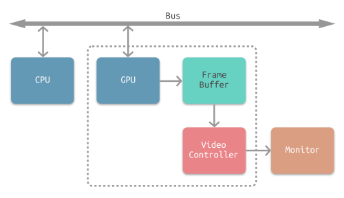
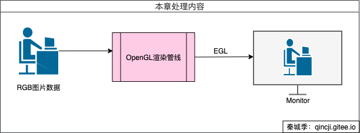
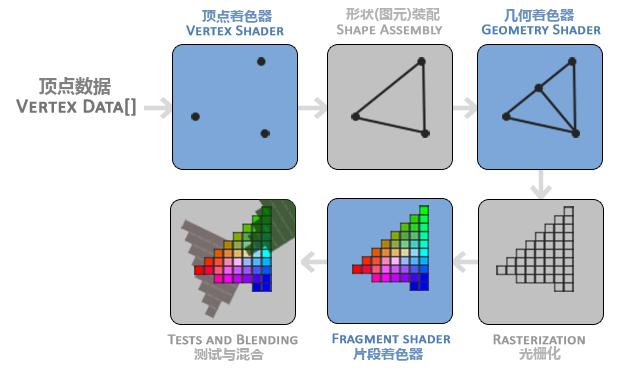
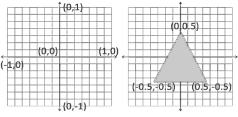
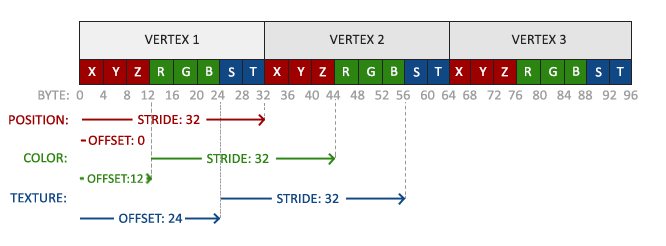
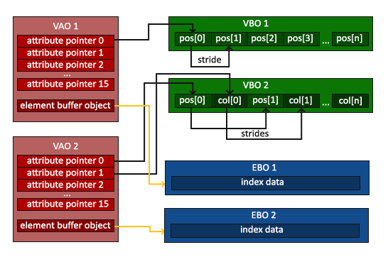
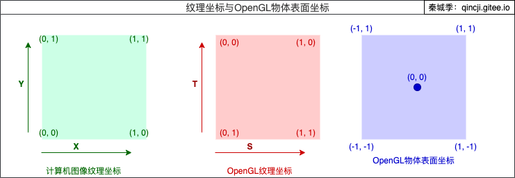
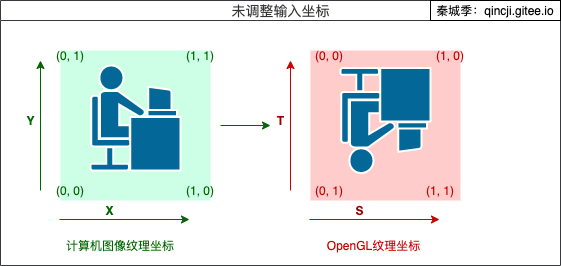

#OpenGL ES播放RGB

## 简述
OpenGL（英语：Open Graphics Library，译名：开放图形库或者“开放式图形库”）是用于渲染2D、3D矢量图形的跨语言、跨平台的应用程序编程接口（API）。而OpenGL ES （OpenGL for Embedded Systems）是三维图形应用程序接口OpenGL的子集，针对手机、PDA和游戏主机等嵌入式设备而设计，如Android 。

## 屏幕图像显示流程
下图所示为常见的 CPU、GPU、显示器工作方式（网上找的）。CPU 计算好显示内容提交至 GPU，GPU 渲染完成后将渲染结果存入帧缓冲区，视频控制器会按照 VSync 信号逐帧读取帧缓冲区的数据，经过数据转换后最终由显示器进行显示。



所以在本节涉及到的内容主要有：
CPU：获取本地数据（图像）并计算好作为GPU的输入数据。
GPU：通过OpengGL ES处理后的数据传递给Monitor进行显示。
Monitor：在Android中需要通过EGL作为桥梁衔接屏幕进行显示（因为OpenGL不负责窗口管理及上下文环境管理，而EGL承担了这一职责）。

## OpengGL相关处理

### OpenGL渲染管线
**图形渲染管线（Graphics Pipeline）：** 大多译为管线，实际上指的是一堆原始<font color=#008000>图形数据</font><font color=#888888>（顶点信息(坐标、法向量等)和像素信息(图像、纹理等)）</font>途经一个输送管道，期间经过各种变化处理最终出现在屏幕的过程。



#### 图形渲染管线的主要工作可以被划分为两个部分
- 1）把 3D 坐标转换为 2D 坐标（在OpenGL中，任何事物都在3D空间中，而屏幕和窗口却是2D像素数组）。
- 2）把 2D 坐标转变为实际的有颜色的像素


#### 图形渲染管线的具体实现可分为六个阶段


- 注：蓝色部分代表着色器的部分。

**第一阶段，顶点着色器：** 顶点数据（Vertex Data） 数据（一系列顶点的集合）由3D 坐标转为另一种 3D 坐标，同时顶点着色器可以对顶点属性进行一些基本处理。（下面详细介绍）

**第二阶段，形状（图元）装配：** 该阶段将顶点着色器输出的所有顶点作为输入，并将所有的点装配成指定图元的形状。图中则是一个三角形。图元（Primitive） 用于表示如何渲染顶点数据，如：点、线、三角形。

**第三阶段，几何着色器：** 该阶段把图元形式的一系列顶点的集合作为输入，它可以通过产生新顶点构造出新的（或是其它的）图元来生成其他形状。例子中，它生成了另一个三角形。（这个阶段可以省略）

**第四阶段，光栅化：** 该阶段会把图元映射为最终屏幕上相应的像素，生成片段。片段（Fragment） 是渲染一个像素所需要的所有数据（一个矩形数组，包含了颜色、深度、线宽、点的大小等信息）。

**第五阶段，片段着色器：** 该阶段首先会对输入的片段进行 裁切（Clipping）。裁切会丢弃超出视图以外的所有像素，用来提升执行效率。（下面详细介绍）

**第六阶段，测试与混合** 该阶段会检测片段的对应的深度值（z 坐标），判断这个像素位于其它物体的前面还是后面，决定是否应该丢弃。此外，该阶段还会检查 alpha 值（ alpha 值定义了一个物体的透明度），从而对物体进行混合。因此，即使在片段着色器中计算出来了一个像素输出的颜色，在渲染多个三角形的时候最后的像素颜色也可能完全不同。

这是OpenGL内部需要处理的流程，而我们程序处理OpenGL的则是以下两大模块：
1）创建着色器（至少是顶点着色器和片段着色器），设置相关参数"告诉"OpenGL如何进行处理，以及绑定相关程序。
2）生成以及编译纹理，把纹理输入到着色器中，并且设置相关参数"告诉"OpenGL如何进行处理。


### 着色器
**着色器(Shader)：** 是指GPU上为每一个（渲染管线）阶段运行各自的小程序。而OpenGL着色器是用OpenGL着色器语言(OpenGL Shading Language, GLSL)写成的，[这是语法简单介绍](https://learnopengl-cn.readthedocs.io/zh/latest/01%20Getting%20started/05%20Shaders/) 。上面就介绍了3种着色器。

如果我们打算做渲染的话，在现代OpenGL中，我们必须定义至少一个顶点着色器和一个片段着色器（因为GPU中没有默认的顶点/片段着色器）。以下将要对两者做详细的介绍。

#### 顶点着色器 
主要的目的是把3D坐标转为另一种3D坐标(标准化设备坐标)，以及顶点着色器允许我们对顶点属性进行一些基本处理。

标准化设备坐标（就是下文纹理说的OpenGL物体表面坐标）是一个x、y和z值在-1.0到1.0的一小段空间。任何落在范围外的坐标都会被丢弃/裁剪，不会显示在你的屏幕上。下面你会看到我们定义的在标准化设备坐标中的三角形(忽略z轴)：


与通常的屏幕坐标不同，y轴正方向为向上，(0, 0)坐标是这个图像的中心，而不是左上角。最终你希望所有(变换过的)坐标都在这个坐标空间中，否则它们就不可见了。你的标准化设备坐标接着会变换为屏幕空间坐标(Screen-space Coordinates)，这是使用你通过`glViewport`函数提供的数据，进行视口变换(Viewport Transform)完成的。所得的屏幕空间坐标又会被变换为片段输入到片段着色器中。

顶点着色器允许我们指定任何以顶点属性为形式的输入。这使其具有很强的灵活性的同时，它还的确意味着我们必须手动指定输入数据的哪一个部分对应顶点着色器的哪一个顶点属性。所以，我们必须在渲染前指定OpenGL该如何解释顶点数据。

**使用示例：**
1）编写顶点着色器的源代码（根c语言基本一样）：
```c
const GLchar* VERTEX_SHADER =
        "#version 330 core\n"
        "layout (location = 0) in vec3 position;\n"
        "layout (location = 1) in vec3 color;\n"
        "layout (location = 2) in vec2 texCoord;\n"
        "out vec3 ourColor;\n"
        "out vec2 TexCoord;\n"
        "void main(){\n"
        "    gl_Position = vec4(position, 1.0f);\n"
        "    ourColor = color;\n"
        "    TexCoord = texCoord;\n"
        "}\n";
```
- `#version 330 core`：表示需要使用OpenGL的版本。
- `layout (location = 0) in vec3 position;`（第三、四行同理）：
> 1) `layout (location = 0)`：设定了输入变量`position`的位置值为`0`，跟`glVertexAttribPointer`配合使用，用来告诉OpenGL该如何解析顶点数据。下面纹理还会具体介绍。
> 2) `in`：表示`position`变量是接收外界出入的数据。
> 3）`vec3`：表示值为`float`类型，有3分量的容器，同理有：`ivecn`包含n个int分量的向量；`uvecn`包含n个unsigned int分量的向量等等。

- `out vec3 ourColor;`： 表示`ourColor`变量的数据将作为输出，传递到"片段着色器"中作为输入被使用。
- `gl_Position = vec4(position, 1.0f);`：
> 1) `gl_Position`：原始的顶点数据在顶点着色器中经过平移、旋转、缩放等数学变换后，生成新的顶点位置（一个四维 (vec4) 变量，包含顶点的 x、y、z 和 w 值）。新的顶点位置通过在顶点着色器中写入gl_Position传递到渲染管线的后继阶段继续处理。
> 2) `vec4(position, 1.0f)`：把3个分量的容器`position`再一个分量`1.0f`创建一个4个分量的容器。

2）编译顶点着色器（为了能够让OpenGL使用它）：
```c
GLuint vertexShader;
vertexShader = glCreateShader(GL_VERTEX_SHADER);   //创建顶点着色器
glShaderSource(vertexShader, 1, VERTEX_SHADER, NULL); //关联上面的源代码
glCompileShader(vertexShader);                        //在线编译
//以下为异常情况处理，打印编译错误（如果有的话）
GLint success;
GLchar infoLog[512];
glGetShaderiv(vertexShader, GL_COMPILE_STATUS, &success);
if(!success){
    glGetShaderInfoLog(vertex, 512, NULL, infoLog);
    std::cout << "ERROR::SHADER::VERTEX::COMPILATION_FAILED\n" << infoLog << std::endl;
};
```

3）链接到一个用来渲染的着色器程序，**着色器程序** ，已激活着色器程序的着色器将在我们发送渲染调用的时候被使用。
```c
//1）着色器程序
GLuint shaderProgram;
shaderProgram = glCreateProgram();              //创建一个程序对象
glAttachShader(shaderProgram, vertexShader);    //把顶点着色器附加到程序对象上
glAttachShader(shaderProgram, fragmentShader);  //把片段着色器附加到程序对象上
glLinkProgram(shaderProgram);                   //链接它们
glUseProgram(shaderProgram);                    //激活这个程序对象，调用后每个着色器调用和渲染调用都会使用这个程序对象
// 打印连接错误（如果有的话）
glGetProgramiv(shaderProgram, GL_LINK_STATUS, &success);
if(!success){
    glGetProgramInfoLog(shaderProgram, 512, NULL, infoLog);
    std::cout << "ERROR::SHADER::PROGRAM::LINKING_FAILED\n" << infoLog << std::endl;
}

//2）删除着色器，它们已经链接到我们的程序中了，已经不再需要了
glDeleteShader(vertex);
glDeleteShader(fragment);
```

#### 片段着色器
片段着色器(Fragment Shader)全是关于计算你的像素最后的颜色输出。在计算机图形中颜色被表示为有4个元素的数组：红色、绿色、蓝色和alpha(透明度)分量，通常缩写为RGBA。当在OpenGL或GLSL中定义一个颜色的时候，我们把颜色每个分量的强度设置在0.0到1.0之间。比如说我们设置红为1.0f，绿为1.0f，我们会得到两个颜色的混合色，即黄色。

**使用示例：**
1）编写片段着色器的源代码：
```c
const GLchar* FRAGMENT_SHADER =
        "#version 330 core\n"
        "in vec3 ourColor;\n"
        "in vec2 TexCoord;\n"
        "out vec4 color;\n"
        "uniform sampler2D ourTexture;\n"
        "void main(){\n"
        "    color = texture(ourTexture, TexCoord);\n"
        "}\n";
```
- `uniform sampler2D ourTexture;`：定义全局(`uniform`)变量`ourTexture`，`sampler2D`是指2D的纹理采样器。
- `color = texture(ourTexture, TexCoord);`：GLSL内建的`texture`函数来采样纹理的颜色，它第一个参数是纹理采样器，第二个参数是对应的纹理坐标。

2）编译片段着色器（同顶点着色器，参数变了而已）：
```c
GLuint fragmentShader;
vertexShader = glCreateShader(GL_FRAGMENT_SHADER);            //创建顶点着色器
glShaderSource(fragmentShader, 1, FRAGMENT_SHADER, NULL);     //关联上面的源代码
glCompileShader(fragmentShader);                              //在线编译
//以下为异常情况处理，打印编译错误（如果有的话）
GLint success;
GLchar infoLog[512];
glGetShaderiv(fragmentShader, GL_COMPILE_STATUS, &success);
if(!success){
    glGetShaderInfoLog(vertex, 512, NULL, infoLog);
    std::cout << "ERROR::SHADER::VERTEX::COMPILATION_FAILED\n" << infoLog << std::endl;
};
```
3）链接到一个用来渲染的着色器程序，同顶点着色器。

### 几个重要概念

#### [FBO](https://learnopengl-cn.readthedocs.io/zh/latest/04%20Advanced%20OpenGL/05%20Framebuffers/)
FBO: 帧缓存对象(FrameBuffer Objects)；我们想象一个场景，蛋糕工厂加工时，一个蛋糕会贴上奶油，放各种水果，最后打包出一个可以出售的蛋糕给到商店。在GPU和显示器通讯过程中，CPU是工厂，显示器是商店，而帧缓存对象是流水线，流水线保存着蛋糕，直到最后所有加工完才会输出给显示器。这么做的好处主要有两点：①节省GPU和显示器通讯过程的消耗；②在CPU可以拿到最终的成品（蛋糕），比如：录像过程中，开启了各种美颜、贴纸等操作，我们可以使用帧缓存得到GPU中最终显示的数据，进行编码保存或者推送到服务端等操作。这个技术叫做——离屏渲染。

**使用实例：**
```c
//创建帧缓存对象，FBO，之后所有的渲染操作将会渲染到当前绑定帧缓冲的附件中
GLuint fbo;
glGenFramebuffers(1, &fbo);
glBindFramebuffer(GL_FRAMEBUFFER, fbo);

//纹理附件：把一个纹理附加到帧缓冲的时候，所有的渲染指令将会写入到这个纹理中，就像它是一个普通的颜色/深度或模板缓冲一样
GLuint texture;
glGenTextures(1, &texture);
glBindTexture(GL_TEXTURE_2D, texture);
glTexImage2D(GL_TEXTURE_2D, 0, GL_RGB, 800, 600, 0, GL_RGB, GL_UNSIGNED_BYTE, NULL);
glTexParameteri(GL_TEXTURE_2D, GL_TEXTURE_MIN_FILTER, GL_LINEAR);
glTexParameteri(GL_TEXTURE_2D, GL_TEXTURE_MAG_FILTER, GL_LINEAR);

//把创建好的纹理texture，要做的最后一件事就是将它附加到帧缓冲上了
glFramebufferTexture2D(GL_FRAMEBUFFER, GL_COLOR_ATTACHMENT0,GL_TEXTURE_2D, texture, 0);

//在完整性检查执行之前，我们需要给帧缓冲附加一个附件, 要保证所有的渲染操作在主窗口中有视觉效果，我们需要再次激活默认帧缓冲，将它绑定到0
glBindFramebuffer(GL_FRAMEBUFFER, 0);


//当进行绘制到屏幕时，看是否需要推送到屏幕

//这里先将FrameBuffer绑定到当前的绘制环境上，所以，在没解绑之前，所有的GL图形绘制操作，都不是直接绘制到屏幕上，而是绘制到这个FrameBuffer上！
glBindFramebuffer(GL_FRAMEBUFFER, fbo);//先把所有本来应该渲染到屏幕的数据先推进FBO
draw(texture);//本来应该是显示的屏幕的，结果到了FBO中。如果draw之前调用glBindFramebuffer(GLES20.GL_FRAMEBUFFER, 0);解绑则会显示到屏幕
glBindFramebuffer(GL_FRAMEBUFFER, 0);  //最后解绑FBO，下次如果直接调用onDraw则显示到屏幕
```


#### VBO
VBO：顶点缓冲对象(Vertex Buffer Objects)；它会在GPU内存(通常被称为显存)中储存大量顶点，使用这些缓冲对象的好处是我们可以一次性的发送一大批数据到显卡上，而不是每个顶点发送一次。从CPU把数据发送到显卡相对较慢，所以只要可能我们都要尝试尽量一次性发送尽可能多的数据。当数据发送至显卡的内存中后，顶点着色器几乎能立即访问顶点，这是个非常快的过程。

**使用实例：**
```c
GLuint VBO;
glGenBuffers(1, &VBO); 
glBindBuffer(GL_ARRAY_BUFFER, VBO); //此时：会生成 1 个 GL_ARRAY_BUFFER 类型的 VBO对象（数量可以一次多个）
glBufferData(GL_ARRAY_BUFFER, sizeof(vertices), vertices, GL_STATIC_DRAW);//把之前定义的顶点数据复制到缓冲的内存中

//最后程序退出时：
glDeleteBuffers(1, &VBO);
```
**glBufferData相关参数介绍：**
- 参1：目标缓冲的类型：顶点缓冲对象当前绑定到GL_ARRAY_BUFFER目标上。还有GL_ELEMENT_ARRAY_BUFFER等，下面介绍。
- 参2：指定传输数据的大小(以字节为单位)；用一个简单的sizeof计算出顶点数据大小就行。
- 参3：我们希望发送的实际数据。
- 参4：指定了我们希望显卡如何管理给定的数据，它有三种形式：
> - GL_STATIC_DRAW ：数据不会或几乎不会改变。
> - GL_DYNAMIC_DRAW：数据会被改变很多。
> - GL_STREAM_DRAW ：数据每次绘制时都会改变。

#### VAO（Android OpenGL ES3.0才支持）
VAO：顶点数组对象(Vertex Array Object)；可以像顶点缓冲对象那样被绑定，任何随后的顶点属性调用都会储存在这个VAO中。这样的好处就是，当配置顶点属性指针时，你只需要将那些调用执行一次，之后再绘制物体的时候只需要绑定相应的VAO就行了。这使在不同顶点数据和属性配置之间切换变得非常简单，只需要绑定不同的VAO就行了。刚刚设置的所有状态都将存储在VAO中。

**一个顶点数组对象会储存以下这些内容：**
- `glEnableVertexAttribArray`和`glDisableVertexAttribArray`的调用。
- 通过`glVertexAttribPointer`设置的顶点属性配置。
- 通过`glVertexAttribPointer`调用进行的顶点缓冲对象与顶点属性链接。


**使用实例：**
```c
GLuint VAO;
glGenVertexArrays(1, &VAO);   //创建一个VAO和创建一个VBO很类似
// ..:: 初始化代码（只运行一次 (除非你的物体频繁改变)） ::..
// 1. 绑定VAO
glBindVertexArray(VAO);
    // 2. 把顶点数组复制到缓冲中供OpenGL使用
    glBindBuffer(GL_ARRAY_BUFFER, VBO);
    glBufferData(GL_ARRAY_BUFFER, sizeof(vertices), vertices, GL_STATIC_DRAW);
    // 3. 设置顶点属性指针
    glVertexAttribPointer(2, 2, GL_FLOAT, GL_FALSE, 8 * sizeof(GLfloat), (GLvoid*)(6 * sizeof(GLfloat)));
    glEnableVertexAttribArray(2);//对应glVertexAttribPointer中的第一个参数 2
//4. 解绑VAO
glBindVertexArray(0);

[...]

// ..:: 绘制代（游戏循环中） ::..
// 5. 绘制物体
glUseProgram(shaderProgram);
glBindVertexArray(VAO);
//使用 glDrawElements 等进行绘制
glBindVertexArray(0);
```

**glVertexAttribPointer相关参数介绍：**
- 参1：指定我们要配置的顶点属性。还记得我们在顶点着色器中使用layout(location = 0)定义了position顶点属性的位置值(Location)吗？它可以把顶点属性的位置值设置为2。因为我们希望把数据传递到这一个顶点属性中，所以这里我们传入2。
- 参2：指定顶点属性的大小。顶点属性是一个vec2，它由2个值组成，所以大小是2。
- 参3：指定数据的类型，这里是GL_FLOAT(GLSL中vec*都是由浮点数值组成的)。
- 参4：我们是否希望数据被标准化(Normalize)。如果我们设置为GL_TRUE，所有数据都会被映射到0（对于有符号型signed数据是-1）到1之间。我们把它设置为GL_FALSE。
- 参5：步长(Stride)，它告诉我们在连续的顶点属性组之间的间隔。由于下个组位置数据在8个GLfloat之后，我们把步长设置为8 * sizeof(GLfloat)。
- 参6：类型是GLvoid*，所以需要我们进行这个奇怪的强制类型转换。它表示位置数据在缓冲中起始位置的偏移量(Offset)。

该方法告诉了OpenGL如何指向（解析）不同的顶点。如上面定义的`顶点着色器`中的属性：
```c
"layout (location = 0) in vec3 position;\n"
"layout (location = 1) in vec3 color;\n"
"layout (location = 2) in vec2 texCoord;\n"
```
说明一个顶点中存在了：3个向量顶点位置 + 3个向量RGB颜色 + 2个向量纹理 = 8个向量；根据下图更容易理解是如何如何计算寻找下一个顶点位置的纹理位置：



#### EBO
EBO：索引缓冲对象(Element Buffer Object，EBO，也叫Index Buffer Object，IBO)；和顶点缓冲对象一样，EBO也是一个缓冲，它专门储存索引，OpenGL调用这些顶点的索引来决定该绘制哪个顶点。因为OpenGL主要处理三角形的，所以如果绘制矩形则需要绘制两个三角形，而两个三角形有6个顶点，其中有两个顶点是重叠的，造成多余的浪费，为此，OpenGL引入了"索引缓冲对象"来处理，只需要4个顶点，然后画两个三角形即可；如：
原本通过6个顶点来绘制一个矩形的：
```text
GLfloat vertices[] = {
    // 第一个三角形
    0.5f, 0.5f, 0.0f,   // 右上角
    0.5f, -0.5f, 0.0f,  // 右下角
    -0.5f, 0.5f, 0.0f,  // 左上角
    // 第二个三角形
    0.5f, -0.5f, 0.0f,  // 右下角
    -0.5f, -0.5f, 0.0f, // 左下角
    -0.5f, 0.5f, 0.0f   // 左上角
};
```
现在通过EBO方法进行处理，只需要存储4个顶点，然后告诉OpenGL如何绘制即可：
```text
GLfloat vertices[] = {
    0.5f, 0.5f, 0.0f,   // 右上角
    0.5f, -0.5f, 0.0f,  // 右下角
    -0.5f, -0.5f, 0.0f, // 左下角
    -0.5f, 0.5f, 0.0f   // 左上角
};

GLuint indices[] = { // 注意索引从0开始! 
    0, 1, 3, // 第一个三角形
    1, 2, 3  // 第二个三角形
};
```
下图为通过图：


**下面使用索引绘制两个三角形拼成一个矩形，使用实例：**
```c
GLuint EBO;
glGenBuffers(1, &EBO);
glBindBuffer(GL_ELEMENT_ARRAY_BUFFER, EBO);         //和VBO类似，
glBufferData(GL_ELEMENT_ARRAY_BUFFER, sizeof(indices), indices, GL_STATIC_DRAW);//把索引复制到缓冲里
//当进行使用时
glBindBuffer(GL_ELEMENT_ARRAY_BUFFER, EBO);
glDrawElements(GL_TRIANGLES, 6, GL_UNSIGNED_INT, 0);//使用当前绑定到GL_ELEMENT_ARRAY_BUFFER目标的EBO中获取索引进行绘制
```
**glDrawElements相关参数介绍：**
- 参1：指定绘制模式，这里三角形。
- 参2：绘制顶点的个数，绘制两个三角形，即6个顶点。
- 参3：索引的类型，GL_UNSIGNED_INT（无符号整形）。
- 参4：指定EBO中的偏移量，（或者传递一个索引数组，但是这是当你不在使用索引缓冲对象的时候）。

注意：VAO绑定时正在绑定的索引缓冲对象会被保存为VAO的元素缓冲对象。绑定VAO的同时也会自动绑定EBO，如图:


#### VBO、VAO、EBO总结
VBO在GPU中缓存大量顶点数据，VAO存储顶点属性(函数)的调用，而EBO则根据索引来绘制顶点（三角形->矩形）。


### 纹理
纹理（Texture）是一个2D图片（甚至也有1D和3D的纹理），它可以用来添加物体的细节；在视频渲染中，只需要处理2D的纹理。[这是纹理的介绍和使用](https://learnopengl-cn.readthedocs.io/zh/latest/01%20Getting%20started/06%20Textures/) 。

#### 纹理所在流程
```text
纹理(图片) --映射-> 纹理坐标 --传入-> 顶点着色器(进行采样) --传入-> 片段着色器(为每个片段进行纹理坐标的插值) 
```
上面流程介绍了纹理(图片)被处理的过程，这都是在OpengGL渲染管道里面被处理的，而我们所需要做的就是如何设置参数，指引OpenGL处理，处理之前，需要介绍一下纹理的相关知识。

##### 纹理坐标(Texture Coordinate)
这里说的纹理坐标是指OpenGL纹理坐标，除此之外，我们还需要知道另外两个坐标系，"计算机图像纹理坐标" 和 "OpenGL物体表面坐标"；通常使用是从图片等解析出来RGB格式的Byte数组是 "计算机图像纹理坐标" ；三者之间的关系如下：
```text
计算机图像纹理坐标 -> OpenGL纹理坐标 -> OpenGL物体表面坐标
```
以下为三者的坐标系：


当我们直接把解析出来的数据（图：坐着电脑前的人）直接使用在 "OpenGL纹理坐标" 上，就会上下颠倒了，如下：


正确姿势如下（看"计算机图像纹理坐标"和"OpenGL物体表面坐标"对应的坐标与图像的变化）：


坐标理解非常重要，处理不好导致的效果就是歪画面。这里纹理还需要对应着顶点的坐标，见下面【纹理的使用】中定义的`vertices`纹理坐标。

##### 采样(Sampling)
使用纹理坐标获取纹理颜色。

##### 片段插值(Fragment Interpolation)
在片段中（假如无限放大后，纹理在物体表面中的片段），某些坐标点没有颜色，这时候需要对这些坐标进行插值。

#### 纹理的使用
先看示例代码
```c
/*****************************************/
/*****       1）生成纹理：      ************/
/*****************************************/
GLuint texture;
glGenTextures(1, &texture);             //生成"1"个纹理
glBindTexture(GL_TEXTURE_2D, texture);  //绑定为2D类型
//将image图片数据生成纹理，这里的image数据会根据下面vertices中- 纹理坐标 -传入到顶点着色器中进行处理
glTexImage2D(GL_TEXTURE_2D, 0, GL_RGB, width, height, 0, GL_RGB, GL_UNSIGNED_BYTE, image);
glGenerateMipmap(GL_TEXTURE_2D);        //这会为当前绑定的纹理自动生成所有需要的多级渐远纹理。
glBindTexture(GL_TEXTURE_2D, 0);        //生成了纹理和相应的多级渐远纹理后，释放图像的内存并解绑纹理对象
/*****************************************/
/*****       2）应用纹理：      ************/
/*****************************************/
//使用纹理坐标更新顶点数据：
GLfloat vertices[] = {
    //  ---- 顶点位置 ----       ---- 颜色 ----     - 纹理坐标 -
        1.0f,  1.0f, 0.0f,   1.0f, 0.0f, 0.0f,   1.0f, 0.0f, // 右上
        1.0f, -1.0f, 0.0f,   0.0f, 1.0f, 0.0f,   1.0f,  1.0f, // 右下
        -1.0f, -1.0f, 0.0f,   0.0f, 0.0f, 1.0f,   0.0f,  1.0f, // 左下
        -1.0f,  1.0f, 0.0f,   1.0f, 1.0f, 0.0f,   0.0f, 0.0f  // 左上
};
//告诉OpenGL应该如何去找新的顶点纹理属性数据
glVertexAttribPointer(2, 2, GL_FLOAT,GL_FALSE, 8 * sizeof(GLfloat), (GLvoid*)(6 * sizeof(GLfloat)));
glEnableVertexAttribArray(2);
//调整顶点着色器使其能够接受顶点坐标为一个顶点属性，并把坐标传给片段着色器：
const GLchar* VERTEX_SHADER = "见 顶点着色器 源码";
//片段着色器：接收顶点着色器传递过来的纹理对象，并使用sampler2D采集器进行采集
const GLchar* FRAGMENT_SHADER = "见 片段着色器 源码";

//这里省略着色器以及关联程序流程

//绑定纹理，并进行绘制
glBindTexture(GL_TEXTURE_2D, texture);
glBindVertexArray(VAO);
glDrawElements(GL_TRIANGLES, 6, GL_UNSIGNED_INT, 0);
glBindVertexArray(0);
```

## OpenGL小结
上面是直接使用RGB24格式的纹理进行渲染，而OpenGL是支持矩阵计算的([矩阵使用在这](https://learnopengl-cn.readthedocs.io/zh/latest/01%20Getting%20started/07%20Transformations/)) ，也就是可以支持输入YUV格式数据，通过GPU在`顶点着色器`进行矩阵计算，转换成RGB后再进行使用。但这也会导致更复杂的计算以及适配问题（如各种yuv或其他格式的rgb数据转换为RGB时），所以我们可以选择牺牲一点CPU使用`FFmpeg`进行格式转换后再进行渲染。

上面的内容已经把OpenGL中纹理绘制讲解完了，然后在Mac上写了一个Demo，实现绘制一张rgb24格式的裸数据 **[Demo地址：OpenGLMacTextureDemo](https://github.com/xhunmon/AFPlayer/tree/main/OpenGLMacTextureDemo)** 。接下来要在Android中实现。


## EGL（Android）
开头就已经说了EGL的作用了，就是作为OpenGL的输出与设备的屏幕之间架接起的桥梁，EGL是双缓冲的工作模式，即有一个Back Frame Buffer和一个Front Frame Buffer，正常绘制操作的目标都是Back Frame Buffer，操作完毕之后，调用`eglSwapBuffer`这个API，将绘制完毕的FrameBuffer交换到Front Frame Buffer并显示出来。而在Android平台上，使用的是EGL这一套机制，EGL承担了为OpenGL提供上下文环境以及窗口管理的职责。

下面直接来看代码：
```c
//_surface是从JAVA层传递过来的
ANativeWindow *window = ANativeWindow_fromSurface(env, _surface);

 // 1 EGL dispaly创建和初始化
EGLDisplay display = eglGetDisplay(EGL_DEFAULT_DISPLAY);
if(display == EGL_NO_DISPLAY){
    LOGE("eglGetDisplay failed");
    return;
}
//初始化这个显示设备，该方法会返回一个布尔型变量来代表执行状态，后面两个参数则代表Major和Minor的版本。
if (EGL_FALSE == eglInitialize(display, 0, 0)) {
    LOGE("NativeEngine: failed to init display, error %d", eglGetError());
    return;
}

//一旦EGL有了Display之后，它就可以将OpenGL ES的输出和设备的屏幕桥接起来，但是需要指定一些配置项，类似于色彩格式、像素格式、RGBA的表示以及SurfaceType等

//2 surface窗口配置
EGLConfig config;
EGLint configNum;
EGLint attribs[] = {
        EGL_SURFACE_TYPE,EGL_WINDOW_BIT,
        EGL_BUFFER_SIZE, 24,
        EGL_RED_SIZE,8,
        EGL_GREEN_SIZE, 8,
        EGL_BLUE_SIZE, 8,
        EGL_DEPTH_SIZE, 16,
        EGL_NONE
};
if(EGL_TRUE != eglChooseConfig(display, attribs, &config, 1, &configNum)){
    LOGE("eglChooseConfig failed!");
    return;
}

//3. 创建surface，将EGL和设备的屏幕连接起来
EGLSurface surface = NULL;
EGLint format;
if (!eglGetConfigAttrib(display, config, EGL_NATIVE_VISUAL_ID,
                        &format)) {
    LOGE("eglGetConfigAttrib() returned error %d", eglGetError());
    return;
}
ANativeWindow_setBuffersGeometry(window, 0, 0, format);
if (!(surface = eglCreateWindowSurface(display, config, window, 0))) {
    LOGE("eglCreateWindowSurface() returned error %d", eglGetError());
}


//4 context 创建关联的上下文
const EGLint ctxAttr[] = {
        EGL_CONTEXT_CLIENT_VERSION, 2, EGL_NONE
};
EGLContext  context = eglCreateContext(display, config, EGL_NO_CONTEXT, ctxAttr);
if(context == EGL_NO_CONTEXT){
    LOGE("eglCreateContext failed!");
    return;
}

//5. 进行绑定
if(EGL_TRUE != eglMakeCurrent(display, surface, surface, context)){
    LOGE("eglMakeCurrent failed！");
    return;
}

//此处为处理以上OpenGL相关

//在OpenGL执行渲染之后，最后通知window进行显示：
eglSwapBuffers(display,surface);
```

## 实现显示RGB24（Android）
1）在`CMakeList.txt`引入相关库:
```cmake
target_link_libraries(
        native-lib
        android log EGL GLESv3)
```

2）申请读取文件权限；（因为本demo需要把文件拷贝到手机的Download目录下）。
3）在java层通过`SurfaceView.getHolder().getSurface()`函数把Surface传递给底层，开启子线程。
4）在C++处理OpenGL以及窗口显示等：
```c++
VideoPlayer::VideoPlayer(ANativeWindow* window,const char *filename) {
     // 1 EGL dispaly创建和初始化
    EGLDisplay display = eglGetDisplay(EGL_DEFAULT_DISPLAY);
    if(display == EGL_NO_DISPLAY){
        LOGE("eglGetDisplay failed");
        return;
    }
    //初始化这个显示设备，该方法会返回一个布尔型变量来代表执行状态，后面两个参数则代表Major和Minor的版本。
    if (EGL_FALSE == eglInitialize(display, 0, 0)) {
        LOGE("NativeEngine: failed to init display, error %d", eglGetError());
        return;
    }
    
    //一旦EGL有了Display之后，它就可以将OpenGL ES的输出和设备的屏幕桥接起来，但是需要指定一些配置项，类似于色彩格式、像素格式、RGBA的表示以及SurfaceType等
    
    //2 surface窗口配置
    EGLConfig config;
    EGLint configNum;
    EGLint attribs[] = {
            EGL_SURFACE_TYPE,EGL_WINDOW_BIT,
            EGL_BUFFER_SIZE, 24,
            EGL_RED_SIZE,8,
            EGL_GREEN_SIZE, 8,
            EGL_BLUE_SIZE, 8,
            EGL_DEPTH_SIZE, 16,
            EGL_NONE
    };
    if(EGL_TRUE != eglChooseConfig(display, attribs, &config, 1, &configNum)){
        LOGE("eglChooseConfig failed!");
        return;
    }
    
    //3. 创建surface，将EGL和设备的屏幕连接起来
    EGLSurface surface = NULL;
    EGLint format;
    if (!eglGetConfigAttrib(display, config, EGL_NATIVE_VISUAL_ID,
                            &format)) {
        LOGE("eglGetConfigAttrib() returned error %d", eglGetError());
        return;
    }
    ANativeWindow_setBuffersGeometry(window, 0, 0, format);
    if (!(surface = eglCreateWindowSurface(display, config, window, 0))) {
        LOGE("eglCreateWindowSurface() returned error %d", eglGetError());
    }
    
    
    //4 context 创建关联的上下文
    const EGLint ctxAttr[] = {
            EGL_CONTEXT_CLIENT_VERSION, 2, EGL_NONE
    };
    EGLContext  context = eglCreateContext(display, config, EGL_NO_CONTEXT, ctxAttr);
    if(context == EGL_NO_CONTEXT){
        LOGE("eglCreateContext failed!");
        return;
    }
    
    //5. 进行绑定
    if(EGL_TRUE != eglMakeCurrent(display, surface, surface, context)){
        LOGE("eglMakeCurrent failed！");
        return;
    }

    LOGD("NativeEngine: EGL finish, and creating OpenGL.");
    /*********************************************************/
    /*******************       OpenGL     ********************/
    /*********************************************************/


// 版本查看NDK Demo
    const GLchar *VERTEX_SHADER =
            "#version 300 es\n"
            "layout (location = 0) in vec3 position;\n"
            "layout (location = 1) in vec3 color;\n"
            "layout (location = 2) in vec2 texCoord;\n"
            "out vec3 ourColor;\n"
            "out vec2 TexCoord;\n"
            "void main(){\n"
            "    gl_Position = vec4(position, 1.0f);\n"
            "    ourColor = color;\n"
            "    TexCoord = texCoord;\n"
            "}\n";

    //precision mediump float; 是从报错日志查出来的
    const GLchar *FRAGMENT_SHADER =
            "#version 300 es\n"
            "precision mediump float;\n"
            "in vec3 ourColor;\n"
            "in vec2 TexCoord;\n"
            "out vec4 color;\n"
            "uniform sampler2D ourTexture;\n"
            "void main(){\n"
            "    color = texture(ourTexture, TexCoord);\n"
            "}\n";


    const int pixel_w = 384, pixel_h = 216;
    unsigned char *buffer = new unsigned char[pixel_w * pixel_h * 3];
    FILE *fp = fopen(filename, "rb+");
    fread(buffer, pixel_w * pixel_h * 3, 1, fp);
    // Define the viewport dimensions
    //此处应该感觉屏幕实际大小进行处理
    glViewport(80, 300, pixel_w*2, pixel_h*2);


    // Build and compile our shader program
    GLuint vertexShader = glCreateShader(GL_VERTEX_SHADER);
    glShaderSource(vertexShader, 1, &VERTEX_SHADER, NULL);
    glCompileShader(vertexShader);

    //以下为异常情况处理，打印编译错误（如果有的话）
    GLint success;
    GLchar infoLog[512];
    glGetShaderiv(vertexShader, GL_COMPILE_STATUS, &success);
    if(!success){
        glGetShaderInfoLog(vertexShader, 512, NULL, infoLog);
        LOGE("ERROR::SHADER::VERTEX::COMPILATION_FAILED1 %s\n",infoLog);
    }

    GLuint fragmentShader = glCreateShader(GL_FRAGMENT_SHADER);
    glShaderSource(fragmentShader, 1, &FRAGMENT_SHADER, NULL);
    glCompileShader(fragmentShader);

    //以下为异常情况处理，打印编译错误（如果有的话）
    glGetShaderiv(fragmentShader, GL_COMPILE_STATUS, &success);
    if(!success){
        glGetShaderInfoLog(fragmentShader, 512, NULL, infoLog);
        LOGE("ERROR::SHADER::VERTEX::COMPILATION_FAILED2 %s\n",infoLog);
    }

    GLuint shaderProgram = glCreateProgram();
    glAttachShader(shaderProgram, vertexShader);
    glAttachShader(shaderProgram, fragmentShader);
    glLinkProgram(shaderProgram);
    glDeleteShader(vertexShader);
    glDeleteShader(fragmentShader);


    // Set up vertex data (and buffer(s)) and attribute pointers
    GLfloat vertices[] = {
            //     ---- 位置 ----       ---- 颜色 ----     - 纹理坐标 -
            1.0f,  1.0f,  0.0f,    1.0f, 0.0f, 0.0f,   1.0f, 0.0f, // 右上
            1.0f, -1.0f,  0.0f,    0.0f, 1.0f, 0.0f,   1.0f, 1.0f, // 右下
            -1.0f, -1.0f, 0.0f,    0.0f, 0.0f, 1.0f,   0.0f, 1.0f, // 左下
            -1.0f, 1.0f,  0.0f,    1.0f, 1.0f, 0.0f,   0.0f, 0.0f  // 左上
    };
    //从0开始，画两个三角形，组成矩形（从0开始，画两个三角形的索引即可）
    GLuint indices[] = {  // Note that we start from 0!
            0, 1, 3, // First Triangle
            1, 2, 3  // Second Triangle
    };
    GLuint VBO, VAO, EBO;
    // 1. 绑定顶点数组对象
    glGenVertexArrays(1, &VAO);
    glGenBuffers(1, &VBO);
    glGenBuffers(1, &EBO);

    glBindVertexArray(VAO);

    glBindBuffer(GL_ARRAY_BUFFER, VBO);
    glBufferData(GL_ARRAY_BUFFER, sizeof(vertices), vertices, GL_STATIC_DRAW);

    glBindBuffer(GL_ELEMENT_ARRAY_BUFFER, EBO);
    glBufferData(GL_ELEMENT_ARRAY_BUFFER, sizeof(indices), indices, GL_STATIC_DRAW);

    // Position attribute
    glVertexAttribPointer(0, 3, GL_FLOAT, GL_FALSE, 8 * sizeof(GLfloat), (GLvoid *) 0);
    glEnableVertexAttribArray(0);
    // Color attribute
    glVertexAttribPointer(1, 3, GL_FLOAT, GL_FALSE, 8 * sizeof(GLfloat), (GLvoid *) (3 * sizeof(GLfloat)));
    glEnableVertexAttribArray(1);
    // TexCoord attribute
    glVertexAttribPointer(2, 2, GL_FLOAT, GL_FALSE, 8 * sizeof(GLfloat), (GLvoid *) (6 * sizeof(GLfloat)));
    glEnableVertexAttribArray(2);

    glBindVertexArray(0); // Unbind VAO


    // Load and create a texture
    GLuint texture;
    glGenTextures(1, &texture);
    glBindTexture(GL_TEXTURE_2D,
                  texture); // All upcoming GL_TEXTURE_2D operations now have effect on this texture object
    // Set the texture wrapping parameters
    glTexParameteri(GL_TEXTURE_2D, GL_TEXTURE_WRAP_S,
                    GL_REPEAT);    // Set texture wrapping to GL_REPEAT (usually basic wrapping method)
    glTexParameteri(GL_TEXTURE_2D, GL_TEXTURE_WRAP_T, GL_REPEAT);
    // Set texture filtering parameters
    glTexParameteri(GL_TEXTURE_2D, GL_TEXTURE_MIN_FILTER, GL_LINEAR);
    glTexParameteri(GL_TEXTURE_2D, GL_TEXTURE_MAG_FILTER, GL_LINEAR);
    // Load image, create texture and generate mipmaps

    //就让他一直显示吧
    while (1){
        // Render
        // Clear the colorbuffer
        glClearColor(0.2f, 0.3f, 0.3f, 1.0f);
        glClear(GL_COLOR_BUFFER_BIT);

        // Bind Texture
        glBindTexture(GL_TEXTURE_2D, texture);
        glTexImage2D(GL_TEXTURE_2D, 0, GL_RGB, pixel_w, pixel_h, 0, GL_RGB, GL_UNSIGNED_BYTE, buffer);

        // Activate shader
        glUseProgram(shaderProgram);

        // Draw container
        glBindVertexArray(VAO);
        glDrawElements(GL_TRIANGLES, 6, GL_UNSIGNED_INT, 0);
        glBindVertexArray(0);

        eglSwapBuffers(display,surface);
        sleep(0.5);
    }

    // Properly de-allocate all resources once they've outlived their purpose
    glDeleteVertexArrays(1, &VAO);
    glDeleteBuffers(1, &VBO);
    glDeleteBuffers(1, &EBO);

    //省略释放内存等.....
}
```

**[Android项目地址：OpenGLESDemo](https://github.com/xhunmon/AFPlayer/tree/main/OpenGLESDemo)**

**[Mac项目地址：OpenGLMacTextureDemo](https://github.com/xhunmon/AFPlayer/tree/main/OpenGLMacTextureDemo)**

## 参考
- https://en.wikipedia.org/wiki/OpenSL_ES
- https://blog.csdn.net/leixiaohua1020/article/details/40379845
- https://github.com/android/ndk-samples/tree/main/audio-echo
- https://blog.csdn.net/ywl5320/article/details/78503768
- http://web.cse.ohio-state.edu/~shen.94/781/Site/Slides_files/pipeline.pdf
