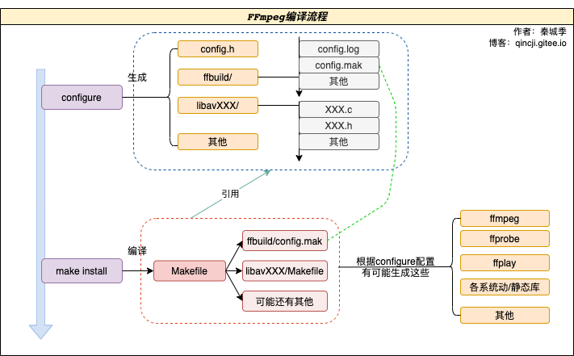
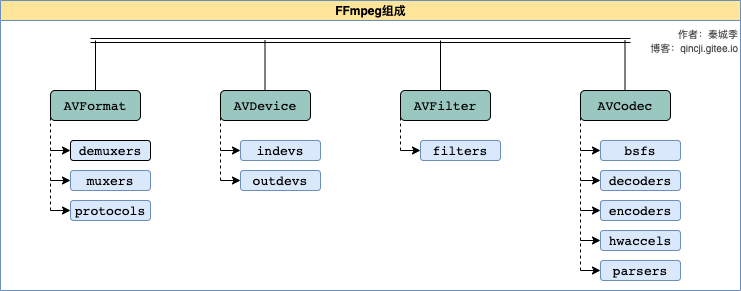
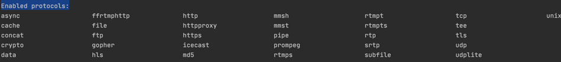
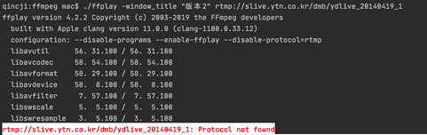
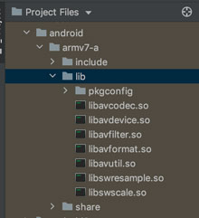

#编译FFmpeg4.2.2


##前言
在编译FFmpeg之前，我们得先知道FFmpeg包含了那些内容（组件），我们应该要如何查看并选择？这里我们就简单来说说FFmpeg编译的过程，以及集成x264，编译android平台所需要的动态库等。（这里的测试使用的是Mac系统）

##FFmpeg编译流程
编译过程主要分为两步（下图）：
- (1)`configure`：通过`configure --help`查看我们所能选择的配置。[前往查看configure配置选项注释](./01_configure_help.md)。这一步后会生成许多`Makefile`编译所需要的东西。其中在 `ffbuild/config.log` 可查看当前执行的日志。
- (2)`make install`：编译生成我们所配置的东西。如果之前编译过需要`make clean`清除之前编译过的数据再执行`make install`。



注：生成的执行文件或可移植类库时根据系统会不一样，比如生成`ffplay`时：Unix系统会是`ffplay`，windows会是`ffplay.exe`。

##FFmpeg基本组成结构
从`configure`配置文件中阅读可知，FFmpeg基本组成结构可以下部分（下图）：



主要由`AVCodec`（编解码相关）、`AVDevice`（输入/输出设备相关）、`AVFilter`（滤波处理相关）和`AVFormat`（数据格式处理相关）四大基本模块构成。在这四大模块下又细分了一些小模块，这里对小模块作用简单做一下说明：
- `bsfs`：格式转换。通过`./configure --list-bsfs`查看所有能支持转换的格式。
- `decoders`：解码器。通过`./configure --list-decoders`查看所有能支持解码器。
- `encoders`：编码器。通过`./configure --list-encoders`查看所有能支持编码器。
- `hwaccels`：硬件编解码器。通过`./configure --list-hwaccels`查看所有能支持硬件编解码器。
- `parsers`：解析器。通过`./configure --list-parsers`查看所有能支持解析器。
- `indevs`：输入设备（如安卓摄像头）。通过`./configure --list-indevs`查看所有能支持输入设备。
- `outdevs`：输出设备（如opengl）。通过`./configure --list-outdevs`查看所有能支持输出设备。
- `filters`：滤镜处理器（如gblur高斯模糊）。通过`./configure --list-filters`查看所有能支持滤镜处理器。
- `muxers`：封装（如把flv容器格式视频拆解出视频流、音频流等）。通过`./configure --list-muxers`查看所有能支持封装。
- `demuxers`：解封装（对应封装）。通过`./configure --list-demuxers`查看所有能支持解封装。
- `protocols`：协议（如rtmp）。通过`./configure --list-protocols`查看所有能支持的协议。

##选择模块进行编译
上面简单介绍了ffmpeg的编译流程以及ffmpeg库到底包含了那些类库。知道了这些，我们就可以选择我们所需要的类库进行编译了。如果默认编译出来的ffmpeg将会是相当庞大的，像一下动态库移植，库太大就很烦恼了。而且像x264库等一些第三方库也是需要知道如何进行配置的。这里我们的就探讨一下如何选择我们所需要的类库进行编译。

###准备
- (1)下载[ffmpeg源文件](https://ffmpeg.org/download.html) ，根据自己的系统进行选择，下载回来后进行解压。
- (2)[参考官方文档](https://trac.ffmpeg.org/wiki/CompilationGuide) ，如：Mac需要按照Xcode等，编译也应该先看官网文档介绍。（最靠谱的方式吧？）
- (3)掌握[Shell基础知识](./02_shell.md) ，为了方便修改与编译。
- (4)下载[x264](https://www.videolan.org/developers/x264.html) ，《测试3》需要用。
- (5)下载[NDK](https://developer.android.google.cn/ndk/downloads?hl=en) ，注意系统的类型。《测试4》需要用。

###测试1：仅仅编译出ffplay程序
`configure`配置文件中默认是输出所有程序的（ffmpeg、ffplay和ffprobe）。但是因为ffplay需要sdl2库，所以这里讲一下如何配置单单输出ffplay程序。

- **(1)安装sdl2**

从`configure`配置文件中得知，ffplay程序需要依赖sdl2库。Mac可通过执行`brew install sdl2`命令进行安装。

- **(2)编译验证ffplay**

在项目的根目录编写`build.sh`脚本文件并授权，如下。然后在控制台中直接执行`./build.sh`。
```c
#!/bin/bash
./configure \
  --disable-programs \
  --enable-ffplay
make clean
make install
```
然后在控制台中看到输出信息，发现只有ffplay程序将要被编译。


等待十几分钟后，我们发现在项目的根目录仅仅生成ffplay可执行文件，我们在控制台执行`du -sh ./ffplay`命令看看生成文件的大小有20M。
```c
qincji:ffmpeg mac$ du -sh ./ffplay
 20M    ./ffplay
```
执行命令播放一个rtmp：`./ffplay -window_title "版本1" rtmp://slive.ytn.co.kr/dmb/ydlive_20140419_1`，结果如下：


好了，我们编译的ffplay播放器能正常使用了。使用`./ffplay --help`查看具体用法。

- **(3)查找这样配置的原因**

上面我们已经知道了编译结果，这里需要找一下原因，这到底为何？我们从`configure`文件找到一些蛛丝马迹：
```c
#略……………………
#program队列
PROGRAM_LIST="
    ffplay
    ffprobe
    ffmpeg
"
#略……………………
#disable方法，将调用set_all，并传值为no，以及将要设置disable的名称($*)。
disable(){
    set_all no $*
}
#略……………………
set_all(){
    value=$1
    shift
    for var in $*; do
        eval $var=$value
    done
}

:<<EOF
这里的opt其实就是我们输入的 --disable-programs 和 --enable-ffplay
./configure \
  --disable-programs \
  --enable-ffplay
EOF
for opt do
    optval="${opt#*=}"
    case "$opt" in
        #略……………………
        #当我们配置了--disable-programs，就会命中这里，将PROGRAM_LIST列表里面的disable掉。
        --disable-programs)
            disable $PROGRAM_LIST
        ;;
        #略……………………
        #当我们配置了--enable-ffplay时，就会命中这里，将启用ffplay。这里语法不太熟悉，我们可以在这个地方中打印就下即可
        *)
            optname="${opt%%=*}"
            optname="${optname#--}"
            optname=$(echo "$optname" | sed 's/-/_/g')
            if is_in $optname $CMDLINE_SET; then
                eval $optname='$optval'
            elif is_in $optname $CMDLINE_APPEND; then
                append $optname "$optval"
            else
                die_unknown $opt
            fi
        ;;
    esac
done
#略……………………
```

###测试2：根据测试1中去掉支持rtmp协议
在测试1中我们是把程序模块的先全部取消编译，然后再选择其中一个。这里我们选择仅仅去掉一个模块中的单个组件。我们举一个例子，取消支持`protocols`中的`rtmp`协议：
- **(1)如何入手？**

我们知道一切编译皆来自`configure`配置文件，所以我们得从这个文件找我们需要的信息。我刚开始找`rtmp`相关信息，只是找到`librtmp`库的启用或取消，然后编译了一下，发现**并不是！** 然后我就搜索`protocols`，发现有一条关键信息，如下：
```c
#单个组件配置
Individual component options:
  #略…………
  #这就是我想要的！！后面NAME是rtmp！如何知道？通过 ./configure --list-protocols 看到所有支持协议的名称
  --disable-protocol=NAME  disable protocol NAME
  --disable-protocols      disable all protocols
```
- **(2)编译验证结果**

修改`build.sh`脚本，如下。然后在控制台中直接执行`./build.sh`。
```c
#!/bin/bash
./configure \
  --disable-programs \
  --enable-ffplay \
  --disable-protocol=rtmp
make clean
make install
```
然后在控制台中看到输出信息，发现`Enabled protocols:`中已经没有了`rtmp`协议了！


等待编译完成，执行命令播放一个rtmp：`./ffplay -window_title "版本2" rtmp://slive.ytn.co.kr/dmb/ydlive_20140419_1`，结果如下：



开启或者禁用其他组件的道理也是一样哦。


###测试3：集成第三方库：x264
[ffmpeg官方mac编译指南集成libx264](https://trac.ffmpeg.org/wiki/CompilationGuide/macOS) ，但是给出的信息不是很明确（有些我不太懂），几经波折后发现，是需要指定`CFLAGS`和`LDFLAGS`（也就是`--extra-cflags`和`--extra-ldflags`）才编译通过的。这里给出编译脚本，在编写前我们把下载下来解压后的x264库改名为`libx264`然后放进ffmpeg项目根目录。修改`build.sh`脚本，如下。然后在控制台中直接执行`./build.sh`。
```c
#!/bin/bash
function build_x264() {
  cd libx264
  ./configure \
    --prefix=${X264_LIBS} \
    --enable-static
  make clean
  make install
}

function build_ffmpeg() {
  cd ..
  ./configure \
    --disable-programs \
    --enable-ffmpeg \
    --enable-gpl \
    --extra-cflags="-I${X264_LIBS}/include" \
    --extra-ldflags="-L${X264_LIBS}/lib" \
    --enable-libx264
  make clean
  make install
}
#设置x264变成出来的静态库保存路径，然后编译ffmpeg时，链接进去
X264_LIBS=$(pwd)/libx264/libouput

build_x264
build_ffmpeg
```

编译过程中，我们留意到控制台的到输出信息，发现`libx264`协议被启用了：


等待编译成功后，验证当前生成的`ffmpeg`程序是否已经集成了`libx264`，找个mp4视频放到当前目录，命名为input.mp4。然后执行以下命令，如果没报错说了已成功集成：
`./ffmpeg -re -i input.mp4 -vcodec libx264 -an output.mp4`


###测试4：android交叉编译

[ffmpeg官网android编译指南](https://trac.ffmpeg.org/wiki/CompilationGuide/Android) ， 测试了一下，最后发现这几个参数比较关键：

- `--enable-cross-compile` : 开启交叉编译。
- `--cross-prefix` : gcc的前缀。（如果使用clang编译则可以不给）
- `--target-os` : 指定android使用平台。
- `--arch` : 处理器类型。
- `--cpu` : cpu类型。
- `--cc` : c语言编译器（给当前指定的绝对路径）。
- `--cxx` : c++语言编译器（给当前指定的绝对路径）。
- `--extra-cflags` : 给传递给编译器的参数。

修改`build.sh`脚本，如下。然后在控制台中直接执行`./build.sh`。
```c
#!/bin/bash

API=21
export NDK=/Users/Qincji/Desktop/develop/android/source/sdk/ndk-bundle
export SYSROOT=$NDK/toolchains/llvm/prebuilt/linux-x86_64/sysroot
export TOOLCHAIN=$NDK/toolchains/llvm/prebuilt/darwin-x86_64

function build_android() {
  ./configure \
    --prefix=$PREFIX \
    --disable-programs \
    --disable-static \
    --enable-shared \
    --cross-prefix=$CROSS_PREFIX \
    --target-os=android \
    --arch=$ARCH \
    --cpu=$CPU \
    --cc=$CC \
    --cxx=$CXX \
    --enable-cross-compile \
    --extra-cflags="$CFLAG" || exit 0

  make clean
  make install
}

ARCH=arm
CPU=armv7-a
CC=$TOOLCHAIN/bin/armv7a-linux-androideabi$API-clang
CXX=$TOOLCHAIN/bin/armv7a-linux-androideabi$API-clang++
CROSS_PREFIX=$TOOLCHAIN/bin/arm-linux-androideabi-
PREFIX=$(pwd)/android/$CPU
OPTIMIZE_CFLAGS="-mfloat-abi=softfp -mfpu=vfp -marm -march=$CPU"
CFLAG="-Os -fpic $OPTIMIZE_CFLAGS"
build_android
```
等待编译完成，我们发现能成功编译出动态库：



##总结
好了，ffmpeg编译已经基本讲述完了。这里总结一下我所编译过程的一些想法：
- 使用IDE管理项目，自己处理的方便就行。我这里用clion，github有破解方式。
- `configure` 文件非常重要，`shell`语法还是要懂一点。
- 报错了注意查看日志`ffbuild/config.log`。
- 路径一定要看是否真实存在，如`$CC`可能在一些API版本上`xxx-clang`是没有的。


参考
- https://blog.csdn.net/leixiaohua1020/article/details/44587465
- https://blog.csdn.net/leixiaohua1020/article/details/44556525