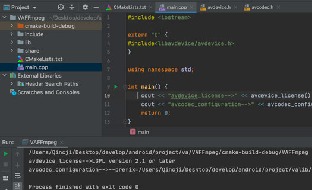

#FFmpeg导入到Clion（MacOS）

继[如何编译FFmpeg](./03_build_ffmpeg.md)后，本章也是基于前面来讲解如何把编译后的库文件移入到Clion。

在编译ffmpeg前，有一点需要提前说明的，Mac系统并不支持链接静态库，详细请看[初步认识c/c++编译](../Other/01_c_compile.md) 这篇文章。针对于平台的差异性，CLion工具在Mac系统中使用CMakelist.txt进行交叉编译并不友好，我试过集成Android平台的ffmpeg，最终以失败而告终，主要报错原因是：无法指向NDK中的 ld 链接器（要是哪位朋友尝试编译通过还望告知）。所以后续如果是Android项目还是老老实实使用Android Studio吧。

##编译MacOS平台的FFmpeg动态库
在ffmpeg项目根目录编写`build.sh`脚本文件如下：
```c
#!/bin/bash

make clean
function build_macosx() {
  ./configure \
    --prefix=$PREFIX \
    --disable-programs \
    --target-os=darwin \
    --disable-static \
    --pkg-config=$(which pkg-config) \
    --enable-shared || exit 0

  make clean
  make install
}

PREFIX=$(pwd)/macox
build_macosx
```
然后在控制台上执行编译脚本`./build.sh`，建议使用IDE，如我使用CLion导入ffmpeg源码就行操作如下：


等待编译成功后，会在当前目录的macox文件夹生成动态库，如下：


##将生成的库导入到Clion
（1）在Clion新建C++项目，项目名称为`VAFFmpeg`。
（2）将生成的`include`和`lib`复制到项目跟目录。如图下图所示：


（3）编写`CMakeLists.txt`文件，分别引入刚刚复制过来的头文件和动态库，如下：
```cmake
cmake_minimum_required(VERSION 3.17)
project(VAFFmpeg)

set(CMAKE_CXX_STANDARD 11)
set(SOURCE_FILES main.cpp)

link_directories(./lib/)
include_directories(./include/)

add_executable(VAFFmpeg ${SOURCE_FILES})

target_link_libraries(
        VAFFmpeg
        avcodec
        avdevice
        avfilter
        avformat
)
```

##进行验证
编写`main.cpp`文件如下：
```c++
#include <iostream>

extern "C" {
#include<libavdevice/avdevice.h>
}

using namespace std;

int main() {
    cout << "avdevice_license-->" << avdevice_license() << endl;
    cout << "avcodec_configuration-->" << avcodec_configuration() << endl;
    return 0;
}
```
执行能正常输出，如下：

