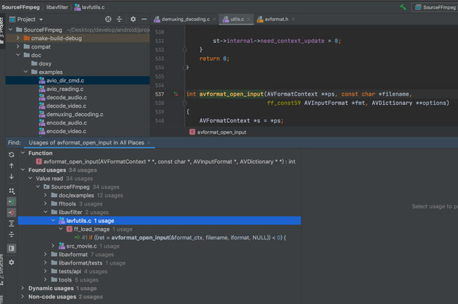

#使用Clion阅读FFmpeg源码（支持跳转）

##前言
本方案仅仅适用于阅读FFmpeg，配置方式及其简单，能支持方法间的跳转，但由于配置原因部分无法识别或跳转，介意者勿入！！

##方案一（简单）
此方案非常简单，能阅读绝大部分源码了，但仍会缺失一些头文件，导致无法小小部分无法查阅。

###步骤1

在Clion新建c++项目项目`File->New Project->Create`，如下图：


###步骤2
将FFmpeg源码复制到根目录，如下图：


###步骤3
编写`CMakeLists.txt`文件，如下：
```cmake
cmake_minimum_required(VERSION 3.17)
project(SourceFFmpeg)

set(CMAKE_CXX_STANDARD 11)

file(GLOB EX_DIR ./*.cpp ./*.c ./*/*.c ./*/*/*.c ./*/*/*/*.c)
set(INCLUDE_DIR ./ ./*/ ./*/*/ ./*/*/*/ ./*/*/*/*/)

include_directories(${INCLUDE_DIR})

add_executable(SourceFFmpeg ${EX_DIR})
```

###简单查看

到这已经完成了，这里我们查看一下源码之间的跳转，以及一些方法的被调用，可以从`doc/examples`例子看看源码能不能正常跳转等，我这如下：




##方案二（需要编译源码）
解决方案一中一些头文件缺失问题。

###步骤1（同方案一）

###步骤2（同方案一）

###步骤3

编译源码生成动态库/静态库，目的需要头文件，然后把生成的头文件复制到项目中，如下：


###步骤4

编写`CMakeLists.txt`文件，如下：
```cmake
cmake_minimum_required(VERSION 3.17)
project(SourceFFmpeg)

set(CMAKE_CXX_STANDARD 11)

include_directories(./include/)

file(GLOB EX_DIR ./*.cpp ./*.c ./*/*.c ./*/*/*.c ./*/*/*/*.c)

add_executable(SourceFFmpeg ${EX_DIR})
```

到这里方案二的也完成了，可自行查阅。
