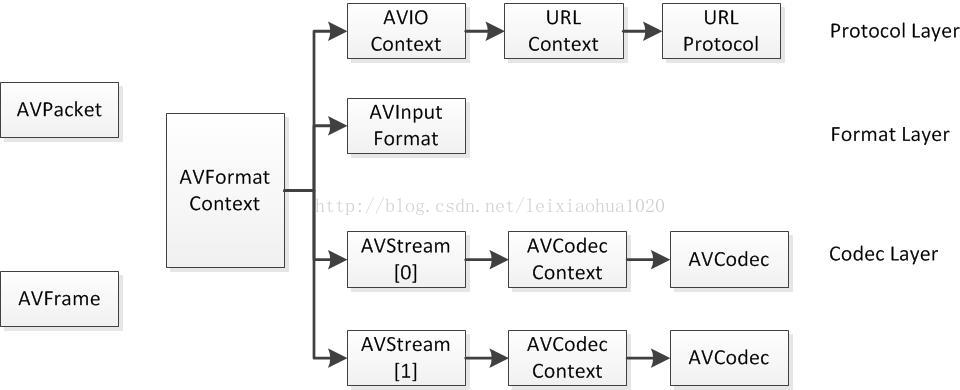

#FFmpeg重要结构体（转载）

本文主要整合[FFMPEG中最关键的结构体之间的关系](https://blog.csdn.net/leixiaohua1020/article/details/11693997) 系列文章，以便于后面学习以及资料的查阅。

##结构体间联系



###a)解协议（http,rtsp,rtmp,mms）
AVIOContext，URLProtocol，URLContext主要存储视音频使用的协议的类型以及状态。URLProtocol存储输入视音频使用的封装格式。每种协议都对应一个URLProtocol结构。（注意：FFMPEG中文件也被当做一种协议“file”）

###b)解封装（flv,avi,rmvb,mp4）
AVFormatContext主要存储视音频封装格式中包含的信息；AVInputFormat存储输入视音频使用的封装格式。每种视音频封装格式都对应一个AVInputFormat 结构。

###c)解码（h264,mpeg2,aac,mp3）
每个AVStream存储一个视频/音频流的相关数据；每个AVStream对应一个AVCodecContext，存储该视频/音频流使用解码方式的相关数据；每个AVCodecContext中对应一个AVCodec，包含该视频/音频对应的解码器。每种解码器都对应一个AVCodec结构。

###d)存数据
视频的话，每个结构一般是存一帧；音频可能有好几帧;
解码前数据：AVPacket
解码后数据：AVFrame


##AVFrame （libavutil/frame.h）

AVFrame是包含码流参数较多的结构体。AVFrame结构体一般用于存储原始数据（即非压缩数据，例如对视频来说是YUV，RGB，对音频来说是PCM），此外还包含了一些相关的信息。比如说，解码的时候存储了宏块类型表，QP表，运动矢量表等数据。编码的时候也存储了相关的数据。因此在使用FFMPEG进行码流分析的时候，AVFrame是一个很重要的结构体。

- `#define AV_NUM_DATA_POINTERS 8`
- **uint8_t \*data[AV_NUM_DATA_POINTERS]**：解码后原始数据（对视频来说是YUV、RGB，对音频来说是PCM）
- **int linesize[AV_NUM_DATA_POINTERS]**：data中“一行”数据的大小。注意：未必等于图像的宽，一般大于图像的宽。
- **int width, height**：视频帧宽和高（1920x1080,1280x720...）
- **int nb_samples**：音频的一个AVFrame中可能包含多个音频帧，在此标记包含了几个
- **int format**：解码后原始数据类型（YUV420，YUV422，RGB24...），未知或未设置为-1。
- **int key_frame**：是否是关键帧
- **enum AVPictureType pict_type**：帧类型（I,B,P...）
- **AVRational sample_aspect_ratio**：宽高比（16:9，4:3...）
- **int64_t pts**：显示时间戳
- **int coded_picture_number**：编码帧序号
- **int display_picture_number**：显示帧序号
- **int8_t \*qscale_table**：QP表
- **int channels**：音频通道数
- **int interlaced_frame**：是否是隔行扫描

其中，sample_aspect_ratio宽高比是一个分数，**AVRational**结构体：
```c
typedef struct AVRational{
    int num; ///< Numerator 分子
    int den; ///< Denominator 分母
} AVRational;
```

QP表 **qscale_table** :
QP表指向一块内存，里面存储的是每个宏块的QP值。宏块的标号是从左往右，一行一行的来的。每个宏块对应1个QP。qscale_table[0]就是第1行第1列宏块的QP值；qscale_table[1]就是第1行第2列宏块的QP值；qscale_table[2]就是第1行第3列宏块的QP值。以此类推...
宏块的个数用下式计算(注：宏块大小是16x16的)，每行宏块数：
> int mb_stride = pCodecCtx->width/16+1

宏块的总数：
> int mb_sum = ((pCodecCtx->height+15)>>4)*(pCodecCtx->width/16+1)


##AVFormatContext （libavformat/avformat.h）
在使用FFMPEG进行开发的时候，AVFormatContext是一个贯穿始终的数据结构，很多函数都要用到它作为参数。它是FFMPEG解封装（flv，mp4，rmvb，avi）功能的结构体。（在这里考虑解码的情况）

- **AVInputFormat \*iformat**：输入容器格式数据
- **AVOutputFormat \*oformat**：输出容器格式数据
- **AVIOContext \*pb**：输入数据的缓存
- **AVIOContext \*pb**：输入数据的缓存
- **unsigned int nb_streams**：视音频流的个数
- **AVStream \*\*streams**：视音频流
- **char filename[1024]**：文件名
- **char \*url**：输入/输出URL
- **int64_t duration**：时长（单位：微秒us，转换为秒需要除以1000000）
- **int bit_rate**：比特率（单位bps，转换为kbps需要除以1000）
- **int packet_size**：packet的长度
- **AVDictionary \*metadata**：元数据

其中，通过av_dict_get()函数获得视频的元数据。封装在了AVDictionary和AVDictionaryEntry：
```c
struct AVDictionary {
    int count;
    AVDictionaryEntry *elems;
};

typedef struct AVDictionaryEntry {
    char *key;
    char *value;
} AVDictionaryEntry;
```

##AVStream （libavformat/avformat.h）
AVStream是存储每一个视频/音频流信息的结构体。

- **int index**：标识该视频/音频流(AVFormatContext中)
- **AVCodecContext \*codec**：指向该视频/音频流的AVCodecContext（它们是一一对应的关系）
- **AVRational time_base**：时基。通过该值可以把PTS，DTS转化为真正的时间。FFMPEG其他结构体中也有这个字段，但是根据我的经验，只有AVStream中的time_base是可用的。PTS*time_base=真正的时间
- **int64_t duration**：该视频/音频流长度
- **int64_t nb_frames**：该流中已知时的帧数
- **AVDictionary \*metadata**：元数据信息
- **AVRational avg_frame_rate**：帧率（注：对视频来说，这个挺重要的）
- **AVPacket attached_pic**：附带的图片。比如说一些MP3，AAC音频文件附带的专辑封面。


##AVIOContext （libavformat/avio.h）
AVIOContext是FFMPEG管理输入输出数据的结构体

- **unsigned char \*buffer**：缓存开始位置
- **int buffer_size**：缓存大小（默认32768）
- **unsigned char \*buf_ptr**：当前指针读取到的位置
- **unsigned char \*buf_end**：缓存结束的位置
- **void *opaque**：URLContext结构体

其中，**opaque**指向的URLContext：
```c
typedef struct URLContext {
    const AVClass *av_class;    /**< information for av_log(). Set by url_open(). */
    const struct URLProtocol *prot;
    void *priv_data;
    char *filename;             /**< specified URL */
    int flags;
    int max_packet_size;        /**< if non zero, the stream is packetized with this max packet size */
    int is_streamed;            /**< true if streamed (no seek possible), default = false */
    int is_connected;
    AVIOInterruptCB interrupt_callback;
    int64_t rw_timeout;         /**< maximum time to wait for (network) read/write operation completion, in mcs */
    const char *protocol_whitelist;
    const char *protocol_blacklist;
    int min_packet_size;        /**< if non zero, the stream is packetized with this min packet size */
} URLContext;
```
URLContext结构体中还有一个结构体URLProtocol。注：每种协议（rtp，rtmp，file等）对应一个URLProtocol。这个结构体也不在FFMPEG提供的头文件中。从FFMPEG源代码中翻出其的定义：
```c
typedef struct URLProtocol {
    const char *name;
    int     (*url_open)( URLContext *h, const char *url, int flags);
    int     (*url_open2)(URLContext *h, const char *url, int flags, AVDictionary **options);
    int     (*url_accept)(URLContext *s, URLContext **c);
    int     (*url_handshake)(URLContext *c);
    int     (*url_read)( URLContext *h, unsigned char *buf, int size);
    int     (*url_write)(URLContext *h, const unsigned char *buf, int size);
    int64_t (*url_seek)( URLContext *h, int64_t pos, int whence);
    int     (*url_close)(URLContext *h);
    int (*url_read_pause)(URLContext *h, int pause);
    int64_t (*url_read_seek)(URLContext *h, int stream_index,
                             int64_t timestamp, int flags);
    int (*url_get_file_handle)(URLContext *h);
    int (*url_get_multi_file_handle)(URLContext *h, int **handles,
                                     int *numhandles);
    int (*url_get_short_seek)(URLContext *h);
    int (*url_shutdown)(URLContext *h, int flags);
    int priv_data_size;
    const AVClass *priv_data_class;
    int flags;
    int (*url_check)(URLContext *h, int mask);
    int (*url_open_dir)(URLContext *h);
    int (*url_read_dir)(URLContext *h, AVIODirEntry **next);
    int (*url_close_dir)(URLContext *h);
    int (*url_delete)(URLContext *h);
    int (*url_move)(URLContext *h_src, URLContext *h_dst);
    const char *default_whitelist;
} URLProtocol;
```

##AVCodecContext （libavcodec/avcodec.h）
AVCodecContext是包含变量较多的结构体（感觉差不多是变量最多的结构体）。本文将会大概分析一下该结构体里每个变量的含义和作用。（这里只考虑解码）

- **enum AVMediaType codec_type**：编解码器的类型（视频，音频，字幕...）
- **struct AVCodec \*codec**：采用的解码器AVCodec（H.264,MPEG2...）
- **int bit_rate**：平均比特率
- **uint8_t \*extradata; int extradata_size**：针对特定编码器包含的附加信息（例如对于H.264解码器来说，存储SPS，PPS等）
- **AVRational time_base**：根据该参数，可以把PTS转化为实际的时间（单位为秒s）
- **int width, height**：如果是视频的话，代表宽和高
- **int refs**：运动估计参考帧的个数（H.264的话会有多帧，MPEG2这类的一般就没有了）
- **int sample_rate**：采样率（音频）
- **int channels**：声道数（音频）
- **enum AVSampleFormat sample_fmt**：采样格式
- **int frame_size**：帧中每个通道的采样率（音频）
- **int profile**：型（H.264里面就有，其他编码标准应该也有）
- **int level**：级（和profile差不太多）

其中，1.编解码器类型：**codec_type**
```c
enum AVMediaType {
    AVMEDIA_TYPE_UNKNOWN = -1,  ///< Usually treated as AVMEDIA_TYPE_DATA
    AVMEDIA_TYPE_VIDEO,
    AVMEDIA_TYPE_AUDIO,
    AVMEDIA_TYPE_DATA,          ///< Opaque data information usually continuous
    AVMEDIA_TYPE_SUBTITLE,
    AVMEDIA_TYPE_ATTACHMENT,    ///< Opaque data information usually sparse
    AVMEDIA_TYPE_NB
};
```

2.在FFMPEG中音频采样格式：**sample_fmt**
```c
enum AVSampleFormat {
    AV_SAMPLE_FMT_NONE = -1,
    AV_SAMPLE_FMT_U8,          ///< unsigned 8 bits
    AV_SAMPLE_FMT_S16,         ///< signed 16 bits
    AV_SAMPLE_FMT_S32,         ///< signed 32 bits
    AV_SAMPLE_FMT_FLT,         ///< float
    AV_SAMPLE_FMT_DBL,         ///< double

    AV_SAMPLE_FMT_U8P,         ///< unsigned 8 bits, planar
    AV_SAMPLE_FMT_S16P,        ///< signed 16 bits, planar
    AV_SAMPLE_FMT_S32P,        ///< signed 32 bits, planar
    AV_SAMPLE_FMT_FLTP,        ///< float, planar
    AV_SAMPLE_FMT_DBLP,        ///< double, planar
    AV_SAMPLE_FMT_S64,         ///< signed 64 bits
    AV_SAMPLE_FMT_S64P,        ///< signed 64 bits, planar

    AV_SAMPLE_FMT_NB           ///< Number of sample formats. DO NOT USE if linking dynamically
};
```

3.FFMPEG中型：**profile**
```c

#define FF_PROFILE_UNKNOWN -99
#define FF_PROFILE_RESERVED -100
 
#define FF_PROFILE_AAC_MAIN 0
#define FF_PROFILE_AAC_LOW  1
#define FF_PROFILE_AAC_SSR  2
#define FF_PROFILE_AAC_LTP  3
#define FF_PROFILE_AAC_HE   4
#define FF_PROFILE_AAC_HE_V2 28
#define FF_PROFILE_AAC_LD   22
#define FF_PROFILE_AAC_ELD  38
 
#define FF_PROFILE_DTS         20
#define FF_PROFILE_DTS_ES      30
#define FF_PROFILE_DTS_96_24   40
#define FF_PROFILE_DTS_HD_HRA  50
#define FF_PROFILE_DTS_HD_MA   60
 
#define FF_PROFILE_MPEG2_422    0
#define FF_PROFILE_MPEG2_HIGH   1
#define FF_PROFILE_MPEG2_SS     2
#define FF_PROFILE_MPEG2_SNR_SCALABLE  3
#define FF_PROFILE_MPEG2_MAIN   4
#define FF_PROFILE_MPEG2_SIMPLE 5
 
#define FF_PROFILE_H264_CONSTRAINED  (1<<9)  // 8+1; constraint_set1_flag
#define FF_PROFILE_H264_INTRA        (1<<11) // 8+3; constraint_set3_flag
 
#define FF_PROFILE_H264_BASELINE             66
#define FF_PROFILE_H264_CONSTRAINED_BASELINE (66|FF_PROFILE_H264_CONSTRAINED)
#define FF_PROFILE_H264_MAIN                 77
#define FF_PROFILE_H264_EXTENDED             88
#define FF_PROFILE_H264_HIGH                 100
#define FF_PROFILE_H264_HIGH_10              110
#define FF_PROFILE_H264_HIGH_10_INTRA        (110|FF_PROFILE_H264_INTRA)
#define FF_PROFILE_H264_HIGH_422             122
#define FF_PROFILE_H264_HIGH_422_INTRA       (122|FF_PROFILE_H264_INTRA)
#define FF_PROFILE_H264_HIGH_444             144
#define FF_PROFILE_H264_HIGH_444_PREDICTIVE  244
#define FF_PROFILE_H264_HIGH_444_INTRA       (244|FF_PROFILE_H264_INTRA)
#define FF_PROFILE_H264_CAVLC_444            44
 
#define FF_PROFILE_VC1_SIMPLE   0
#define FF_PROFILE_VC1_MAIN     1
#define FF_PROFILE_VC1_COMPLEX  2
#define FF_PROFILE_VC1_ADVANCED 3
 
#define FF_PROFILE_MPEG4_SIMPLE                     0
#define FF_PROFILE_MPEG4_SIMPLE_SCALABLE            1
#define FF_PROFILE_MPEG4_CORE                       2
#define FF_PROFILE_MPEG4_MAIN                       3
#define FF_PROFILE_MPEG4_N_BIT                      4
#define FF_PROFILE_MPEG4_SCALABLE_TEXTURE           5
#define FF_PROFILE_MPEG4_SIMPLE_FACE_ANIMATION      6
#define FF_PROFILE_MPEG4_BASIC_ANIMATED_TEXTURE     7
#define FF_PROFILE_MPEG4_HYBRID                     8
#define FF_PROFILE_MPEG4_ADVANCED_REAL_TIME         9
#define FF_PROFILE_MPEG4_CORE_SCALABLE             10
#define FF_PROFILE_MPEG4_ADVANCED_CODING           11
#define FF_PROFILE_MPEG4_ADVANCED_CORE             12
#define FF_PROFILE_MPEG4_ADVANCED_SCALABLE_TEXTURE 13
#define FF_PROFILE_MPEG4_SIMPLE_STUDIO             14
#define FF_PROFILE_MPEG4_ADVANCED_SIMPLE           15
```

##AVCodec （libavcodec/avcodec.h）
AVCodec是存储编解码器信息的结构体。

- **const char \*name**：编解码器的名字，比较短
- **const char \*long_name**：编解码器的名字，全称，比较长
- **enum AVMediaType type**：指明了类型，是视频，音频，还是字幕
- **enum AVCodecID id**：ID，不重复
- **const AVRational \*supported_framerates**：支持的帧率（仅视频）
- **const enum AVPixelFormat \*pix_fmts**：支持的像素格式（仅视频）
- **const int \*supported_samplerates**：支持的采样率（仅音频）
- **const enum AVSampleFormat \*sample_fmts**：支持的采样格式（仅音频）
- **const uint64_t \*channel_layouts**：支持的声道数（仅音频）
- **int priv_data_size**：私有数据的大小

其中，**AVMediaType**结构体：
```c
enum AVMediaType {
    AVMEDIA_TYPE_UNKNOWN = -1,  ///< Usually treated as AVMEDIA_TYPE_DATA
    AVMEDIA_TYPE_VIDEO,
    AVMEDIA_TYPE_AUDIO,
    AVMEDIA_TYPE_DATA,          ///< Opaque data information usually continuous
    AVMEDIA_TYPE_SUBTITLE,
    AVMEDIA_TYPE_ATTACHMENT,    ///< Opaque data information usually sparse
    AVMEDIA_TYPE_NB
};
```
**AVCodecID**结构体：
```c
enum AVCodecID {
    AV_CODEC_ID_NONE,
    /* video codecs */
    AV_CODEC_ID_MPEG1VIDEO,
    AV_CODEC_ID_MPEG2VIDEO, ///< preferred ID for MPEG-1/2 video decoding
    AV_CODEC_ID_H261,
    AV_CODEC_ID_H263,
    //...（代码太长，略）
}
```
**AVPixelFormat**结构体：
```c
enum AVPixelFormat {
    AV_PIX_FMT_NONE = -1,
    AV_PIX_FMT_YUV420P,   ///< planar YUV 4:2:0, 12bpp, (1 Cr & Cb sample per 2x2 Y samples)
    AV_PIX_FMT_YUYV422,   ///< packed YUV 4:2:2, 16bpp, Y0 Cb Y1 Cr
    AV_PIX_FMT_RGB24,     ///< packed RGB 8:8:8, 24bpp, RGBRGB...
    //...（代码太长，略）
}
```


##AVPacket （libavcodec/avcodec.h）
AVPacket是存储压缩编码数据相关信息的结构体。例如对于H.264来说。1个AVPacket的data通常对应一个NAL。注意：在这里只是对应，而不是一模一样。他们之间有微小的差别：使用FFMPEG类库分离出多媒体文件中的H.264码流。因此在使用FFMPEG进行视音频处理的时候，常常可以将得到的AVPacket的data数据直接写成文件，从而得到视音频的码流文件。

- **int64_t pts**：显示时间戳
- **int64_t dts**：解码时间戳
- **uint8_t \*data**：压缩编码的数据
- **int size**：data的大小
- **int stream_index**：标识该AVPacket所属的视频/音频流。

