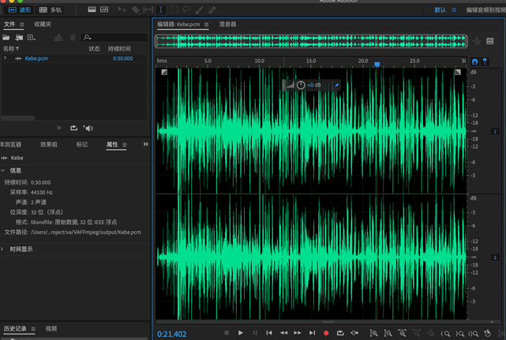
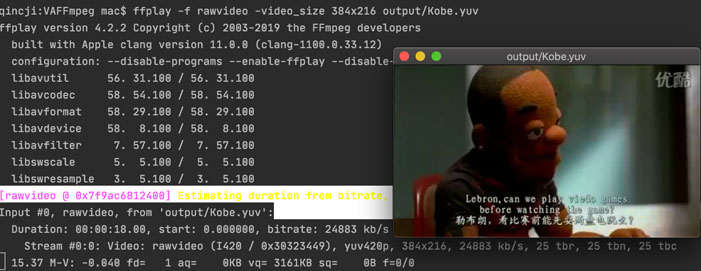

#Decode（解码）

本文来自官方例子`doc/examples/decode_audio.c` 和 `doc/examples/decode_video.c`。

##FFmpeg解码流程


其中，AVFormatContext、AVPacket等重要的结构体请看：[FFmpeg重要结构体（转载）](./06_struct.md) 。

##官方例子【Audio】
```c
/**
 * @author 秦城季
 * @email xhunmon@126.com
 * @Blog https://qincji.gitee.io
 * @date 2021/01/06
 * description: 来自官方例子：doc/examples/decode_audio.c  <br>
 */
#include <stdio.h>
#include <stdlib.h>
#include <string.h>

extern "C"{
#include <libavutil/frame.h>
#include <libavutil/mem.h>

#include <libavcodec/avcodec.h>
}

#define AUDIO_INBUF_SIZE 20480
#define AUDIO_REFILL_THRESH 4096

static void decode(AVCodecContext *dec_ctx, AVPacket *pkt, AVFrame *frame,
                   FILE *outfile)
{
    int i, ch;
    int ret, data_size;

    //把AVPacket数据送去解码器
    ret = avcodec_send_packet(dec_ctx, pkt);
    if (ret < 0) {
        fprintf(stderr, "Error submitting the packet to the decoder\n");
        exit(1);
    }

    /* read all the output frames (in general there may be any number of them */
    while (ret >= 0) {
        //接到解码后的<AVPacket数据>，读取到AVFrame中
        ret = avcodec_receive_frame(dec_ctx, frame);
        if (ret == AVERROR(EAGAIN) || ret == AVERROR_EOF)
            return;
        else if (ret < 0) {
            fprintf(stderr, "Error during decoding\n");
            exit(1);
        }
        /*下面是得到解码后的裸流数据进行处理，根据裸流数据的特征做相应的处理，如AAC解码后是PCM，h264解码后是YUV等。*/
        data_size = av_get_bytes_per_sample(dec_ctx->sample_fmt);
        if (data_size < 0) {
            /* This should not occur, checking just for paranoia */
            fprintf(stderr, "Failed to calculate data size\n");
            exit(1);
        }
        for (i = 0; i < frame->nb_samples; i++)
            for (ch = 0; ch < dec_ctx->channels; ch++)
                fwrite(frame->data[ch] + data_size*i, 1, data_size, outfile);
    }
}

int main(int argc, char **argv)
{
    const char *outfilename, *filename;
    const AVCodec *codec;
    AVCodecContext *c= NULL;
    AVCodecParserContext *parser = NULL;
    int len, ret;
    FILE *f, *outfile;
    uint8_t inbuf[AUDIO_INBUF_SIZE + AV_INPUT_BUFFER_PADDING_SIZE];
    uint8_t *data;
    size_t   data_size;
    AVPacket *pkt;
    AVFrame *decoded_frame = NULL;

    filename    = "source/Kobe.aac";
    outfilename = "output/Kebe.pcm";

    pkt = av_packet_alloc();

    //通过AVCodecID查找到相应的AVCodec，类型需要输入文件解码类型保持一致
    codec = avcodec_find_decoder(AV_CODEC_ID_AAC);
    if (!codec) {
        fprintf(stderr, "Codec not found\n");
        exit(1);
    }

    //获取解析器上下文
    parser = av_parser_init(codec->id);
    if (!parser) {
        fprintf(stderr, "Parser not found\n");
        exit(1);
    }

    //获取解码器器上下文
    c = avcodec_alloc_context3(codec);
    if (!c) {
        fprintf(stderr, "Could not allocate audio codec context\n");
        exit(1);
    }

    //初始化码器器上下文
    if (avcodec_open2(c, codec, NULL) < 0) {
        fprintf(stderr, "Could not open codec\n");
        exit(1);
    }

    f = fopen(filename, "rb");
    if (!f) {
        fprintf(stderr, "Could not open %s\n", filename);
        exit(1);
    }
    outfile = fopen(outfilename, "wb+");
    if (!outfile) {
        av_free(c);
        exit(1);
    }

    /* decode until eof */
    data      = inbuf;
    data_size = fread(inbuf, 1, AUDIO_INBUF_SIZE, f);

    //读取输入文件
    while (data_size > 0) {
        if (!decoded_frame) {
            if (!(decoded_frame = av_frame_alloc())) {
                fprintf(stderr, "Could not allocate audio frame\n");
                exit(1);
            }
        }

        //把输入的文件流进行解析，输出到AVPacket中
        ret = av_parser_parse2(parser, c, &pkt->data, &pkt->size,
                               data, data_size,
                               AV_NOPTS_VALUE, AV_NOPTS_VALUE, 0);
        if (ret < 0) {
            fprintf(stderr, "Error while parsing\n");
            exit(1);
        }
        data      += ret;
        data_size -= ret;

        if (pkt->size){
            //这部分主要是把上面AVPacket数据进行解码，最后得到裸流数据输出到AVFrame中
            decode(c, pkt, decoded_frame, outfile);
        }

        if (data_size < AUDIO_REFILL_THRESH) {
            memmove(inbuf, data, data_size);
            data = inbuf;
            len = fread(data + data_size, 1,
                        AUDIO_INBUF_SIZE - data_size, f);
            if (len > 0)
                data_size += len;
        }
    }

    /* flush the decoder */
    pkt->data = NULL;
    pkt->size = 0;
    decode(c, pkt, decoded_frame, outfile);

    fclose(outfile);
    fclose(f);

    avcodec_free_context(&c);
    av_parser_close(parser);
    av_frame_free(&decoded_frame);
    av_packet_free(&pkt);

    return 0;
}
```

- 测试文件下载地址: [Kobe.aac](img/09_muxing/Kobe.aac) 。
- 解析后的pcm原始数据可以使用ffplay或者audition等工具播放，而播放前必须先知道该原始数据的初始化信息，如通道数、位宽等，可以使用`ffprobe`进行查看解码前的aac文件，如：
```commandline
qincji:usr mac$ ffprobe ./VAFFmpeg/source/Kobe.aac 
ffprobe version 4.2.2 Copyright (c) 2007-2019 the FFmpeg developers
  built with Apple clang version 11.0.0 (clang-1100.0.33.12)
  configuration: 
  libavutil      56. 31.100 / 56. 31.100
  libavcodec     58. 54.100 / 58. 54.100
  libavformat    58. 29.100 / 58. 29.100
  libavdevice    58.  8.100 / 58.  8.100
  libavfilter     7. 57.100 /  7. 57.100
  libswscale      5.  5.100 /  5.  5.100
  libswresample   3.  5.100 /  3.  5.100
[aac @ 0x7fec2b005200] Estimating duration from bitrate, this may be inaccurate
Input #0, aac, from '/Users/Qincji/Desktop/develop/android/project/va/VAFFmpeg/source/Kobe.aac':
  Duration: 00:00:29.90, bitrate: 34 kb/s
    Stream #0:0: Audio: aac (HE-AAC), 44100 Hz, stereo, fltp, 34 kb/s
```
- 使用audition输入出文件实例：



##官方例子【Video】

```c
/**
 * @author 秦城季
 * @email xhunmon@126.com
 * @Blog https://qincji.gitee.io
 * @date 2021/01/06
 * description: 来自官方例子：doc/examples/decode_video.c  <br>
 */
#include <stdio.h>
#include <stdlib.h>
#include <string.h>

extern "C"{
#include <libavcodec/avcodec.h>
}
#define INBUF_SIZE 4096


static void decode(AVCodecContext *dec_ctx, AVFrame *frame, AVPacket *pkt,
                   FILE *outfile)
{
    int ret;

    ret = avcodec_send_packet(dec_ctx, pkt);
    if (ret < 0) {
        fprintf(stderr, "Error sending a packet for decoding\n");
        exit(1);
    }

    while (ret >= 0) {
        ret = avcodec_receive_frame(dec_ctx, frame);
        if (ret == AVERROR(EAGAIN) || ret == AVERROR_EOF)
            return;
        else if (ret < 0) {
            fprintf(stderr, "Error during decoding\n");
            exit(1);
        }

        printf("saving frame %3d\n", dec_ctx->frame_number);
        fflush(stdout);

        //根据自己解码出来的数据格式进行处理
        fwrite(frame->data[0],1,frame->width*frame->height,outfile);//Y
        fwrite(frame->data[1],1,frame->width*frame->height/4,outfile);//U
        fwrite(frame->data[2],1,frame->width*frame->height/4,outfile);//V
    }
}

int main(int argc, char **argv)
{
    const char *filename, *outfilename;
    const AVCodec *codec;
    AVCodecParserContext *parser;
    AVCodecContext *c= NULL;
    FILE *f;
    AVFrame *frame;
    uint8_t inbuf[INBUF_SIZE + AV_INPUT_BUFFER_PADDING_SIZE];
    uint8_t *data;
    size_t   data_size;
    int ret;
    AVPacket *pkt;

    filename    = "source/Kobe.h264";
    outfilename = "output/Kobe.yuv";

    FILE *outfile = fopen(outfilename, "wb");

    pkt = av_packet_alloc();
    if (!pkt)
        exit(1);

    /* set end of buffer to 0 (this ensures that no overreading happens for damaged MPEG streams) */
    memset(inbuf + INBUF_SIZE, 0, AV_INPUT_BUFFER_PADDING_SIZE);

    /* find the MPEG-1 video decoder */
    codec = avcodec_find_decoder(AV_CODEC_ID_H264);
    if (!codec) {
        fprintf(stderr, "Codec not found\n");
        exit(1);
    }

    parser = av_parser_init(codec->id);
    if (!parser) {
        fprintf(stderr, "parser not found\n");
        exit(1);
    }

    c = avcodec_alloc_context3(codec);
    if (!c) {
        fprintf(stderr, "Could not allocate video codec context\n");
        exit(1);
    }

    /* For some codecs, such as msmpeg4 and mpeg4, width and height
       MUST be initialized there because this information is not
       available in the bitstream. */

    /* open it */
    if (avcodec_open2(c, codec, NULL) < 0) {
        fprintf(stderr, "Could not open codec\n");
        exit(1);
    }

    f = fopen(filename, "rb");
    if (!f) {
        fprintf(stderr, "Could not open %s\n", filename);
        exit(1);
    }

    frame = av_frame_alloc();
    if (!frame) {
        fprintf(stderr, "Could not allocate video frame\n");
        exit(1);
    }

    while (!feof(f)) {
        /* read raw data from the input file */
        data_size = fread(inbuf, 1, INBUF_SIZE, f);
        if (!data_size)
            break;

        /* use the parser to split the data into frames */
        data = inbuf;
        while (data_size > 0) {
            ret = av_parser_parse2(parser, c, &pkt->data, &pkt->size,
                                   data, data_size, AV_NOPTS_VALUE, AV_NOPTS_VALUE, 0);
            if (ret < 0) {
                fprintf(stderr, "Error while parsing\n");
                exit(1);
            }
            data      += ret;
            data_size -= ret;

            if (pkt->size)
                decode(c, frame, pkt, outfile);
        }
    }

    /* flush the decoder */
    decode(c, frame, NULL, outfile);

    fclose(f);

    av_parser_close(parser);
    avcodec_free_context(&c);
    av_frame_free(&frame);
    av_packet_free(&pkt);

    return 0;
}
```
- 测试文件下载地址:  [Kobe.h264](img/09_muxing/kobe.h264) 。
- 解析后的yuv原始数据可以使用ffplay等工具播放，而播放前必须先知道该原始数据的宽高等信息，可以使用`ffprobe`进行查看解码前的h264文件，如：
```commandline
qincji:usr mac$ ffprobe /Users/Qincji/Desktop/develop/android/project/va/VAFFmpeg/source/Kobe.h264 
ffprobe version 4.2.2 Copyright (c) 2007-2019 the FFmpeg developers
  built with Apple clang version 11.0.0 (clang-1100.0.33.12)
  configuration: 
  libavutil      56. 31.100 / 56. 31.100
  libavcodec     58. 54.100 / 58. 54.100
  libavformat    58. 29.100 / 58. 29.100
  libavdevice    58.  8.100 / 58.  8.100
  libavfilter     7. 57.100 /  7. 57.100
  libswscale      5.  5.100 /  5.  5.100
  libswresample   3.  5.100 /  3.  5.100
Input #0, h264, from '/Users/Qincji/Desktop/develop/android/project/va/VAFFmpeg/source/Kobe.h264':
  Duration: N/A, bitrate: N/A
    Stream #0:0: Video: h264 (Main), yuv420p(progressive), 384x216 [SAR 1:1 DAR 16:9], 15 fps, 15 tbr, 1200k tbn, 30 tbc
```
- 使用`ffplay`播放：

> ffplay -f rawvideo -video_size 384x216 output/Kobe.yuv

输入出文件实例：


