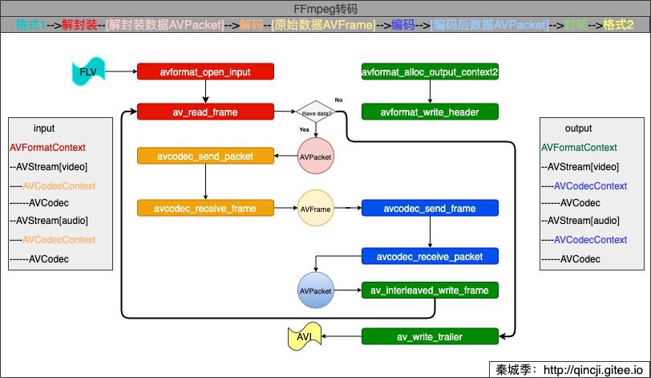

#简单实现转码

本文汇总前面几篇文章，把所有流程合并到一块，简单实现转码的流程。其中有些异常不做处理。

##转码原理 

先看雷神的一张图：


上图描述的很明白，上完图发现已经不需要语言描述了[Dog]。 但还是画个来说明一下这块之间的联系：




其中，AVFormatContext、AVPacket等重要的结构体请看：[FFmpeg重要结构体](./06_struct.md) 。

##代码实现
```c
/**
 * @author 秦城季
 * @email xhunmon@126.com
 * @Blog https://qincji.gitee.io
 * @date 2021/01/08
 * description: 转码
 * 主要思路：
 * 格式1-->解封装--[解封装数据AVPacket]-->解码--[原始数据AVFrame]-->编码-->[编码后数据AVPacket]-->封装-->格式2
 *
 * 2021/01/11 增加音频重采样变换
 * <br>
 */
#include <stdint.h>
#include <stdio.h>

extern "C" {
#include <libavformat/avformat.h>
#include <libavcodec/avcodec.h>

#include <libavutil/channel_layout.h>
#include <libavutil/common.h>
#include <libavutil/frame.h>
#include <libavutil/samplefmt.h>

#include <libavutil/opt.h>
#include <libavutil/imgutils.h>
#include <libswresample/swresample.h>
}

int main(int argc, char **argv) {
//    const char *in_filename = "source/lol.mp4";
//    const char *out_filename = "output/lol.wma";
//    const char *in_filename = "source/Kobe.flv";
//    const char *out_filename = "output/Kobe.avi";
//    const char *in_filename = "source/lol.mp4";
//    const char *out_filename = "output/lol.avi";
    const char *in_filename = "source/Kobe.flv";
    const char *out_filename = "output/Kobe2.avi";
    remove(out_filename);

    SwrContext *swr_ctx;//当有需要时，需要重采样
    AVFormatContext *ifmt_ctx = NULL, *ofmt_ctx = NULL;
    AVPacket *ipkt = NULL, *opkt = NULL;
    AVFrame *iframe = NULL, *oframe_a = NULL;
    AVCodecContext *ic_v = NULL, *ic_a = NULL, *oc_v = NULL, *oc_a = NULL;
    AVCodec *ocodec_v = NULL, *ocodec_a = NULL;
    int iindex_v = -1, iindex_a = -1, oindex_v = -1, oindex_a = -1, ret, dst_nb_samples;

    ipkt = av_packet_alloc();
    opkt = av_packet_alloc();

    /**（解封装 1.1）：创建并初始化AVFormatContext*/
    if (avformat_open_input(&ifmt_ctx, in_filename, NULL, NULL) < 0) {
        fprintf(stderr, "Could not open source file %s\n", in_filename);
        goto end;
    }
    /**（解封装 1.2）：检索流信息，这个过程会检查输入流中信息是否存在异常*/
    if (avformat_find_stream_info(ifmt_ctx, NULL) < 0) {
        fprintf(stderr, "Could not find stream information\n");
        goto end;
    }
    /**（解封装 1.3）：查找视频和音频的下标*/
    if ((iindex_v = av_find_best_stream(ifmt_ctx, AVMEDIA_TYPE_VIDEO, -1, -1, NULL, 0)) < 0) {
        fprintf(stderr, "Could not find video stream\n");
        goto end;
    }
    if ((iindex_a = av_find_best_stream(ifmt_ctx, AVMEDIA_TYPE_AUDIO, -1, -1, NULL, 0)) < 0) {
        fprintf(stderr, "Could not find video stream\n");
        goto end;
    }

    /**（解码 2.1）：解码器直接从AVFormatContext对象的流中获取，然后指定该解码器的AVCodec*/
    ic_v = ifmt_ctx->streams[iindex_v]->codec;
    if (!(ic_v->codec = avcodec_find_decoder(ic_v->codec_id))) {
        fprintf(stderr, "Could find in video AVCodec\n");
        goto end;
    }
    ic_a = ifmt_ctx->streams[iindex_a]->codec;
    if (!(ic_a->codec = avcodec_find_decoder(ic_a->codec_id))) {
        fprintf(stderr, "Could find in audio AVCodec\n");
        goto end;
    }
    /**（解码 2.2）：初始化码器器上下文*/
    if (avcodec_open2(ic_v, ic_v->codec, NULL) < 0) {
        fprintf(stderr, "Could not open codec v\n");
        goto end;
    }
    if (avcodec_open2(ic_a, ic_a->codec, NULL) < 0) {
        fprintf(stderr, "Could not open codec a\n");
        goto end;
    }

    /**（封装 4.1）：根据文件格式初始化封装器上下文AVFormatContext*/
    avformat_alloc_output_context2(&ofmt_ctx, NULL, NULL, out_filename);
    if (!ofmt_ctx) {
        fprintf(stderr, "Could not create output context\n");
        goto end;
    }

    /**（封装 4.2）：创建输入的视频和音频AVCodec*/
    if (!(ocodec_v = avcodec_find_encoder(ofmt_ctx->oformat->video_codec))) {
        fprintf(stderr, "Could find out video AVCodec\n");
        goto end;
    }
    if (!(ocodec_a = avcodec_find_encoder(ofmt_ctx->oformat->audio_codec))) {
        fprintf(stderr, "Could find out audio AVCodec\n");
        goto end;
    }

    /**（封装 4.3）：创建输出视频和音频AVStream，并与关联上AVFormatContext。（编码 3.1）：创建我们所需的编码器*/
    for (int i = 0; i < ifmt_ctx->nb_streams; i++) {
        if (i != iindex_v && i != iindex_a) {
            continue;
        }
        AVStream *out_stream = avformat_new_stream(ofmt_ctx, NULL);
        if (!out_stream) {
            fprintf(stderr, "Failed allocating output stream\n");
            goto end;
        }

        out_stream->codecpar->codec_tag = 0;

        /*********************************************************************************************/
        /**   这一块是编码器的参数信息设置，ffmpeg生产的默认编码器信息可能不是我们想要的，需要根据具体情况进行设置    **/
        /*********************************************************************************************/
        if (i == iindex_v) {
            oindex_v = out_stream->index;
//            oc_v = ofmt_ctx->streams[oindex_v]->codec; //这是旧版的写法
            if (!(oc_v = avcodec_alloc_context3(ocodec_v))) {
                fprintf(stderr, "Could not allow out AVCodecContext v\n");
                goto end;
            }
            oc_v->height = ic_v->height;
            oc_v->width = ic_v->width;
            oc_v->sample_aspect_ratio = ic_v->sample_aspect_ratio;
            oc_v->pix_fmt = ocodec_v->pix_fmts[0];
            oc_v->time_base = ic_v->time_base;
            oc_v->has_b_frames = ic_v->has_b_frames;
            //输出将相对于输入延迟max_b_frames + 1-->但是输入的为0！
//            oc_v->max_b_frames = ic_v->max_b_frames + 1;
            oc_v->max_b_frames = 2;
            oc_v->bit_rate = ic_v->bit_rate;
            oc_v->codec_type = ic_v->codec_type;
            if ((ret = avcodec_parameters_from_context(out_stream->codecpar, oc_v)) < 0) {
                fprintf(stderr, "Could not copy the out stream parameters v\n");
                goto end;
            }

            if (avcodec_open2(oc_v, ocodec_v, NULL) < 0) {
                fprintf(stderr, "Could not open out codec v\n");
                goto end;
            }
        } else if (i == iindex_a) {
            oindex_a = out_stream->index;
//            oc_a = ofmt_ctx->streams[oindex_a]->codec;
            if (!(oc_a = avcodec_alloc_context3(ocodec_a))) {
                fprintf(stderr, "Could not allow out AVCodecContext v\n");
                goto end;
            }
            oc_a->sample_rate = ic_a->sample_rate;
            oc_a->channel_layout = ic_a->channel_layout;
            oc_a->channels = av_get_channel_layout_nb_channels(ic_a->channel_layout);
            oc_a->sample_fmt = ocodec_a->sample_fmts[0];
            oc_a->time_base = {1, ic_a->sample_rate};
            oc_a->bit_rate = ic_a->bit_rate;
            oc_a->codec_type = ic_a->codec_type;

            if ((ret = avcodec_parameters_from_context(out_stream->codecpar, oc_a)) < 0) {
                fprintf(stderr, "Could not copy the out stream parameters a\n");
                goto end;
            }

            if (avcodec_open2(oc_a, ocodec_a, NULL) < 0) {
                fprintf(stderr, "Could not open out codec a\n");
                goto end;
            }
        }
    }

    /**（封装 4.4）：初始化AVIOContext*/
    /* open the output file, if needed */
    if (!(ofmt_ctx->oformat->flags & AVFMT_NOFILE)) {
        if (avio_open(&ofmt_ctx->pb, out_filename, AVIO_FLAG_WRITE)) {
            fprintf(stderr, "Could not open '%s': %s\n", out_filename,
                    av_err2str(ret));
            goto end;
        }
    }

    /**（重采样 5.1）：申请内存*/
    if (!(swr_ctx = swr_alloc())) {
        fprintf(stderr, "Could not allocate resampler context\n");
        goto end;
    }

    /**（重采样 5.2）：设置参数*/
    av_opt_set_int(swr_ctx, "in_channel_count", ic_a->channels, 0);
    av_opt_set_int(swr_ctx, "in_sample_rate", ic_a->sample_rate, 0);
    av_opt_set_sample_fmt(swr_ctx, "in_sample_fmt", ic_a->sample_fmt, 0);
    av_opt_set_int(swr_ctx, "out_channel_count", oc_a->channels, 0);
    av_opt_set_int(swr_ctx, "out_sample_rate", oc_a->sample_rate, 0);
    av_opt_set_sample_fmt(swr_ctx, "out_sample_fmt", oc_a->sample_fmt, 0);

    /**（重采样 5.3）：初始化SwrContext*/
    if ((ret = swr_init(swr_ctx)) < 0) {
        fprintf(stderr, "Failed to initialize the resampling context\n");
        goto end;
    }

    /**（封装 4.5）：写入文件头*/
    if ((ret = avformat_write_header(ofmt_ctx, NULL)) < 0) {
        fprintf(stderr, "Error occurred when opening output file: %s\n",
                av_err2str(ret));
        goto end;
    }

    /**（解封装 1.4）：读取到AVPacket中*/
    while (av_read_frame(ifmt_ctx, ipkt) >= 0) {
        if (!iframe) {
            if (!(iframe = av_frame_alloc())) {
                fprintf(stderr, "Could not allocate iframe\n");
                goto end;
            }
        }
        if (!oframe_a) {
            if (!(oframe_a = av_frame_alloc())) {
                fprintf(stderr, "Could not allocate oframe_a\n");
                goto end;
            }
            oframe_a->format = oc_a->sample_fmt;
            oframe_a->channel_layout = oc_a->channel_layout;
            oframe_a->sample_rate = oc_a->sample_rate;
            oframe_a->nb_samples = oc_a->frame_size;

            if (oframe_a->nb_samples) {
                ret = av_frame_get_buffer(oframe_a, 0);
                if (ret < 0) {
                    fprintf(stderr, "Error allocating an oframe_a buffer\n");
                    goto end;
                }
            }
        }

        AVCodecContext *ic_temp, *oc_temp;
        AVStream *in_stream, *out_stream;
        int oindex_temp = -1;
        if (ipkt->stream_index == iindex_v) {
            ic_temp = ic_v;
            oc_temp = oc_v;
            oindex_temp = oindex_v;
        } else if (ipkt->stream_index == iindex_a) {
            ic_temp = ic_a;
            oc_temp = oc_a;
            oindex_temp = oindex_a;
        } else {
            fprintf(stderr, "has other streams?\n");
            continue;
        }

        in_stream  = ifmt_ctx->streams[ipkt->stream_index];
        out_stream = ofmt_ctx->streams[oindex_temp];

        /**（解码 2.3）：将得到的AVPacket送去解码器*/
        ret = avcodec_send_packet(ic_temp, ipkt);
        if (ret < 0) {
            fprintf(stderr, "Error submitting the packet to the decoder\n");
            goto end;
        }

        /* read all the output frames (in general there may be any number of them */
        while (ret >= 0) {
            //接到解码后的<AVPacket数据>，读取到AVFrame中
            /**（解码 2.4）：从解码器中得到的数据到AVFrame*/
            ret = avcodec_receive_frame(ic_temp, iframe);
            if (ret == AVERROR(EAGAIN) || ret == AVERROR_EOF) {
                break;
            } else if (ret < 0) {
                fprintf(stderr, "Error during decoding\n");
                goto end;
            }

            /**（编码 3.2）：将裸数据AVFrame送去编码器*/
            //报错：more samples than iframe size (avcodec_encode_audio2) 的解决方案; 参考官方例子：transcoding.c/* 这种情况需要重采样 */
            if (ipkt->stream_index == iindex_a && iframe->nb_samples != oc_temp->frame_size) {
                oframe_a->nb_samples = oc_temp->frame_size;
//                dst_nb_samples = av_rescale_rnd(swr_get_delay(swr_ctx, ic_a->sample_rate) +
//                                                        ic_a->frame_size, oc_a->sample_rate, ic_a->sample_rate, AV_ROUND_UP);
                /**（重采样 5.4）：重新采样*/
                ret = swr_convert(swr_ctx, oframe_a->data, oc_a->frame_size, (const uint8_t **) iframe->data,
                                  ic_a->frame_size);
                if (ret < 0) {
                    fprintf(stderr, "Error while converting\n");
                    goto end;
                }
                ret = avcodec_send_frame(oc_temp, oframe_a);
            } else {
                ret = avcodec_send_frame(oc_temp, iframe);
            }
            if (ret < 0) {
                fprintf(stderr, "Error sending the iframe to the encoder\n");
                goto end;
            }

            /* read all the available output packets (in general there may be any
             * number of them */
            while (ret >= 0) {
                /**（编码 3.3）：从编码器中得到编码后数据，放入AVPacket中*/
                ret = avcodec_receive_packet(oc_temp, opkt);
                if (ret == AVERROR(EAGAIN) || ret == AVERROR_EOF)
                    break;
                else if (ret < 0) {
                    fprintf(stderr, "Error encoding iframe\n");
                    goto end;
                }

                //设置pts等信息---> 从输入的信息转换成输出的信息；参考官方例子：doc/examples/remuxing.c
                opkt->stream_index = oindex_temp;
                opkt->pts = av_rescale_q_rnd(ipkt->pts, in_stream->time_base, out_stream->time_base, (AVRounding)(AV_ROUND_NEAR_INF|AV_ROUND_PASS_MINMAX));
                opkt->dts = av_rescale_q_rnd(ipkt->dts, in_stream->time_base, out_stream->time_base, (AVRounding)(AV_ROUND_NEAR_INF|AV_ROUND_PASS_MINMAX));
                opkt->duration = av_rescale_q(ipkt->duration, in_stream->time_base, out_stream->time_base);
                opkt->pos = -1;

//                printf("in Read    1 Packet. size:%5d\tstream_index:% d\tdts:%lld\tpts:%lld\tduration:%lld\tcur_dts:%lld\n",
//                       ipkt->size, ipkt->stream_index, ipkt->dts, ipkt->pts, ipkt->duration,
//                       ofmt_ctx->streams[oindex_temp]->cur_dts);
                printf("out Write  1 Packet. size:%5d\tstream_index:% d\tdts:%lld\tpts:%lld\tduration:%lld\tcur_dts:%lld\n",
                       opkt->size, opkt->stream_index, opkt->dts, opkt->pts, opkt->duration,
                       ofmt_ctx->streams[oindex_temp]->cur_dts);
                /**（封装 4.6）：写入数据*/
                if (av_interleaved_write_frame(ofmt_ctx, opkt) < 0) {
                    fprintf(stderr, "Error muxing packet\n");
                    goto end;
                }

                av_packet_unref(opkt);
            }
        }

        av_packet_unref(ipkt);
    }

    //刷新缓存
    avcodec_send_packet(ic_v, NULL);
    avcodec_send_packet(ic_a, NULL);
    avcodec_send_frame(oc_v, NULL);
    avcodec_send_frame(oc_a, NULL);

    /**（封装 4.7）：写入文件尾*/
    av_write_trailer(ofmt_ctx);
    printf("finish.\n");
    end:
    av_frame_free(&iframe);
    av_frame_free(&oframe_a);
    av_packet_free(&ipkt);
    avformat_close_input(&ifmt_ctx);
    avformat_close_input(&ofmt_ctx);
    return 0;
}
```

参考
- https://blog.csdn.net/leixiaohua1020/article/details/26838535
