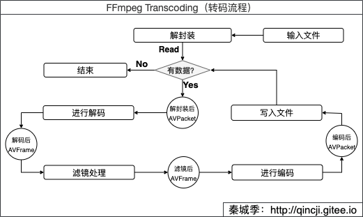

#Transcode(转码)

本文基于官方例子：`doc/examples/transcoding.c` 。

##流程



其中，AVFormatContext、AVPacket等重要的结构体请看：[FFmpeg重要结构体](./06_struct.md) 。

##与[FFmpeg 简单实现转码](http://localhost:4000/2021/01/08/ffmpeg/13_transfer/) 差异性如下：

###1.增加Filter（滤镜）处理
具体请看[Filter和SDL（Video）](./14_filter_v.md) 和 [Filter和SDL（Audio）](./15_filter_a.md)

###2.优化SwrContext（重采样）处理
关键理解是这一段：
```c
//1.swr_get_out_samples
if (swr_get_out_samples(swr_ctx, 0) >= enc_ctx->frame_size) {//当上次缓存足够时，取缓存
    //2.swr_convert
    if ((ret = swr_convert(swr_ctx, reasampling_frame->data, enc_ctx->frame_size, NULL, 0)) < 0) {
        fprintf(stderr, "resampling cache failed\n");
        goto end;
    }
    fprintf(stdout, "resampling cache\n");
} else {
    //进行重采样 //3.swr_convert
    if ((ret = swr_convert(swr_ctx, reasampling_frame->data, enc_ctx->frame_size,
                           (const uint8_t **) filt_frame->data,
                           filt_frame->nb_samples)) < 0) {
        fprintf(stderr, "resampling data failed\n");
        goto end;
    }
}
```
- 1. `swr_get_out_samples` 含义：获取当前采样缓存的大小。
- 2. `swr_convert` 含义：从采样缓存中采样`enc_ctx->frame_size`个长度数据到`reasampling_frame->data`中。
- 3. `swr_convert` 含义：从有个`filt_frame->nb_samples`数据的`filt_frame->data`中采样`enc_ctx->frame_size`个长度数据到`reasampling_frame->data`中。

###3.增加AVAudioFifo缓存处理
主要有三个方法`av_audio_fifo_size` 、 `av_audio_fifo_write` 和`av_audio_fifo_read` ，详细见代码。

###4.视频和音频同步
- 1. 创建流时(`avformat_new_stream`)，初始化时间基`out_stream->time_base = enc_ctx->time_base` 。
- 2. 送去**解码前**，需要重新计算pts、dts和duration，代码如下：
```c
av_packet_rescale_ts(de_pkt,
     ifmt_ctx->streams[stream_index]->time_base,
     ifmt_ctx->streams[stream_index]->codec->time_base);
```
- 3. 送去**编码前**，计算pts、dts和duration，代码如下：
```c
av_packet_rescale_ts(enc_pkt,
     ofmt_ctx->streams[stream_index]->codec->time_base,
     ofmt_ctx->streams[stream_index]->time_base);
```
- 4. 注意：当音频编码器的`frame_size`和需要被编码的`AVFrame`中的`nb_samples` 大小不相等时，需要使用重采样或使用AVAudioFifo缓存，使得`frame_size == nb_samples`后再送去编码，这种情况会导致pts、dts和duration的值与其他帧相同问题。
```c
if (stream_index == AVMEDIA_TYPE_AUDIO && filt_frame->nb_samples != enc_ctx->frame_size){
    ......
}
```

##代码实现
```c
/**
 * @author 秦城季
 * @email xhunmon@126.com
 * @Blog https://qincji.gitee.io
 * @date 2021/01/12
 * description: 来着官方例子：doc/examples/transcoding.c
 * <br>
 */

extern "C" {
#include <libavcodec/avcodec.h>
#include <libavformat/avformat.h>
#include <libavfilter/buffersink.h>
#include <libavfilter/buffersrc.h>
#include <libavutil/opt.h>
#include <libavutil/pixdesc.h>
#include <libswresample/swresample.h>
#include "libavutil/audio_fifo.h"
}

//将每一组滤镜组合放到一起，filter_stm[i]和ifmt_ctx->streams[i]下标保持一致，表示对音频或者视频的滤镜
typedef struct FilterStream {
    AVFilterContext *buffersink_ctx;
    AVFilterContext *buffersrc_ctx;
    AVFilterGraph *filter_graph;
} FilterStream;

static FilterStream *filter_stm;
static AVFormatContext *ifmt_ctx;
static AVFormatContext *ofmt_ctx;
static int audio_index, video_index;
static SwrContext *swr_ctx;//音频：当有需要时，需要重采样
static int64_t resample_pos = 0;//重采样时，会有缓存，这时候要另外计算dts和pts
static AVAudioFifo *fifo = NULL;;//重采样时，如果输入nb_sample比输出的nb_sample小时，需要缓存


int open_input_file(const char *in_filename) {
    int ret = -1, i;
    /**（解封装 1.1）：创建并初始化AVFormatContext*/
    if (avformat_open_input(&ifmt_ctx, in_filename, NULL, NULL) < 0) {
        fprintf(stderr, "Could not open source file %s\n", in_filename);
        goto end;
    }
    /**（解封装 1.2）：检索流信息，这个过程会检查输入流中信息是否存在异常*/
    if (avformat_find_stream_info(ifmt_ctx, NULL) < 0) {
        fprintf(stderr, "Could not find stream information\n");
        goto end;
    }

    for (i = 0; i < ifmt_ctx->nb_streams; i++) {
        AVStream *stream = ifmt_ctx->streams[i];
        AVCodec *dec;
        AVCodecContext *dec_ctx;
        //dec_ctx = stream->codec; //-->通过这种形式获取的解码器上下文已过时
        /**（解码 2.1）：查找解码器(AVCodec)*/
        if (!(dec = avcodec_find_decoder(stream->codecpar->codec_id))) {
            fprintf(stderr, "Failed to find decoder for stream #%u\n", i);
            ret = AVERROR_DECODER_NOT_FOUND;
            goto end;
        }
        /**（解码 2.2）：通过解码器(AVCodec)生成解码器上下文(AVCodecContext)*/
        if (!(dec_ctx = avcodec_alloc_context3(dec))) {
            fprintf(stderr, "Failed to allocate the decoder context for stream #%u\n", i);
            ret = AVERROR(ENOMEM);
            goto end;
        }
        /**（解码 2.3）：将AVCodecParameters参数赋值给AVCodecContext*/
        if ((ret = avcodec_parameters_to_context(dec_ctx, stream->codecpar)) < 0) {
            fprintf(stderr, "Failed to copy decoder parameters to input decoder context for stream #%u\n", i);
            goto end;
        }
        /* Reencode video & audio and remux subtitles etc. */
        if (dec_ctx->codec_type == AVMEDIA_TYPE_VIDEO || dec_ctx->codec_type == AVMEDIA_TYPE_AUDIO) {
            if (dec_ctx->codec_type == AVMEDIA_TYPE_VIDEO) {
                dec_ctx->framerate = av_guess_frame_rate(ifmt_ctx, stream, NULL);
                video_index = i;
            } else if (dec_ctx->codec_type == AVMEDIA_TYPE_AUDIO) {
                audio_index = i;
            }
            /**（解码 2.4）：初始化码器器上下文*/
            if ((ret = avcodec_open2(dec_ctx, dec, NULL)) < 0) {
                fprintf(stderr, "Failed to open decoder for stream #%u\n", i);
                goto end;
            }
        }

        //替换掉原来的，后面可以直接取了
        stream->codec = dec_ctx;
    }
    //打印输出日志
//    fprintf(stderr, "---------------------------ifmt_ctx----------------\n");
//    av_dump_format(ifmt_ctx, 0, in_filename, 0);
    ret = 0;
    end:
    return ret;
}

int open_output_file(const char *out_filename) {
    int ret = -1, i;
    AVStream *out_stream, *in_stream;
    AVCodecContext *dec_ctx, *enc_ctx;
    AVCodec *encoder;
    AVCodecID encodec_id;
    /**（封装 4.1）：根据文件格式初始化封装器上下文AVFormatContext*/
    avformat_alloc_output_context2(&ofmt_ctx, NULL, NULL, out_filename);
    if (!ofmt_ctx) {
        fprintf(stderr, "Could not create output context\n");
        ret = AVERROR_UNKNOWN;
        goto end;
    }
    for (i = 0; i < ifmt_ctx->nb_streams; i++) {
        /**（封装 4.2）：创建输出视频和音频AVStream*/
        if (!(out_stream = avformat_new_stream(ofmt_ctx, NULL))) {
            fprintf(stderr, "Failed allocating output stream\n");
            ret = AVERROR_UNKNOWN;
            goto end;
        }
        out_stream->codecpar->codec_tag = 0;
        in_stream = ifmt_ctx->streams[i];
        dec_ctx = in_stream->codec;

        if (dec_ctx->codec_type == AVMEDIA_TYPE_VIDEO
            || dec_ctx->codec_type == AVMEDIA_TYPE_AUDIO) {
            if (dec_ctx->codec_type == AVMEDIA_TYPE_VIDEO) {
                encodec_id = ofmt_ctx->oformat->video_codec;
            } else if (dec_ctx->codec_type == AVMEDIA_TYPE_AUDIO) {
                encodec_id = ofmt_ctx->oformat->audio_codec;
            }
            /* in this example, we choose transcoding to same codec */
            /**（编码 3.1）：获取对应的编码器AVCodec*/
            if (!(encoder = avcodec_find_encoder(encodec_id))) {
                fprintf(stderr, "Necessary encoder not found\n");
                ret = AVERROR_INVALIDDATA;
                goto end;
            }
            /**（编码 3.2）：通过编码器(AVCodec)获取编码器上下文(AVCodecContext)*/
            if (!(enc_ctx = avcodec_alloc_context3(encoder))) {
                fprintf(stderr, "Failed to allocate the encoder context\n");
                ret = AVERROR(ENOMEM);
                goto end;
            }

            /**给编码器初始化信息*/
            /* In this example, we transcode to same properties (picture size,
             * sample rate etc.). These properties can be changed for output
             * streams easily using filters */
            if (dec_ctx->codec_type == AVMEDIA_TYPE_VIDEO) {
                enc_ctx->height = dec_ctx->height;
                enc_ctx->width = dec_ctx->width;
                enc_ctx->sample_aspect_ratio = dec_ctx->sample_aspect_ratio;
                //take first format from list of supported formats
                if (encoder->pix_fmts)
                    enc_ctx->pix_fmt = encoder->pix_fmts[0];
                else
                    enc_ctx->pix_fmt = dec_ctx->pix_fmt;
                //video time_base can be set to whatever is handy and supported by encoder
                enc_ctx->time_base = dec_ctx->time_base;
                enc_ctx->has_b_frames = dec_ctx->has_b_frames;
                //输出将相对于输入延迟max_b_frames + 1-->但是输入的为0！
                //enc_ctx->max_b_frames = dec_ctx->max_b_frames + 1;
                enc_ctx->max_b_frames = 2;
                enc_ctx->bit_rate = dec_ctx->bit_rate;
                enc_ctx->codec_type = dec_ctx->codec_type;
                //不支持B帧
                if (enc_ctx->max_b_frames &&
                    enc_ctx->codec_id != AV_CODEC_ID_MPEG4 &&
                    enc_ctx->codec_id != AV_CODEC_ID_MPEG1VIDEO &&
                    enc_ctx->codec_id != AV_CODEC_ID_MPEG2VIDEO) {
                    enc_ctx->has_b_frames = 0;
                    enc_ctx->max_b_frames = 0;
                }
            } else {
                enc_ctx->sample_rate = dec_ctx->sample_rate;
                enc_ctx->channel_layout = dec_ctx->channel_layout;
                enc_ctx->channels = av_get_channel_layout_nb_channels(dec_ctx->channel_layout);
                enc_ctx->sample_fmt = encoder->sample_fmts[0];
                enc_ctx->time_base = {1, enc_ctx->sample_rate};
                enc_ctx->bit_rate = dec_ctx->bit_rate;
                enc_ctx->codec_type = dec_ctx->codec_type;
            }

            if (ofmt_ctx->oformat->flags & AVFMT_GLOBALHEADER)
                enc_ctx->flags |= AV_CODEC_FLAG_GLOBAL_HEADER;

            /**（编码 3.3）：*/
            /* Third parameter can be used to pass settings to encoder */
            if ((ret = avcodec_open2(enc_ctx, encoder, NULL)) < 0) {
                fprintf(stderr, "Cannot open video encoder for stream #%u\n", i);
                goto end;
            }

            /**（编码 3.4）：*/
            if ((ret = avcodec_parameters_from_context(out_stream->codecpar, enc_ctx)) < 0) {
                fprintf(stderr, "Failed to copy encoder parameters to output stream #%u\n", i);
                goto end;
            }

            out_stream->time_base = enc_ctx->time_base;
            //替换掉旧的
            out_stream->codec = enc_ctx;
        } else if (dec_ctx->codec_type == AVMEDIA_TYPE_UNKNOWN) {
            fprintf(stderr, "Elementary stream #%d is of unknown type, cannot proceed\n", i);
            ret = AVERROR_INVALIDDATA;
            goto end;
        } else {
            /* if this stream must be remuxed */
            if ((ret = avcodec_parameters_copy(out_stream->codecpar, in_stream->codecpar)) < 0) {
                fprintf(stderr, "Copying parameters for stream #%u failed\n", i);
                goto end;
            }
            out_stream->time_base = in_stream->time_base;
        }

    }

    //打印输出日志
//    fprintf(stderr, "---------------------------ofmt_ctx----------------\n");
//    av_dump_format(ofmt_ctx, 0, out_filename, 1);

    /**（封装 4.4）：初始化AVIOContext*/
    if (!(ofmt_ctx->oformat->flags & AVFMT_NOFILE)) { ;
        if ((ret = avio_open(&ofmt_ctx->pb, out_filename, AVIO_FLAG_WRITE)) < 0) {
            fprintf(stderr, "Could not open output file '%s'", out_filename);
            goto end;
        }
    }

    /**（封装 4.5）：写入文件头*/
    /* init muxer, write output file header */
    if ((ret = avformat_write_header(ofmt_ctx, NULL)) < 0) {
        fprintf(stderr, "Error occurred when opening output file\n");
        goto end;
    }
    ret = 0;
    end:
    return ret;
}

int init_resampling() {
    AVCodecContext *dec_ctx_audio = ifmt_ctx->streams[audio_index]->codec;
    AVCodecContext *enc_ctx_audio = ofmt_ctx->streams[audio_index]->codec;
    int ret = -1;
    /**（重采样 5.1）：申请内存*/
    if (!(swr_ctx = swr_alloc())) {
        fprintf(stderr, "Could not allocate resampler context\n");
        return ret;
    }

    /**（重采样 5.2）：设置参数*/
    av_opt_set_int(swr_ctx, "in_channel_count", dec_ctx_audio->channels, 0);
    av_opt_set_int(swr_ctx, "in_sample_rate", dec_ctx_audio->sample_rate, 0);
    av_opt_set_sample_fmt(swr_ctx, "in_sample_fmt", dec_ctx_audio->sample_fmt, 0);
    av_opt_set_int(swr_ctx, "out_channel_count", enc_ctx_audio->channels, 0);
    av_opt_set_int(swr_ctx, "out_sample_rate", enc_ctx_audio->sample_rate, 0);
    av_opt_set_sample_fmt(swr_ctx, "out_sample_fmt", enc_ctx_audio->sample_fmt, 0);

    /**（重采样 5.3）：初始化SwrContext*/
    if ((ret = swr_init(swr_ctx)) < 0) {
        fprintf(stderr, "Failed to initialize the resampling context\n");
        return ret;
    }
    return 0;
}

int init_filter(FilterStream *fctx, AVCodecContext *dec_ctx, AVCodecContext *enc_ctx, const char *filter_spec) {
    char args[512];
    int ret = 0;
    const AVFilter *buffersrc = NULL;
    const AVFilter *buffersink = NULL;
    AVFilterContext *buffersrc_ctx = NULL;
    AVFilterContext *buffersink_ctx = NULL;
    AVFilterInOut *outputs = avfilter_inout_alloc();
    AVFilterInOut *inputs = avfilter_inout_alloc();
    AVFilterGraph *filter_graph = avfilter_graph_alloc();

    if (!outputs || !inputs || !filter_graph) {
        ret = AVERROR(ENOMEM);
        fprintf(stderr, "Filter alloc failed\n");
        goto end;
    }

    if (dec_ctx->codec_type == AVMEDIA_TYPE_VIDEO) {
        /**（滤镜 6.1）：获取输入和输出滤镜器【同音频】*/
        buffersrc = avfilter_get_by_name("buffer");
        buffersink = avfilter_get_by_name("buffersink");
        if (!buffersrc || !buffersink) {
            fprintf(stderr, "filtering source or sink element not found\n");
            ret = AVERROR_UNKNOWN;
            goto end;
        }

        snprintf(args, sizeof(args),
                 "video_size=%dx%d:pix_fmt=%d:time_base=%d/%d:pixel_aspect=%d/%d",
                 dec_ctx->width, dec_ctx->height, dec_ctx->pix_fmt,
                 dec_ctx->time_base.num, dec_ctx->time_base.den,
                 dec_ctx->sample_aspect_ratio.num,
                 dec_ctx->sample_aspect_ratio.den);
        /**（滤镜 6.2）：创建和初始化输入和输出过滤器实例并将其添加到现有图形中*/
        if ((ret = avfilter_graph_create_filter(&buffersrc_ctx, buffersrc, "in", args, NULL, filter_graph)) < 0) {
            fprintf(stderr, "Cannot create buffer source\n");
            goto end;
        }
        if ((ret = avfilter_graph_create_filter(&buffersink_ctx, buffersink, "out", NULL, NULL, filter_graph)) < 0) {
            fprintf(stderr, "Cannot create buffer sink\n");
            goto end;
        }
        /**（滤镜 6.3）：给【输出】滤镜器上下文设置参数*/
        //如：val = {AV_PIX_FMT_YUV420P, AV_PIX_FMT_NONE};//注意输入的格式类型 val[0]
        ret = av_opt_set_bin(buffersink_ctx, "pix_fmts",
                             (uint8_t *) &enc_ctx->pix_fmt, sizeof(enc_ctx->pix_fmt),
                             AV_OPT_SEARCH_CHILDREN);
        if (ret < 0) {
            fprintf(stderr, "Cannot set output pixel format\n");
            goto end;
        }
    } else if (dec_ctx->codec_type == AVMEDIA_TYPE_AUDIO) {
        buffersrc = avfilter_get_by_name("abuffer");//名称比视频的前面多一个a
        buffersink = avfilter_get_by_name("abuffersink");
        if (!buffersrc || !buffersink) {
            fprintf(stderr, "filtering source or sink element not found\n");
            ret = AVERROR_UNKNOWN;
            goto end;
        }

        if (!dec_ctx->channel_layout)
            dec_ctx->channel_layout = av_get_default_channel_layout(dec_ctx->channels);
        snprintf(args, sizeof(args),
                 "time_base=%d/%d:sample_rate=%d:sample_fmt=%s:channel_layout=0x%lld",
                 dec_ctx->time_base.num, dec_ctx->time_base.den, dec_ctx->sample_rate,
                 av_get_sample_fmt_name(dec_ctx->sample_fmt),
                 dec_ctx->channel_layout);

        if ((ret = avfilter_graph_create_filter(&buffersrc_ctx, buffersrc, "in", args, NULL, filter_graph)) < 0) {
            fprintf(stderr, "Cannot create audio buffer source\n");
            goto end;
        }

        if ((ret = avfilter_graph_create_filter(&buffersink_ctx, buffersink, "out", NULL, NULL, filter_graph)) < 0) {
            fprintf(stderr, "Cannot create audio buffer sink\n");
            goto end;
        }

        if ((ret = av_opt_set_bin(buffersink_ctx, "sample_fmts",
                                  (uint8_t *) &enc_ctx->sample_fmt, sizeof(enc_ctx->sample_fmt),
                                  AV_OPT_SEARCH_CHILDREN)) < 0) {
            fprintf(stderr, "Cannot set output sample format\n");
            goto end;
        }

        if ((ret = av_opt_set_bin(buffersink_ctx, "channel_layouts",
                                  (uint8_t *) &enc_ctx->channel_layout, sizeof(enc_ctx->channel_layout),
                                  AV_OPT_SEARCH_CHILDREN)) < 0) {
            fprintf(stderr, "Cannot set output channel layout\n");
            goto end;
        }

        if ((ret = av_opt_set_bin(buffersink_ctx, "sample_rates",
                                  (uint8_t *) &enc_ctx->sample_rate, sizeof(enc_ctx->sample_rate),
                                  AV_OPT_SEARCH_CHILDREN)) < 0) {
            fprintf(stderr, "Cannot set output sample rate\n");
            goto end;
        }
    } else {
        ret = AVERROR_UNKNOWN;
        fprintf(stderr, "Filter input unknown stream\n");
        goto end;
    }

    //绑定关系 in ——> buffersrc_ctx
    /* Endpoints for the filter graph. */
    outputs->name = av_strdup("in");
    outputs->filter_ctx = buffersrc_ctx;
    outputs->pad_idx = 0;
    outputs->next = NULL;

    //绑定关系 out ——> buffersink_ctx
    inputs->name = av_strdup("out");
    inputs->filter_ctx = buffersink_ctx;
    inputs->pad_idx = 0;
    inputs->next = NULL;

    if (!outputs->name || !inputs->name) {
        ret = AVERROR(ENOMEM);
        fprintf(stderr, "Filter av_strdup name failed\n");
        goto end;
    }

    /**（滤镜 6.4）：将字符串描述的图形添加到图形中*/
    if ((ret = avfilter_graph_parse_ptr(filter_graph, filter_spec, &inputs, &outputs, NULL)) < 0) {
        fprintf(stderr, "Filter avfilter_graph_parse_ptr failed\n");
        goto end;
    }

    /**（滤镜 6.5）：检查AVFilterGraph有效性*/
    if ((ret = avfilter_graph_config(filter_graph, NULL)) < 0) {
        fprintf(stderr, "Filter avfilter_graph_config failed\n");
        goto end;
    }

    /* Fill FilteringContext */
    fctx->buffersrc_ctx = buffersrc_ctx;
    fctx->buffersink_ctx = buffersink_ctx;
    fctx->filter_graph = filter_graph;

    end:
    avfilter_inout_free(&inputs);
    avfilter_inout_free(&outputs);

    return ret;
}


int init_filters() {
    const char *filter_spec;
    unsigned int i;
    int ret;
    filter_stm = (FilterStream *) (av_malloc_array(ifmt_ctx->nb_streams, sizeof(*filter_stm)));
    if (!filter_stm)
        return AVERROR(ENOMEM);

    //这里会根据音频和视频的stream_index创建对应的filter_stm组
    for (i = 0; i < ifmt_ctx->nb_streams; i++) {
        filter_stm[i].buffersrc_ctx = NULL;
        filter_stm[i].buffersink_ctx = NULL;
        filter_stm[i].filter_graph = NULL;
        if (!(ifmt_ctx->streams[i]->codecpar->codec_type == AVMEDIA_TYPE_AUDIO
              || ifmt_ctx->streams[i]->codecpar->codec_type == AVMEDIA_TYPE_VIDEO))
            continue;

        if (ifmt_ctx->streams[i]->codecpar->codec_type == AVMEDIA_TYPE_VIDEO)
            filter_spec = "null"; /* passthrough (dummy) filter for video */
//            filter_spec = "scale=iw/2:ih/2[in_tmp];[in_tmp]split=4[in_1][in_2][in_3][in_4];[in_1]pad=iw*2:ih*2[a];[a][in_2]overlay=w[b];[b][in_3]overlay=0:h[d];[d][in_4]overlay=w:h[out]"; /* passthrough (dummy) filter for video */
        else
            filter_spec = "anull"; /* passthrough (dummy) filter for audio */
//            filter_spec = "aecho=0.8:0.88:60:0.4"; /* passthrough (dummy) filter for audio */
        ret = init_filter(&filter_stm[i], ifmt_ctx->streams[i]->codec, ofmt_ctx->streams[i]->codec, filter_spec);
        if (ret)
            return ret;
    }
    return 0;
}

int encode_write_frame(AVFrame *filt_frame, unsigned int stream_index) {
    int ret = -1;
    AVFrame *reasampling_frame;
    AVPacket *enc_pkt = av_packet_alloc();
    AVCodecContext *enc_ctx = ofmt_ctx->streams[stream_index]->codec;

    /* encode filtered frame */
    enc_pkt->data = NULL;
    enc_pkt->size = 0;
    av_init_packet(enc_pkt);

    if (!filt_frame) {//刷新缓存
        fprintf(stderr, "filt_frame is null , flush encode ?\n");
        avcodec_send_frame(enc_ctx, NULL);
        ret = 0;
        goto end;
    }

    //音频的这种情况需要重采样再进行输出
    if (stream_index == AVMEDIA_TYPE_AUDIO && filt_frame->nb_samples != enc_ctx->frame_size) {
        //输入的比输出的还小；参考官方例子：doc/examples/transcode_aac.c
        if (filt_frame->nb_samples < enc_ctx->frame_size) {
            /* Make the FIFO as large as it needs to be to hold both,
            * the old and the new samples. */
            /*if ((ret = av_audio_fifo_realloc(fifo, av_audio_fifo_size(fifo) + filt_frame->nb_samples)) < 0) {
                fprintf(stderr, "Could not reallocate FIFO\n");
                goto end;
            }*/
            /* Store the new samples in the FIFO buffer. */
            int buf_size = av_audio_fifo_write(fifo, (void **) filt_frame->data,
                                               filt_frame->nb_samples);
            if (buf_size < filt_frame->nb_samples) {
                fprintf(stderr, "Could not write data to FIFO\n");
                ret = AVERROR_EXIT;
                goto end;
            }

            //这一次还不够转换
            int new_size = av_audio_fifo_size(fifo);
            if (new_size < enc_ctx->frame_size) {
                ret = 0;
                goto end;
            }
        }

        if (!(reasampling_frame = av_frame_alloc())) {
            fprintf(stderr, "Could not allocate oframe_a\n");
            ret = -1;
            goto end;
        }

        //把filt_frame参数复制给reasampling_frame
        if ((ret = av_frame_copy_props(reasampling_frame, filt_frame)) < 0) {
            fprintf(stderr, "copy filter frame failed\n");
            goto end;
        }

        //需要改变的
        reasampling_frame->format = enc_ctx->sample_fmt;
        reasampling_frame->channel_layout = enc_ctx->channel_layout;
        reasampling_frame->channels = enc_ctx->channels;
        reasampling_frame->sample_rate = enc_ctx->sample_rate;
        reasampling_frame->nb_samples = enc_ctx->frame_size;

        if ((ret = av_frame_get_buffer(reasampling_frame, 0)) < 0) {
            fprintf(stderr, "Error allocating an oframe_a buffer\n");
            goto end;
        }


        //这是处理fifo缓存数据
        if (filt_frame->nb_samples < enc_ctx->frame_size) {
            if (av_audio_fifo_read(fifo, (void **) reasampling_frame->data, reasampling_frame->nb_samples) <
                    reasampling_frame->nb_samples) {
                fprintf(stderr, "Could not read data from FIFO\n");
//                    av_frame_free(&output_frame);
                ret = AVERROR_EXIT;
                goto end;
            }
            fprintf(stdout, "deal fifo\n");
        } else {
            /**（重采样 5.4）：重新采样*/
            if (swr_get_out_samples(swr_ctx, 0) >= enc_ctx->frame_size) {//当上次缓存足够时，取缓存
                if ((ret = swr_convert(swr_ctx, reasampling_frame->data, enc_ctx->frame_size, NULL, 0)) < 0) {
                    fprintf(stderr, "resampling cache failed\n");
                    goto end;
                }
                fprintf(stdout, "resampling cache\n");
            } else {
                //进行重采样
                if ((ret = swr_convert(swr_ctx, reasampling_frame->data, enc_ctx->frame_size,
                                       (const uint8_t **) filt_frame->data,
                                       filt_frame->nb_samples)) < 0) {
                    fprintf(stderr, "resampling data failed\n");
                    goto end;
                }
            }
        }

        //当解码的帧数与送去编码的帧数有差别时，我们必须更改pts和dts的值，否者封装时av_packet_rescale_ts（计算）pts和dts有重复，会出问题
        if(filt_frame->nb_samples != enc_ctx->frame_size){
            resample_pos += enc_ctx->frame_size;
            //编码前重新给pts和dts赋值
            reasampling_frame->pts = resample_pos;
            reasampling_frame->pkt_dts = resample_pos;
        }

        /**（编码 3.5）：把滤镜处理后的AVFrame送去编码*/
        ret = avcodec_send_frame(enc_ctx, reasampling_frame);
    } else {
        /**（编码 3.5）：把滤镜处理后的AVFrame送去编码*/
        ret = avcodec_send_frame(enc_ctx, filt_frame);
    }


    if (ret < 0) {
        fprintf(stderr, "Error sending the iframe to the encoder 2\n");
        goto end;
    }

    while (ret >= 0) {
        /**（编码 3.6）：从编码器中得到编码后数据，放入AVPacket中*/
        ret = avcodec_receive_packet(enc_ctx, enc_pkt);
        if (ret == AVERROR(EAGAIN) || ret == AVERROR_EOF)//本次的ret只针对本循环，对外部为正常
            break;
        else if (ret < 0) {
            fprintf(stderr, "Error encoding iframe\n");
            goto end;
        }
        printf("write1 %s Packet. size:%5d\tdts:%5lld\tpts:%5lld\tduration:%5lld\tcur_dts:%5lld\n",
               stream_index == AVMEDIA_TYPE_AUDIO ? "a>>>>>" : "v-----",
               enc_pkt->size,  enc_pkt->dts, enc_pkt->pts, enc_pkt->duration,
               ofmt_ctx->streams[stream_index]->cur_dts);
        //设置pts等信息
        /* prepare packet for muxing */
        enc_pkt->stream_index = stream_index;
        av_packet_rescale_ts(enc_pkt,
                             ofmt_ctx->streams[stream_index]->codec->time_base,
                             ofmt_ctx->streams[stream_index]->time_base);
        enc_pkt->pos = -1;

        printf("write2 %s Packet. size:%5d\tdts:%5lld\tpts:%5lld\tduration:%5lld\tcur_dts:%5lld\n",
               stream_index == AVMEDIA_TYPE_AUDIO ? "a>>>>>" : "v-----",
               enc_pkt->size,  enc_pkt->dts, enc_pkt->pts, enc_pkt->duration,
               ofmt_ctx->streams[stream_index]->cur_dts);

        /**（封装 4.6）：将编码后的数据AVPacket进行封装，写入到文件*/
        if ((ret = av_interleaved_write_frame(ofmt_ctx, enc_pkt)) < 0) {
            fprintf(stderr, "Error muxer write to packet\n");
            goto end;
        }
        //擦除数据
        av_packet_unref(enc_pkt);
    }

    //当重采样缓存足够时，需要再次重采样，然后送去编码
    if (stream_index == AVMEDIA_TYPE_AUDIO && filt_frame->nb_samples != enc_ctx->frame_size) {
        if (swr_get_out_samples(swr_ctx, 0) >= enc_ctx->frame_size) {
            encode_write_frame(filt_frame, stream_index);
        }
    }
    ret = 0;
    end:
    av_packet_free(&enc_pkt);
    return ret;
}

int filter_encode_write_frame(AVFrame *de_frame, unsigned int stream_index) {
    int ret;
    AVFrame *filt_frame = NULL;

    /**（滤镜 6.6）：将解码后的AVFrame送去filtergraph进行滤镜处理*/
    if ((ret = av_buffersrc_add_frame_flags(filter_stm[stream_index].buffersrc_ctx, de_frame,
                                            AV_BUFFERSRC_FLAG_KEEP_REF)) < 0) {
        fprintf(stderr, "Error while feeding the filtergraph\n");
        return ret;
    }

    /* pull filtered frames from the filtergraph */
    while (1) {
        if (!(filt_frame = av_frame_alloc())) {
            ret = AVERROR(ENOMEM);
            fprintf(stderr, "allow filter frame failed\n");
            goto end;
        }
        /**（滤镜 6.7）：得到滤镜处理后的数据*/
        ret = av_buffersink_get_frame(filter_stm[stream_index].buffersink_ctx,
                                      filt_frame);
        if (ret < 0) {
            /* if no more frames for output - returns AVERROR(EAGAIN)
             * if flushed and no more frames for output - returns AVERROR_EOF
             * rewrite retcode to 0 to show it as normal procedure completion
             */
            if (ret == AVERROR(EAGAIN) || ret == AVERROR_EOF)
                ret = 0;
            break;
        }

        filt_frame->pict_type = AV_PICTURE_TYPE_NONE;
        //然后把滤镜处理后的数据重新进行编码成你想要的格式，再封装输出
        if ((ret = encode_write_frame(filt_frame, stream_index)) < 0)
            break;
    }
    av_frame_free(&filt_frame);
    end:
    return ret;
}


int main(int argc, char **argv) {
//    const char *in_filename = "source/Kobe.flv";
//    const char *out_filename = "output/Kobe.avi";
//    const char *in_filename = "source/lol.mp4";
//    const char *out_filename = "output/lol.avi";
    const char *in_filename = "source/心灵奇旅.mkv";
    const char *out_filename = "output/心灵奇旅.avi";
    remove(out_filename);

    int ret, i = -1;
    AVPacket *de_pkt = av_packet_alloc();
    AVFrame *de_frame = NULL;
    unsigned int stream_index;

    if ((ret = open_input_file(in_filename)) < 0)
        goto end;
    if ((ret = open_output_file(out_filename)) < 0)
        goto end;
    if ((ret = init_resampling()) < 0)
        goto end;
    if ((ret = init_filters()) < 0)
        goto end;
    if (!(fifo = av_audio_fifo_alloc(ofmt_ctx->streams[audio_index]->codec->sample_fmt,
                                     ofmt_ctx->streams[audio_index]->codec->channels,
                                     ofmt_ctx->streams[audio_index]->codec->frame_size * 2))) {
        fprintf(stderr, "Could not allocate FIFO\n");
        ret = AVERROR(ENOMEM);
        goto end;
    }

    while (1) {
        /**（解封装 1.3）：读取解封装后数据到AVPacket中*/
        if ((ret = av_read_frame(ifmt_ctx, de_pkt)) < 0)
            break;
        stream_index = de_pkt->stream_index;
        if (!(de_frame = av_frame_alloc())) {
            ret = AVERROR(ENOMEM);
            fprintf(stderr, "Error alloc frame\n");
            goto end;
        }

        //注意：av_packet_rescale_ts 在解码前重新计算pts、dts和duration的值，需要与编码时对应起来，防止视频和音频出现不同步
        // 注意传入的参数！AVStream和AVCodecContext的时间基。而我的AVCodecContext是通过生成的，并非原来的初始化时的。
        av_packet_rescale_ts(de_pkt,
                             ifmt_ctx->streams[stream_index]->time_base,
                             ifmt_ctx->streams[stream_index]->codec->time_base);
        /**（解码 2.5）：把AVPacket送去解码*/
        /* read all the output frames (in general there may be any number of them */
        if ((ret = avcodec_send_packet(ifmt_ctx->streams[stream_index]->codec, de_pkt)) < 0) {
            fprintf(stderr, "Error submitting the packet to the decoder\n");
            goto end;
        }
        while (ret >= 0) {
            /**（解码 2.6）：从解码器获取解码后的数据到AVFrame*/
            ret = avcodec_receive_frame(ifmt_ctx->streams[stream_index]->codec, de_frame);
            if (ret == AVERROR(EAGAIN) || ret == AVERROR_EOF) {
                break;
            } else if (ret < 0) {
                fprintf(stderr, "Error during decoding\n");
                goto end;
            }

            de_frame->pts = de_frame->best_effort_timestamp;
            //这是解码后的裸数据，如果可以对其进行滤镜处理
            ret = filter_encode_write_frame(de_frame, stream_index);
//            ret = encode_write_frame(de_frame, stream_index);
            if (ret < 0)
                goto end;
            av_frame_unref(de_frame);
        }
        av_packet_unref(de_pkt);
    }

    /* flush the decoder and encoder*/
    for (i = 0; i < ifmt_ctx->nb_streams; i++) {
        avcodec_send_packet(ifmt_ctx->streams[i]->codec, NULL);
        avcodec_send_frame(ofmt_ctx->streams[i]->codec, NULL);
    }


    fprintf(stdout, "write the trailer\n");
    /**（封装 4.7）：写入文件尾*/
    av_write_trailer(ofmt_ctx);
    end:
    av_packet_free(&de_pkt);
    av_frame_free(&de_frame);
    for (i = 0; i < ifmt_ctx->nb_streams; i++) {
        avcodec_free_context(&ifmt_ctx->streams[i]->codec);
        if (ofmt_ctx && ofmt_ctx->nb_streams > i && ofmt_ctx->streams[i] && ofmt_ctx->streams[i]->codec)
            avcodec_free_context(&ofmt_ctx->streams[i]->codec);
        if (filter_stm && filter_stm[i].filter_graph)
            avfilter_graph_free(&filter_stm[i].filter_graph);
    }
    av_free(filter_stm);
    avformat_close_input(&ifmt_ctx);
    if (ofmt_ctx && !(ofmt_ctx->oformat->flags & AVFMT_NOFILE))
        avio_closep(&ofmt_ctx->pb);
    avformat_free_context(ofmt_ctx);
    if (fifo)
        av_audio_fifo_free(fifo);
    if (ret < 0)
        av_log(NULL, AV_LOG_ERROR, "Error occurred: %s\n", av_err2str(ret));

    return ret ? 1 : 0;
}
```

##[测试文件下载地址](../MustRead/img/01_flv/Kobe.flv)