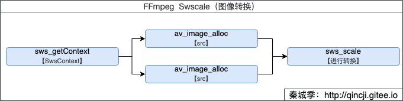

#Swscale（图像转换）

本文对应官方例子：`doc/examples/scaling_video.c`。

## FFmpeg图像转换流程



只有三个简单的函数就可以实现了，而在[FFmpeg Transcode(转码)](./16_transcode.md) 中的应用就是对应着处理音频重采样的地方。重采样是对解码后的裸流数据（AVFrame中的data）进行格式转换等，而图像转换则是视频对解码后的裸流数据（AVFrame中的data）进行格式转换。

## libswscale库
该库就是对图片转换等处理，提供了高级别的图像转换API，例如它允许进行图像缩放和像素格式转换等大量；根音频对应的处理库是`swresample`，它允许操作音频采样、音频通道布局转换与布局调整等。

我们平常也可以通过学习这些源码，来理解这些格式；也可以把里面的函数实现拷贝出来当做自己常规处理的工具。

## 代码例子

```c
/**
 * @author 秦城季
 * @email xhunmon@126.com
 * @Blog https://qincji.gitee.io
 * @date 2021/01/18
 * description: 来着官方例子：doc/examples/transcoding.c
 * <br>
 */

#define __STDC_CONSTANT_MACROS
extern "C" {
#include <libavutil/imgutils.h>
#include <libavutil/parseutils.h>
#include <libswscale/swscale.h>
}

int main(int argc, char **argv) {
    uint8_t *src_data[4], *dst_data[4];
    int src_linesize[4], dst_linesize[4];
    //384x216
    int src_w = 384, src_h = 216, dst_w = src_w, dst_h = src_h;
    enum AVPixelFormat src_pix_fmt = AV_PIX_FMT_YUV420P, dst_pix_fmt = AV_PIX_FMT_YUV444P;
    const char *dst_filename = NULL, *src_filename = NULL;
    FILE *dst_file, *src_file;
    struct SwsContext *sws_ctx;
    int i, ret;

    //输入文件从上几篇文章中的Kobe.flv解码而来的yuv420p数据
    src_filename = "source/Kobe-384x216-yuv420p.yuv";
    dst_filename = "output/Kobe-384x216-yuv44p.yuv";
    remove(dst_filename);

    src_file = fopen(src_filename, "rb+");
    dst_file = fopen(dst_filename, "wb+");
    if (!dst_file) {
        fprintf(stderr, "Could not open destination file %s\n", dst_filename);
        exit(1);
    }

    /**1. 获取SwsContext*/
    /* create scaling context */
    sws_ctx = sws_getContext(src_w, src_h, src_pix_fmt,
                             dst_w, dst_h, dst_pix_fmt,
                             SWS_BILINEAR, NULL, NULL, NULL);
    if (!sws_ctx) {
        fprintf(stderr,
                "Impossible to create scale context for the conversion "
                "fmt:%s s:%dx%d -> fmt:%s s:%dx%d\n",
                av_get_pix_fmt_name(src_pix_fmt), src_w, src_h,
                av_get_pix_fmt_name(dst_pix_fmt), dst_w, dst_h);
        ret = AVERROR(EINVAL);
        goto end;
    }

    /**2.1 申请输入方内存，并初始化大小（对应AVFrame中的data和linesize）*/
    /* allocate source and destination image buffers */
    if ((ret = av_image_alloc(src_data, src_linesize,
                              src_w, src_h, src_pix_fmt, 16)) < 0) {
        fprintf(stderr, "Could not allocate source image\n");
        goto end;
    }

    /**2.2 申请输出方内存，并初始化大小（对应AVFrame中的data和linesize）*/
    /* buffer is going to be written to rawvideo file, no alignment */
    if ((ret = av_image_alloc(dst_data, dst_linesize,
                              dst_w, dst_h, dst_pix_fmt, 1)) < 0) {
        fprintf(stderr, "Could not allocate destination image\n");
        goto end;
    }

    while (!feof(src_file)) {
        //从文件中读取一帧输入数据
        fread(src_data[0], 1, src_w * src_h, src_file);    //Y
        fread(src_data[1], 1, src_w * src_h / 4, src_file);    //U
        fread(src_data[2], 1, src_w * src_h / 4, src_file);    //V

        /**3. 当前将输入的yuv420p转换成yuv444p，并输出*/
        /* convert to destination format */
        sws_scale(sws_ctx, (const uint8_t *const *) src_data,
                  src_linesize, 0, src_h, dst_data, dst_linesize);

        //将输出的一帧保存到本地
        /* write scaled image to file */
        fwrite(dst_data[0], 1, dst_w * dst_h, dst_file); //Y
        fwrite(dst_data[1], 1, dst_w * dst_h, dst_file); //U
        fwrite(dst_data[2], 1, dst_w * dst_h, dst_file); //V
    }

    end:
    fclose(dst_file);
    av_freep(&src_data[0]);
    av_freep(&dst_data[0]);
    sws_freeContext(sws_ctx);
    return ret < 0;
}
```

- [Kobe.flv](../MustRead/img/01_flv/Kobe.flv)

