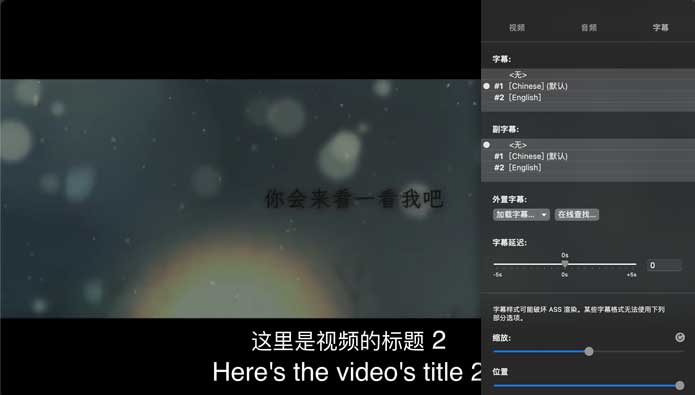

# FFmpeg添加字幕的详细操作

在视频中添加字幕可以使视频更具可读性，并为观众提供更好的观看体验，这在多语种内容中尤为重要。FFmpeg是一个流行的开源视频处理工具，它可以被用来给视频添加字幕。本文将介绍FFmpeg集成libass的编译流程，介绍SRT和ASS字幕格式及其参数，如何使用FFmpeg向视频添加硬字幕和软字幕，并通过示例演示如何生成单一字幕和多项字幕。

而本文最后实现的效果为：默认中英文字幕，可选英文字幕的软字幕的实现：




## 1. 硬字幕和软字幕的简介

### 1.1. 硬字幕

将字幕渲染到视频的纹理上，然后将其编码成独立于视频格式的一个完整的视频。硬字幕不能更改或删除，因为它们与视频（通道）是一个整体。

### 1.2. 软字幕

在播放视频时实时渲染和读取。软字幕可以在播放过程中随时添加或删除。软字幕比硬字幕更加灵活，因为它们可以随时进行修改，但它们也需要高性能的播放器支持。

软字幕单独生成一个字幕通道，与视频
、音频一样，如以下`Stream #0:2`：
```shell
  Stream #0:0[0x1](und): Video: h264 (High) (avc1 / 0x31637661), yuv420p(progressive), 852x480, 397 kb/s, 25 fps, 25 tbr, 12800 tbn (default)
    Metadata:
      handler_name    : VideoHandler
      vendor_id       : [0][0][0][0]
  Stream #0:1[0x2](und): Audio: aac (LC) (mp4a / 0x6134706D), 48000 Hz, stereo, fltp, 127 kb/s (default)
    Metadata:
      handler_name    : SoundHandler
      vendor_id       : [0][0][0][0]
  Stream #0:2[0x3](eng): Subtitle: mov_text (tx3g / 0x67337874), 0 kb/s (default)
    Metadata:
      handler_name    : SubtitleHandler

```

## 2. SRT和ASS字幕格式的简介

### 2.1. SRT（SubRip Subtitle）

是一种简单的字幕格式，主要由时间戳和文本组成。它通常用于简单的字幕文件，如电影聚会之类。SRT字幕格式的参数如下：

- 标题的计数器/索引
- START和END：字幕开始和字幕结束的时间戳，格式为 "小时：分钟：毫秒"。
- TEXT：在此时间戳范围内显示的字幕文本
- 一行空白表示一个结束

```
1
00:00:0,000 --> 00:00:2,000
这是0到2秒显示的字幕

2
00:00:2,000 --> 00:00:4,000 
这是2到4秒显示的字幕

3
00:00:4,000 --> 00:00:7,000
这是4到7秒显示的字幕
```

### 2.2. ASS（Advanced SubStation Alpha）

是一个高级的字幕格式，它可以支持更多的样式和控制，比如，更改颜色、字体和大小，还可以通过几何变换来控制字幕的位置。ASS字幕格式包含以下参数：


#### 2.2.1. 样式:

```
Style: 序号, 字体名称, 字号, 颜色, 阴影, 边框, 描边, 阴影, 抗锯齿, 倾斜度, weight, underline
例子：Style: Top, Microsoft YaHei,40,&H00F5FF&,-1,2,0,0,1,0,0
```

#### 2.2.2. 对齐:

```
Dialogue: 0,0:00:03.42,0:00:04.91,Top,,0,0,0,,{\an6}本字幕居右上
```

其中\an6表示右上角对齐，默认是左下角对齐。

#### 2.2.3. 触发器:

```
Dialogue: 0,0:00:03.42,0:00:04.91,Top,,0,0,0,,{\t(0,300,\fade(400,400))}三秒内渐入渐出
```

其中\fade(400,400)表示透明度从0渐变到400再从400渐变到0。

#### 2.2.4. 动画:

```
Dialogue: 0,0:00:03.42,0:00:04.91,Top,,0,0,0,,{\move(0,0,100,100)}右下角移动
```

其中\move(0,0,100,100)表示从(0,0)移动到(100,100)。

#### 2.2.5. 特殊效果：

```
Dialogue: 0,0:00:03.42,0:00:05.62,Top,,0,0,0,,{\fad(500,500)\blur3}左右淡入淡出，模糊度3
```

其中\blur3表示模糊度为3。

#### 2.2.6. 合的ASS字幕案例：

```
[Script Info]
; Script generated by FFmpeg/Lavc59.18.100
Title: 某电影
Original Script: 某人
ScriptType: v4.00+
WrapStyle: 0
Collisions: Normal
PlayResX: 1920
PlayResY: 1080
Timer: 100.0000

[V4 Styles]
Format: Name, Fontname, Fontsize, PrimaryColour, SecondaryColour, OutlineColour, BackColour, Bold, Italic, Underline, StrikeOut, ScaleX, ScaleY, Spacing, Angle, BorderStyle, Outline, Shadow, Alignment, MarginL, MarginR, MarginV, Encoding
Style: Default,Arial,30,&Hffffff,&Hffffff,&H0,&H0,0,0,0,0,100,100,0,0,1,1,0,2,10,10,50,0

[Events]
Format: Layer, Start, End, Style, Name, MarginL, MarginR, MarginV, Effect, Text
Dialogue: 0,0:00:00.00,0:00:02.00,Default,,0,0,0,,这是0到2秒显示的{\b1}{\i1}字幕{\i0}{\b0}
Dialogue: 0,0:00:02.00,0:00:04.00,Default,,0,0,0,,这是2到4秒显示的字幕
Dialogue: 0,0:00:04.00,0:00:07.00,Default,,0,0,0,,这是4到7秒显示的字幕
Dialogue: 0,0:00:07.00,0:00:10.00,Default,,0,0,0,,这是7到10秒显示的字幕
Dialogue: 0,0:00:10.00,0:00:30.00,Default,,0,0,0,,这是10到30秒显示的字幕{\an5\move(960,700,960,900)\t(\fscx200\fscy200\frx360\fry360\fad(200,200))\fs60\p5\t(\fscx100\fscy100\frx0\fry0\fad(200,200))\c&HFFFFFF&\3c&HA000&}高级操作.
```

在这个案例中，我们可以看到SCRIPT INFO中定义了脚本的一些基本信息，V4 Styles中定义了字幕样式，Events中定义了具体的字幕内容和效果。

在字幕内容中，使用了\an5表示居中上对齐，\move(960,700,960,900)表示在x=960，y从700移动到900，\t()表示特效，\fscx表示X轴缩放，\fscy表示Y轴缩放，\frx表示X轴旋转，\fry表示Y轴旋转，\fs表示字号大小，\p表示描边的点数，\c表示字体颜色，\3c表示描边的颜色。

此外，在这个案例中还使用了透明度、渐变、模糊等各种效果，可以看出ASS字幕的灵活性和功能性非常强大。


## 3. 使用FFmpeg添加字幕的流程


### 3.1. 编译带有libass的FFmpeg

- 1. 下载[FFmpeg6.0](https://ffmpeg.org/download.html)源码

- 2. 下载[libass](https://github.com/libass/libass)，解压到FFmpeg源码目录，并且重命名为`libass`

- 3. 在FFmpeg根目录编写编译脚本，并且执行
    ```shell
    function build() {
        ./configure \
        --prefix=$PREFIX \
        --target-os=$PLATFORM \
        --disable-static \
        --enable-libass \
        --enable-shared || exit 0
        make clean
        make install
    }
    PREFIX=/usr/local/ffmpeg
    #PLATFORM=linux
    PLATFORM=darwin
    
    build
    ```
- 4. 编译完成后，查看版本信息：`/usr/local/ffmpeg/bin/ffmpeg -version`，可见启用了`--enable-libass`
    
    ```shell
    MacBook-Pro:FFmpeg-n6.0 mac$ /usr/local/ffmpeg/bin/ffmpeg -version
    ffmpeg version 6.0 Copyright (c) 2000-2023 the FFmpeg developers
    built with Apple clang version 14.0.0 (clang-1400.0.29.202)
    configuration: --prefix=/usr/local/ffmpeg --target-os=darwin --disable-static --enable-libass --enable-libass --enable-gpl --extra-cflags=-I/usr/local/ffmpeg/libx264/include --extra-ldflags=-L/usr/local/ffmpeg/libx264/lib --enable-libx264 --enable-shared
    libavutil      58.  2.100 / 58.  2.100
    libavcodec     60.  3.100 / 60.  3.100
    libavformat    60.  3.100 / 60.  3.100
    libavdevice    60.  1.100 / 60.  1.100
    libavfilter     9.  3.100 /  9.  3.100
    libswscale      7.  1.100 /  7.  1.100
    libswresample   4. 10.100 /  4. 10.100
    libpostproc    57.  1.100 / 57.  1.100
    ```
  > 可以配置环境变量，方便使用


### 3.2. 生成字幕命令


### 3.2.1 SRT硬字幕命令

```shell
ffmpeg -i input.mp4 -vf subtitles=subtitle.srt output_srt.mp4
```


### 3.2.2 ASS硬字幕命令

```shell
ffmpeg -i input.mp4 -vf ass=subtitle.ass output_ass.mp4
```

### 3.2.3 SRT和ASS软字幕命令

```shell
ffmpeg -i input.mp4 -i subtitle.srt -c copy -c:s mov_text -metadata:s:s:0 language=chi ouptut_chi.mp4
or
ffmpeg -i input.mp4 -i subtitle.ass -c copy -c:s mov_text -metadata:s:s:0 language=chi ouptut_chi.mp4
```

### 3.2.4 SRT可以转ASS命令

```shell
ffmpeg -i subtitle.srt subtitle.ass
```

### 3.2.3 多通道(软)字幕命令

**1. 准备字幕文件：假设有中文字幕文件为`ch.srt`，英文字幕文件为`en.srt`。**

- 中文字幕文件：`ch.srt`
```
1
00:00:0,000 --> 00:00:5,000
这里是视频的标题 1

2
00:00:5,000 --> 00:00:10,000 
这里是视频的标题 2
```

- 英文字幕文件：`en.srt`
```
1
00:00:0,000 --> 00:00:5,000
Here's the video's title 1

2
00:00:5,000 --> 00:00:10,000 
Here's the video's title 2
```

**2. 命令**

```shell
ffmpeg -i input.mp4 -i ch.srt -i en.srt -map 0 -map 1 -map 2 -c copy -c:s mov_text -metadata:s:s:0 language=chi -metadata:s:s:1 language=eng output_chi_eng.mp4
```

> 注意：ass格式同样的操作
> ```shell
> ffmpeg -i input.mp4 -i ch.ass -i en.ass -map 0 -map 1 -map 2 -c copy -c:s mov_text -metadata:s:s:0 language=chi -metadata:s:s:1 language=eng output_chi_eng_ass.mp4
> ```

### 3.2.4 多通道(软)字幕，中英字幕实现

**1. 准备字幕文件：假设有中英文字幕文件为`ch_en.srt`，英文字幕文件为`en.srt`。**

- 中文字幕文件：`ch_en.srt`
```
1
00:00:0,000 --> 00:00:5,000
这里是视频的标题 1
Here's the video's title 1

2
00:00:5,000 --> 00:00:10,000 
这里是视频的标题 2
Here's the video's title 2
```

- 英文字幕文件：`en.srt`
```
1
00:00:0,000 --> 00:00:5,000
Here's the video's title 1

2
00:00:5,000 --> 00:00:10,000 
Here's the video's title 2
```


**2. 命令**

```shell
ffmpeg -i input.mp4 -i ch_en.srt -i en.srt -map 0 -map 1 -map 2 -c copy -c:s mov_text -metadata:s:s:0 language=chi_eng -metadata:s:s:1 language=eng output_chi_eng_eng.mp4
```

**3. 最后使用ffprobe查看一下生成文件的内容**
```shell
Input #0, mov,mp4,m4a,3gp,3g2,mj2, from 'output_chi_eng_eng.mp4':
  Metadata:
    major_brand     : isom
    minor_version   : 512
    compatible_brands: isomiso2avc1mp41
    encoder         : Lavf60.3.100
    description     : Bilibili VXCode Swarm Transcoder v0.6.11
  Duration: 00:05:24.20, start: 0.000000, bitrate: 531 kb/s
  Stream #0:0[0x1](und): Video: h264 (High) (avc1 / 0x31637661), yuv420p(progressive), 852x480, 397 kb/s, 25 fps, 25 tbr, 12800 tbn (default)
    Metadata:
      handler_name    : VideoHandler
      vendor_id       : [0][0][0][0]
  Stream #0:1[0x2](und): Audio: aac (LC) (mp4a / 0x6134706D), 48000 Hz, stereo, fltp, 127 kb/s (default)
    Metadata:
      handler_name    : SoundHandler
      vendor_id       : [0][0][0][0]
  Stream #0:2[0x3](chi): Subtitle: mov_text (tx3g / 0x67337874), 0 kb/s (default)
    Metadata:
      handler_name    : SubtitleHandler
  Stream #0:3[0x4](eng): Subtitle: mov_text (tx3g / 0x67337874), 0 kb/s
    Metadata:
      handler_name    : SubtitleHandler
```

---------
参考：
- https://www.bannerbear.com/blog/how-to-add-subtitles-to-a-video-file-using-ffmpeg/