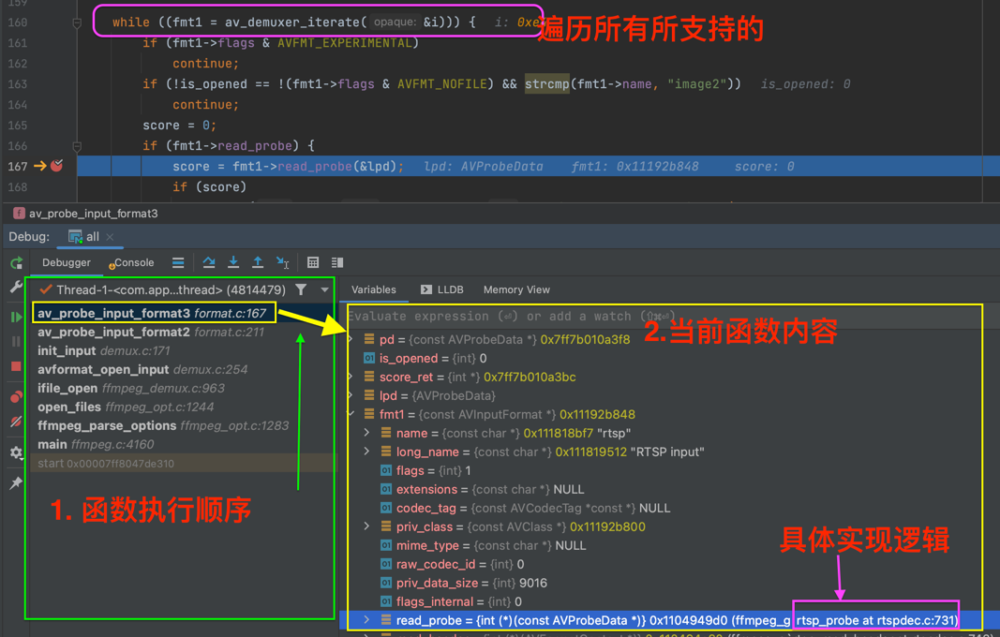
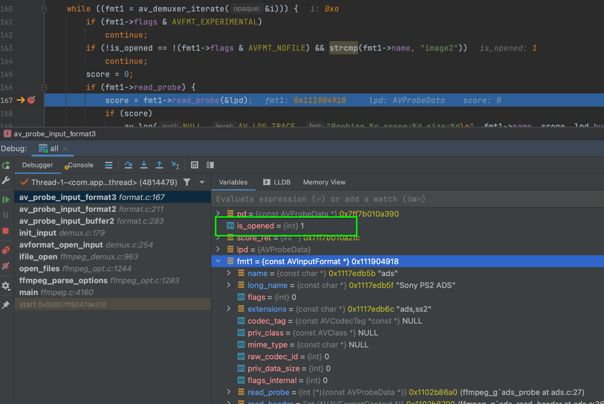
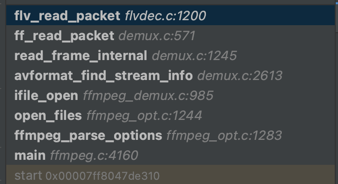
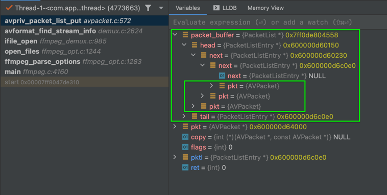
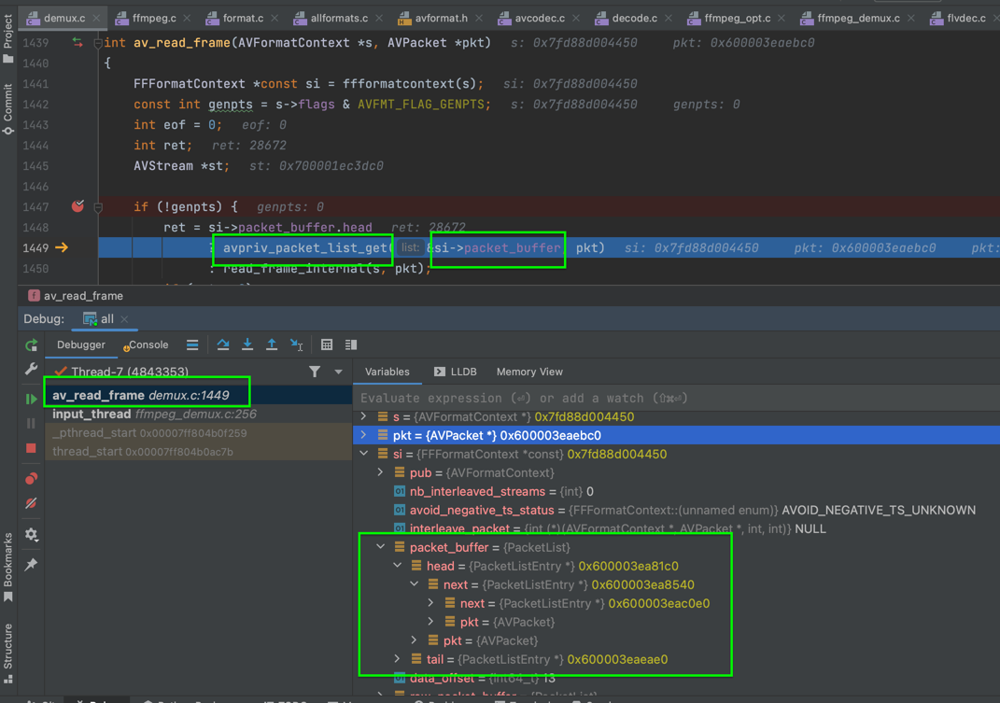

# 如何深入学习解封装？

毫无疑问，通过调试源码是最好的学习的方式！

## 1.查看协议

要学习封装的具体细节，首先，我们得知道规则，不然看源码实现也是很难明白`为什么要这样的？`。我们也许是看MP4、AVI或者RTMP、HLS等流媒体，本人比较建议拿分析工具对应着看每个字节或bit所表示的内容，直接看官方网点分析协议很是费劲的。

在我看来，这些协议不用记，也记不住。知道怎么分析出其所表示的意思即可。

## 2.搭建调试环境

参考[FFmpeg原理——FFmpeg调试环境搭建](https://ffmpeg.xianwaizhiyin.net/debug-ffmpeg/debug-ffmpeg.html) 。

我这里是在Mac上用Clion演示分析。

## 3.在调试中学习解封装

[调用API实现解封装很简单](08_demuxing.md)，但是想要深入学习却是一件枯槁艰难的事情。

### 3.1.未打开文件时，尝试探索匹配封装格式

> 在这里，你可以看`read_probe`对应的协议所匹配的逻辑。

### 3.2.打开文件时，再次尝试探索匹配封装格式

### 3.3.根据不同的封装协议，在该协议内，每次读取一个`AVPacket`

> 可具体看对应的协议，具体读取`AVPacket`的逻辑，根据协议，进行解封装操作。如：根据[flv协议](../MustRead/01_flv.md)读取出每一个`AVPacket`，然后解析出音频、视频、解码器等信息。

### 3.4.把读取的`AVPacket`保存到`FFFormatContext->packet_buffer`链表中

### 3.5.当我们调用`av_read_frame`读取`AVPacket`时，这时候是从`packet_buffer`中获取

