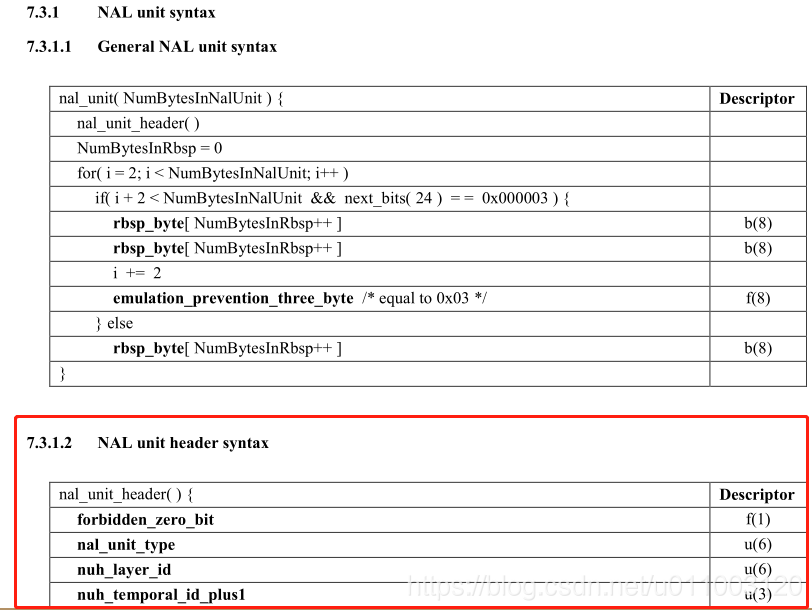
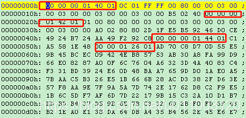

#基于H.264看H.265

##简述

相对于H264来说，H265结构变化看[H.265与H.264的差异详解](https://blog.csdn.net/fireroll/article/details/77827156) 。但对于解析来说，最主要是多了视频参数集VPS。编码压缩方面相对于H264的宏块单位划分，增加最大为64x64（虽然名字不叫宏块）（压缩率更大了），预测方向也更多了（细节也更清晰了），以树状结构算法存储（可能照成I帧内压缩率高，因为要存这些树状信息），P帧得到很大的压缩率。


##H265结构解析

###1. NALU type

###看回H264-[视频编码之H.264](../RTMP/3-h264.md)


在H264中，每一个前缀码后面跟随的第一个字节即为NALU的语法元素，主要有三部分组成：
forbidden_bit(1bit)，nal_reference_bit(2bits)（优先级），nal_unit_type(5bits)（类型）

所以，在H264中，我们如果需要获取NALU的类型，则可以通过以下方式进行解析：

```
nalu_type = first_byte_in_nal & 0x1F
1
```


###H265

而在H265中，每一个前缀码后面跟随的前两个字节为NALU的语法元素，主要有四部分组成：

```
forbidden_zero_bit(1):nal_unit_type(6):nuh_layer_id(6):nuh_temporal_id_plus1(3)
1
```

在文档中定义如下：


可以看到，NALU的语法元素由H264的一个字节变为两个字节，而nal_unit_type则为NALU的类型，因此我们可以通过以下获取NALU的类型：

```
int type = (code & 0x7E)>>1;
1
```

type的定义值如下：


上图，即为H265的NALU的TYPE,这里可以将上面的type简单的理解为如下我们需要的类型：

> **VPS=32**
>
> **SPS=33** 
>
> **PPS=34** 
>
> **IDR=19**
>
>  **P=1**
>
>  **B=0**

## 2.2 实例分析

如下，为下载的视频文件surfing.265的头部信息


如上我们看到了四个NALU包，每个NALU的头部信息为：

```
① 00 00 00 01 40 01  ---> (0x40 & 0x7E)>>1 = 32 ---> VPS
② 00 00 00 01 42 01  ---> (0x42 & 0x7E)>>1 = 33 ---> SPS
③ 00 00 00 01 44 01  ---> (0x44 & 0x7E)>>1 = 34 ---> PPS
④ 00 00 00 01 26 01  ---> (0x26 & 0x7E)>>1 = 19 ---> IDR
```

通过以上头结构也可以看到，NALU的与语法元素中，forbidden_zero_bit通常为0，nuh_layer_id通常为0，nuh_temporal_id_plus1通常为1。


参考：

- [H265码流结构分析](https://blog.csdn.net/u011003120/article/details/83411445#1__3)

- [H.265与H.264的差异详解](https://blog.csdn.net/fireroll/article/details/77827156)

H265码流结构文档参考：《T-REC-H.265-201504-I!!PDF-E.pdf》

- [高效率视频编码](https://zh.wikipedia.org/wiki/%E9%AB%98%E6%95%88%E7%8E%87%E8%A7%86%E9%A2%91%E7%BC%96%E7%A0%81) 

- [首页资料](/)
