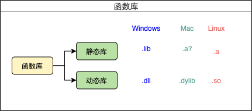

#初步认识c/c++编译

### 程序的生命周期
通过了解程序的生命周期，而直到编译所在生命周期的哪一个部分。


### 编译过程与编译器
编译过程是指编写的源代码通过编译器进行编译，最后生成cpu所能识别的二进制形式存在的源代码的过程。而编译器则是指能够使源代码编译生成二进制形式的工具，根据平台不同，工具也不同，如window是XXX.exe可执行程序，unix系统侧不定后缀名，系统根据文件的头部信息来判断。

例如：在屏幕上输出“VIP会员”，C语言的写法为：
```c
puts("VIP会员");
```
二进制的写法为：


### gcc/g++编译器执行过程
gcc/g++编译器能把一个源文件生成一个执行文件，这是因为该编译器是集成了各种程序（预处理器、汇编器等），这个过程中的工作如下：


例子：编写 `test.c` 如下：
```c
#include <stdio.h>
int main() {
    printf("hello world\n");
    return 0;
}
```
在控制台执行命令(-o：为指定输出文件)：
```commandline
qincji:build mac$ ls
test.c
qincji:build mac$ gcc -E test.c -o test.i
qincji:build mac$ ls
test.c	test.i
qincji:build mac$ gcc -S test.i -o test.s
qincji:build mac$ ls
test.c	test.i	test.s
qincji:build mac$ gcc -c test.s -o test.o
qincji:build mac$ ls
test.c	test.i	test.o	test.s
qincji:build mac$ gcc test.o -o test
qincji:build mac$ ls
test	test.c	test.i	test.o	test.s
qincji:build mac$ ./test 
hello world
qincji:build mac$
```

### 静态库与动态库(Linux)
动态库与静态库统称为函数库，根据系统不一样，后缀名标识也不一定，如图：


#### 静态库
静态库是指编译链接时，把库文件的代码全部加入到可执行文件中，因此生成的文件比较大，但在运行时也就不再需要库文件了。优点：静态库节省时间，不需要再进行动态链接，需要调用的代码直接就在代码内部。
- **生成静态库**
首先用gcc编绎该文件，生成.o文件，然后ar(archive)工具生成静态库。`-fPIC`生成与位置无关代码，不用此选项的话，编译后的代码是位置相关的，所以动态载入时，是通过代码拷贝的方式来满足不同进程的需要，而不能达到真正代码段共享的目的。
> gcc -fPIC -c  test.c -o test.o
> ar r libtest.a test.o 

#### 动态库
动态库与之相反，在编译链接时并没有把库文件的代码加入到可执行文件中，而是在程序执行时由运行时链接文件加载库。优点：动态库节省空间，如果一个动态库被两个程序调用,那么这个动态库只需要在内存中。
首先用gcc编绎该文件，生成.o文件，然后再用gcc指定`-shared`生成动态库。
> gcc -fPIC -c test.c -o test.o
> gcc -shared test.o -o libtest.so
#或者
> gcc -fPIC -shared test.c -o libtest.so

#### 简单使用
编辑`test.c`文件如下：
```c
#include <stdio.h>
void output() {
    printf("hello world\n");
}
```
编辑`main.c`文件如下：
```c
#include "test.c"
int main(){
    output();
    return 0;
}
```
- **(1)使用动态库**
首页将`test.c`编译生成动态库`libtest.so`，然后执行一下命令生成可执行文件：
> gcc main.c -L. -ltest -o main

当编译`main.c`时，需要链接代码中引入的`test.c`文件，其中，`-L.`：是指编译的时候，在当前目录搜索库的路径；`-ltest`：指编译的时候使用的库（详见gcc/g++重要参数）。

在控制台中演示：
```commandline
qincji:build mac$ ls
libtest.so	main.c		test.c		test.o
qincji:build mac$ gcc main.c -L. -ltest -o main
qincji:build mac$ ls
libtest.a	libtest.so	main		main.c		test.c		test.o
qincji:build mac$ ./main 
hello world
qincji:build mac$
```

- **(2)强制使用静态库**
> gcc main.c -L. -Wl,-Bstatic  -ltest -Wl,-Bdynamic -o main

其中：`-Wl` 表示传递给 ld 链接器的参数，通过`ld --help`查看 ld 帮助文档时。

注意：我使用MacOs系统时，在查看ld帮助文档(`man ld`)发现系统并不支持链接动态库，描述如下：
>  -static     Produces a mach-o file that does not use the dyld.  Only used building the kernel.

- **(3)将静态库打包到动态库中**
> gcc -shared -o libtest.so -Wl,--whole-archive libtest.a -Wl,--no-whole-archive

其中：`--whole-archive`: 将未使用的静态库符号(函数实现)也链接进动态库；`--no-whole-archive`: 默认，未使用不链接进入动态库。

### 重要工具
- `ar` : 创建或修改archive文件，或从存档文件中提取。如生成静态库，查看详细参数命令： `ar --help`。
- `nm` : 列出目标文件中的符号（方法），查看动态库方法等，查看详细参数命令： `nm --help`。
- `objcopy` : 复制和翻译目标文件，查看详细参数命令： `objcopy --help`。
- `objdump` : 显示目标文件中的信息，查看详细参数命令： `objdump --help`。
- `readelf` : 显示可执行和可链接格式的文件的信息，查看详细参数命令： `readelf --help`。

### gcc/g++重要参数
- **通过`gcc --help`命令查看更多。**

- **-E**
只激活预处理,这个不生成文件, 你需要把它重定向到一个输出文件里面。

- **-S**
只激活预处理和编译，就是指把文件编译成为汇编代码。

- **-c**
只激活预处理,编译,和汇编,也就是他只把程序做成obj文件

- **-o**
制定目标名称, 默认的时候, gcc 编译出来的文件是 a.out。

- **-fPIC**
生成与位置无关代码。

- **-shared**
生成动态库，使用例子：
> gcc -fPIC -shared test.c -o libTest.so

- **-include file**
包含某个代码,简单来说,就是便以某个文件,需要另一个文件的时候,就可以用它设定,功能就相当于在代码中使用 `#include<filename>`。例子：
> gcc test.c -include xxx.h 

- **-Dmacro**
相当于 C 语言中的 `#define macro`

- **-Dmacro=defn**
相当于 C 语言中的 `#define macro=defn`

- **-Umacro**
相当于 C 语言中的 `#undef macro`

- **-undef**
取消对任何非标准宏的定义

- **-Idir**
在你是用 `#include "file"` 的时候, gcc/g++ 会先在当前目录查找你所制定的头文件, 如果没有找到, 他回到默认的头文件目录找, 如果使用 -I 制定了目录,他会先在你所制定的目录查找, 然后再按常规的顺序去找。
对于 #include<file>, gcc/g++ 会到 -I 制定的目录查找, 查找不到, 然后将到系统的默认的头文件目录查找 。

- **-I-**
就是取消前一个参数的功能, 所以一般在 -Idir 之后使用。

- **-idirafter dir**
在 -I 的目录里面查找失败, 讲到这个目录里面查找。

- **-iprefix prefix 、-iwithprefix dir**
一般一起使用, 当 -I 的目录查找失败, 会到 prefix+dir 下查找

- **-M**
生成文件关联的信息。包含目标文件所依赖的所有源代码你可以用 `gcc -M test.c` 来测试一下，很简单。

- **-MM**
和上面的那个一样，但是它将忽略由 #include<file> 造成的依赖关系。 　　

- **-MD**
和-M相同，但是输出将导入到.d的文件里面 　　

- **-MMD**
和 -MM 相同，但是输出将导入到 .d 的文件里面。

- **-Wa,option**
此选项传递 option 给汇编程序; 如果 option 中间有逗号, 就将 option 分成多个选项, 然 后传递给会汇编程序。

- **-Wl.option**
此选项传递 option 给连接程序; 如果 option 中间有逗号, 就将 option 分成多个选项, 然 后传递给会连接程序。

- **-llibrary**
指编译的时候使用的库，library是指动态库或静态库的名称。如：liblibrary.a或liblibrary.so，系统会自动加上lib前缀和.a(.so)后缀。

- **-Ldir**
指编译的时候，搜索库的路径。比如你自己的库，可以用它指定目录，不然编译器将只在标准库的目录找。这个dir就是目录的名称。

- **-O0 、-O1 、-O2 、-O3**
编译器的优化选项的 4 个级别，-O0 表示没有优化, -O1 为默认值，-O3 优化级别最高。

- **-g**
只是编译器，在编译的时候，产生调试信息。
　　
- **-gstabs**
此选项以 stabs 格式声称调试信息, 但是不包括 gdb 调试信息。
　　
- **-gstabs+**
此选项以 stabs 格式声称调试信息, 并且包含仅供 gdb 使用的额外调试信息。
　　
- **-ggdb**
此选项将尽可能的生成 gdb 的可以使用的调试信息。

- **-static**
此选项将禁止使用动态库，所以，编译出来的东西，一般都很大，也不需要什么动态连接库，就可以运行。

- **-share**
此选项将尽量使用动态库，所以生成文件比较小，但是需要系统由动态库。


参考
- http://c.biancheng.net/view/450.html
- https://www.runoob.com/w3cnote/gcc-parameter-detail.html
- https://cloud.tencent.com/developer/article/1343895

