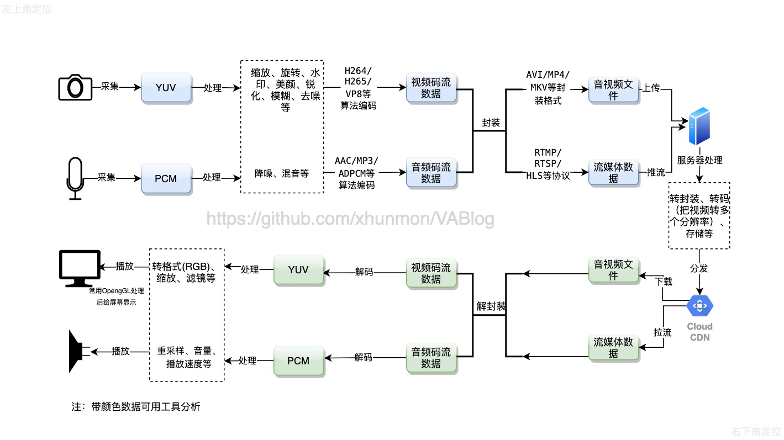

为了更好的阅读请前往[GitBook](https://xhunmon.github.io/VABlog/)  

>> 欢迎加入QQ技术交流群：389713575

# 一、前言
这里整理有着丰富的音视频开发的学习资源、开发工具、优秀书籍、教程和开源项目，旨在帮助开发者和爱好者更好地学习、实践和工作。而下图是开发处理的过程：



# 二、学习技能

| 语言                | 重要度 | 作用 | 
|-------------------| --- | --- | 
| C/C++             | ★★★★★ | 作为底层开发语言，可以实现音视频编码/解码，滤镜等高性能的操作，是音视频开发中最为重要的基础语言之一。 | 
| Python            | ★★★☆☆ | Python 在音视频开发中可以用于快速开发或原型开发，尤其在深度学习及音视频处理应用中表现突出。 |   
| Java/Kotlin       | ★★★☆☆ | Java/Kotlin 适用于 Android平台的音视频开发，它们提供了音视频录制、剪辑、播放等 API。 |  
| Objective-C/Swift | ★★★☆☆ | 用于MacOS、iOS平台的开发，其开发API包含音视频流的处理和流媒体播放等。  | 
| JavaScript        | ★☆☆☆☆ | JavaScript是Web开发的常用编程语言，它的WebRTC技术可以用于浏览器中的音视频流处理和实时通讯。  |
| Shell             | ★☆☆☆☆ | 脚本编写、系统管理等。  |
| CMake             | ★☆☆☆☆ | 跨平台编译、构建工具等。  |
| GLSL              | ★☆☆☆☆ | 图形学、OpenGL着色器等。  |


# 三、学习音视频理论知识

## 1.重要知识点

| 知识点         | 重要度 | 作用                                                         |
|-------------| ------ | ------------------------------------------------------------ |
| YUV/RGB     | ★★★★★  | 视频原始（裸流）数据，解码最终显示就是一帧帧YUV数据 。                |
| PCM         | ★★★★★  | 音频原始（裸流）数据，解码最终播放的就是PCM数据。                    |
| H.264(AVC)  | ★★★★★  | 目前主流的视频编解码协议。                                        |
| H.265(HEVC) | ★★★☆☆  | 基于H.264的升级版，大幅度提升了编码大小和质量。因为版权和收费问题没有普及。|
| AAC         | ★★★★★  |  目前主流的音频编解码协议。                                       | 
| RTMP        | ★★★☆☆  |  直播推流，看侧重点                                              | 
| 封装格式        | ★★☆☆☆  |  MP4、AVI、MKV、RMVB、FLV等容器，把音频、视频、字幕等通道封装成一个文件 |
| webrtc(VP8) | ★★★☆☆  |  P2P的音视频通话，看侧重点                                         |
| OpenGL      | ★★★☆☆  |  使用GPU渲染视频，释放宝贵的CPU资源，看侧重点                       | 

## 2.书籍推荐

- [书：音视频开发进阶指南：基于Android与iOS平台的实践(京东)](https://item.jd.com/12292642.html) ：**第1章　音视频基础概念**；电子书往最后翻。
- [书：Android 音视频开发_何俊林(京东)](https://item.jd.com/12467530.html) ：**第1章　音视频基础知识**；电子书往最后翻。
- [书：新一代视频压缩编码标准-H.264/AVC(第二版)(京东)](https://item.jd.com/10022441804147.html) : 讲述H.264等编解码原理实现，其中几个算法 [这篇文章](https://zhuanlan.zhihu.com/p/40356456)讲的很深刻。
- [这系列文章通俗易懂讲述编解码的一些知识](http://www.52im.net/thread-228-1-1.html) 。


## 3.实践

### 3.1.视音频数据处理入门

[[总结]视音频编解码技术零基础学习方法](https://blog.csdn.net/leixiaohua1020/article/details/18893769) 系列文章，介绍了视音频编解码技术大体上原理和流程，通俗易懂。包括以下文章：
- [视音频数据处理入门：RGB、YUV像素数据处理](https://blog.csdn.net/leixiaohua1020/article/details/50534150) ：视频就是由它们组成的。
- [视音频数据处理入门：PCM音频采样数据处理](https://blog.csdn.net/leixiaohua1020/article/details/50534316) ：音频就是由它们组成的。
- [视音频数据处理入门：H.264视频码流解析](https://blog.csdn.net/leixiaohua1020/article/details/50534369) ：视频编码技术的一种（现代音视频开发必须掌握）。
- [视音频数据处理入门：AAC音频码流解析](https://blog.csdn.net/leixiaohua1020/article/details/50535042) ：音频编码技术的一种（现代音视频开发必须掌握）。
- [视音频数据处理入门：FLV封装格式解析](https://blog.csdn.net/leixiaohua1020/article/details/50535082) ：音视频封装格式的一种。
- [视音频数据处理入门：UDP-RTP协议解析](https://blog.csdn.net/leixiaohua1020/article/details/50535230) ：音视频协议的一种。

### 3.2.完整的RTMP推送小项目

此过程，体现从0~1。0是采集到的原始视频和音频数据，进行编码、封装，变为1（文件）。

- [直播推流全过程：总纲](RTMP/README.md)
- [直播推流全过程：视频数据源之YUV](RTMP/1-yuv.md)
- [直播推流全过程：音频数据源之PCM](RTMP/2-pcm.md)
- [直播推流全过程：视频编码之H.264](RTMP/3-h264.md)
- [直播推流全过程：音频编码之AAC](RTMP/4-aac.md)
- [直播推流全过程：直播推流编码之RTMP](RTMP/5-rtmp.md)
- [其他：H.264符号描述](RTMP/h264-descriptor.md)
- [其他：直播优化基础](RTMP/6-optimize.md)

### 3.3.播放器小项目

此过程，体现从1~0。与3.2正好相反，把封装的文件(网络数据)通过解封装和解码，得到原始的裸数据（一帧帧图片）进行播放。

- [AFPlayer项目](./AFPlayer/README.md) Android实现FFmpeg、OpenSL ES、OpenGL SE、MediaCodec等，实现简单的播放器，主要体现出相关知识点的使用。

# 四、学习过程的分析工具
 

| 工具        | 作用                                                         |     下载地址   |
| ----------- | ------------------------------------------------------------ |---------------|
| VideoEye    | 来自雷神的强大实时视频码流分析软件。                |[地址](https://blog.csdn.net/leixiaohua1020/article/details/34553607)|
| Codecian    | H264/H265等分析工具（跨平台）。                   |[地址](http://codecian.com/)|
| H264Visa    | H.264/AVC实时视频分析工具。                       |（略）|
|Elecard StreamEye|编码视频的可视化表现，流结构分析，这些流是MPEG-1/2/4 or AVC/H.264 VES(视频基本流)、SS（MPEG1的系统流）、PS(MPEG2的程序流)、TS(mpeg2的传输流)。|（略）|
| Hxd Hex Editor| 16进制查看工具。                              |[地址](https://mh-nexus.de/en/downloads.php?product=HxD20)|
| ffprobe     | ffmpeg中自带的分析工具，非常强大，不过上手有难度。    |[参考](FFmpeg/18_command.md)|

 

# 五、重点开发工具/组件/开源库

## 1.FFmpeg
音视频开发是绕不开FFmpeg的，因为它是一个"集大成者"，里面已经包含或可集成现代几乎所有的音视频技术（库）。

### 1.1.学习途径
- [阅读官方文档](http://ffmpeg.org/ffmpeg.html)
- 学习官方例子（源码中`doc/examples/xxx`）
- [[总结]FFMPEG视音频编解码零基础学习方法](https://blog.csdn.net/leixiaohua1020/article/details/15811977)
- [FFmpeg原理（推荐）](https://ffmpeg.xianwaizhiyin.net/)
- [FFmpeg 中文文档](https://github.com/leandromoreira/ffmpeg-libav-tutorial/blob/master/README-cn.md)
- 书籍（电子书往最后翻）
> - [1.FFmpeg从入门到精通(京东)](https://item.jd.com/12349436.html)
> - [2.FFMPEG_FFPLAY源码剖析(CSDN)](https://download.csdn.net/detail/leixiaohua1020/6377803)
> - [3.音视频开发进阶指南：基于Android与iOS平台的实践(京东)](https://item.jd.com/12292642.html)
> - [4.Android 音视频开发_何俊林(京东)](https://item.jd.com/12467530.html) 

### 1.2.学习路线
[这里不推荐直接学习雷神的 [总结]FFMPEG视音频编解码零基础学习方法，建议是通过在学习FFmpeg官方例子中进行学习，避免先入为主使用了过时的API。](https://blog.csdn.net/leixiaohua1020/article/details/15811977)

#### 1.2.1.源码编译
[编译ffmpeg4.2.2](./FFmpeg/03_build_ffmpeg.md)通过这篇文章我们基本可以编译出我们想要的FFmpeg库

#### 1.2.2.源码阅读
- 源码导入：[FFmpeg调试环境搭建](https://ffmpeg.xianwaizhiyin.net/debug-ffmpeg/debug-ffmpeg.html)
- 阅读参考：[FFMPEG_FFPLAY源码剖析(CSDN)](https://download.csdn.net/detail/leixiaohua1020/6377803) 、[雷神的FFmpeg源代码系列](https://blog.csdn.net/leixiaohua1020/article/details/44220151) 

#### 1.2.3.学习官方例子
- [FFmpeg重要结构体（转载）](./FFmpeg/06_struct.md) ，因为在学习FFmpeg中，必须得知道结构体中重要参数的含义，否则举步维艰。
- [FFmpeg Demuxing（解封装）](./FFmpeg/08_demuxing.md) 对应 `doc/examples/demuxing_decoding.c` 中的解封装部分。 
- [FFmpeg Muxing（封装）](./FFmpeg/09_muxing.md) 对应 `doc/examples/muxing.c` 。
- [FFmpeg Remuxing（重新封装）](./FFmpeg/10_remuxing.md) 对应 `doc/examples/remuxing.c` 。
- [FFmpeg Decode（解码）](./FFmpeg/11_decode.md) 对应 `doc/examples/decode_audio.c` 和 `doc/examples/decode_video.c` 。
- [FFmpeg Encode（编码）](./FFmpeg/12_encode.md) 对应 `doc/examples/encode_audio.c` 和 `doc/examples/encode_video.c` 。
- [FFmpeg 简单实现转码](./FFmpeg/13_transfer.md) 汇总解封装、解码、编码、封装放到一起方便理解 。
- [FFmpeg Filter和SDL（Video）](./FFmpeg/14_filter_v.md) 对应 `doc/examples/filtering_video.c` 。
- [FFmpeg Filter和SDL（Audio）](./FFmpeg/15_filter_a.md) 对应 `doc/examples/filtering_video.c` 。
- [FFmpeg Transcode(转码)](./FFmpeg/16_transcode.md) 对应 `doc/examples/transcoding.c` 。
- [FFmpeg Swscale（图像转换）](./FFmpeg/19_swscale.md) 对应 `doc/examples/scaling_video.c` 。

#### 1.2.4.音视频同步
- [FFmpeg 音视频同步处理](./FFmpeg/17_sync.md)

#### 1.2.5.FFmpeg相关
- [FFmpeg 命令使用指南：分析ffmpeg、ffprobe、ffplay工具使用文档，关联官方文档，以及滤镜、协议、视频合并、各种播放参数等相关介绍](./FFmpeg/18_command.md)


## 2 OpenGL

OpenGL使用GPU渲染视频，释放宝贵的CPU资源，学习它是必不可少的。但是，正如[雷神所说](https://blog.csdn.net/leixiaohua1020/article/details/40246783) ：作为一个搞视频技术的人研究OpenGL，需要耗费大量时间和精力，这样学习不是很经济。所以推荐只学习有关视频渲染相关知识。
- [OpenGL介绍，和相关程序库](https://zh.wikipedia.org/wiki/OpenGL)
- [纹理有关的基础知识](https://blog.csdn.net/leixiaohua1020/article/details/40301179) 、[OpenGL播放RGB/YUV](https://blog.csdn.net/leixiaohua1020/article/details/40333583) 、[OpenGL播放YUV420P（通过Texture，使用Shader）](https://blog.csdn.net/leixiaohua1020/article/details/40379845)
- [Android OpenGL ES官方文档](https://developer.android.google.cn/guide/topics/graphics/opengl?hl=zh_cn)
- [LearnOpenGL-CN](https://github.com/LearnOpenGL-CN/LearnOpenGL-CN)
- [OpenGL电子书下载](https://github.com/Canber/OpenGL-ES-for-android)
- [OpenGL基础知识](./OpenGL/01_opengl.md)
- [GLSL（着色器语言）中文手册](./OpenGL/02_glsl.md)
- [Android OpenGL ES 3.0 从入门到精通系统性学习教程](https://github.com/githubhaohao/NDK_OpenGLES_3_0)
- OpenGL ES推荐：WebGL编程指南（资源见下）


## 3.音频相关处理库

| 库名称 | 作用  | 平台 | 项目地址   | 
| --- |-----------------------------------------| --- | ---   | 
| SoX | SoX 可以进行音频处理，如音调、声速、混响、后暂式等等  | Linux、macOS、Windows | https://github.com/chirlu/sox   | 
| Essentia | Essentia 可以进行音频处理、分析、提取等，提供了很多现成的功能算法   | Windows、macOS、Linux、Android、iOS | https://github.com/MTG/essentia   |
| Spleeter | Spleeter   是一款分离歌曲音轨的库，可以分离歌曲中的伴奏、人声等（如：不带背景乐的伴奏）| Linux、macOS、Windows   | https://github.com/deezer/spleeter   |
| libsndfile | libsndfile 可以读写、处理多种音频文件，支持变速、变调等处理 | Linux、macOS、Windows   | http://www.mega-nerd.com/libsndfile/   |
| Rubber Band Audio | Rubber Band Audio 可以进行音频处理，支持变速、变调、变形和时间拉伸等多种处理操作 | Linux、macOS、Windows   | https://breakfastquay.com/rubberband/   |
| librubberband | librubberband 是 Rubber Band Audio 的 C++ 接口，简化了音频处理操作。 | Linux、macOS、Windows   |  https://github.com/breakfastquay/rubberband/tree/master/src   |
| SoundTouch | SoundTouch 可用进行音频连续变速变调处理，包括作品（“chipway/Pydub-Playground”），可实现歌曲同步播放。| Windows、macOS、Linux、Android、iOS   |  https://gitlab.com/soundtouch/soundtouch   |
| Sonic | Sonic   可实现音频变速、变调等处理，运用于 播客、游戏等领域。 | Windows、macOS、Linux、Android、iOS   | https://github.com/waywardgeek/sonic | 
| Oboe | Oboe是一个C++库，它使在Android上建立高性能的音频应用变得容易。| Android   | https://github.com/google/oboe | 


## 4.视频相关处理库

| 库名称 | 作用         | 平台 | 项目地址    | 
| --- |---------------------------------------------------------| --- | ---    | 
| FFmpeg | FFmpeg 可以转换视频文件格式、添加滤镜、剪辑、提取音频等功能     | Linux、macOS、Windows | https://github.com/FFmpeg/FFmpeg    | 
| Libav | libav 同样可以转换视频文件格式、添加滤镜、剪辑、提取音频等功能，是 FFmpeg 的一个分支版本     | Linux、macOS、Windows | https://libav.org/    | 
| GStreamer | GStreamer   是一个流媒体框架，支持流式传输视频文件并进行处理，可以添加滤镜、编解码、格式转换等功能| Linux、macOS、Windows         | https://gstreamer.freedesktop.org/    | 
| MLT Framework | MLT Framework       可以用于视频混合、转换、添加滤镜、效果等，也是 Kdenlive 软件所使用的引擎 | Linux、macOS、Windows         | https://github.com/mltframework/    | 
| OpenCV | OpenCV     是一个计算机视觉库，但也支持读取、写入视频文件、添加滤镜、实现对象追踪等功能 | Linux、macOS、Windows         | https://github.com/opencv/opencv    | 
| Blender | Blender 是一个 3D      制作软件，支持读取、写入视频文件、添加滤镜、实现对象制作等功能 | Linux、macOS、Windows         | https://www.blender.org/    | 
| MLV App | MLV App 主要用于处理和编辑 Magic Lantern       的电影录制格式，可以进行视频转换和色彩分级等 | Linux、macOS、Windows         | https://bitbucket.org/dmilligan/mlv_app/    | 
| HandBrake | HandBrake   是一个跨平台的视频转换器，支持多种输入、输出格式，可以添加滤镜、转换分辨率等操作 | Linux、macOS、Windows         | https://github.com/HandBrake/HandBrake    | 
| Avidemux | Avidemux    是一款视频编辑器，支持许多基本的编辑功能，如修建、编码、添加滤镜等 | Linux、macOS、Windows         | http://avidemux.sourceforge.net/    | 
| Shotcut | Shotcut     是一个跨平台的视频编辑器，支持多种基本编辑功能，并提供了丰富的视频滤镜 | Linux、macOS、Windows         | https://www.shotcut.org/    | 
| Lightworks | Lightworks  是一款视频编辑软件，支持多种高级编辑功能，如多个视频轨道、音频同步、字幕、剪辑等 | Linux、macOS、Windows         | https://www.lwks.com/    | 
| Kino | Kino 是一款开源的视频编辑器，支持视频的剪辑、滤镜、导出等       |     Linux | http://www.kinodv.org/       | 
| Cinelerra GG | Cinelerra GG 是截至目前正在活跃开发的 Cinelerra 的一个独特分支，具有更多先进的编辑功能 | Linux | https://cinelerra-gg.org/    | 
| Flowblade | Flowblade   是一个跨平台的视频编辑器，具有自动编辑、视频剪辑、渐变调色、音轨图、文本动画等功能 | Linux、macOS         | https://github.com/jliljebl/flowblade   | 
| Olive | Olive      是一款跨平台的视频编辑器，支持多个视频、音频和图像轨道，具有类似 Adobe Premiere 和 Final Cut Pro 等视频编辑器的界面 | Linux、macOS、Windows  | https://www.olivevideoeditor.org/ |  


## 5.其他常用库

| 库名称 | 描述    | 作用平台 | 项目地址 | 
| --- |------------------------------------------| --- | --- | 
| ARToolKit | 一个用于创建增强现实体验的开源跟踪库   | 多平台 | https://github.com/artoolkit/ARToolKit5/ | 
| Kurento | 可以集成WebRTC和媒体服务器的平台  | Web | https://www.kurento.org/ | 
| Webrtc | 实时通信的开源项目，包括音频、视频和数据通信    | Web | https://webrtc.org/ | 
| VLC | 一个免费的开源跨平台媒体播放器和框架，可播放大多数多媒体文件      |     多平台 | https://www.videolan.org/vlc/index.html | 
| ExoPlayer | 一个可扩展的Android媒体播放器，包括支持DASH和HLS的内置组件     | Android | https://github.com/google/ExoPlayer | 
| Vitamio | Android和iOS的流媒体解决方案  | Android，iOS | https://www.vitamio.org/en/ | 
| AVPlayer | 一个iOS播放器框架，支持本地和网络音频和视频文件 | iOS |     https://developer.apple.com/documentation/avfoundation/avplayer | 
| FFmpegKit | FFmpeg库的原生iOS和Android包装器  | iOS，Android | https://github.com/tanersener/ffmpeg-kit | 
| libVLC | 适用于Android、iOS、tvOS和macOS的VLC音视频框架  | Android，iOS，tvOS，macOS | https://code.videolan.org/videolan/libvlc-framework | 
| AVKit | 一个macOS框架，提供音频和视频播放和处理功能  | macOS |     https://developer.apple.com/documentation/avkit | 
| Unity Video Player | 一种用于在游戏中播放视频的Unity组件      | Unity | https://docs.unity3d.com/Manual/class-VideoPlayer.html | 
| Three.js | 一个基于WebGL的跨平台JavaScript库，可用于创建和显示3D计算机图形 | Web | https://threejs.org/ | 
| A-Frame | 一个用于构建虚拟现实和增强现实的Web框架     | Web | https://aframe.io/ | 
| WebVR | 一种可用于任何Web浏览器的虚拟现实解决方案    | Web | https://webvr.info/ | 
| Web Audio API | JavaScript API，用于处理和操纵音频  | Web | https://developer.mozilla.org/en-US/docs/Web/API/Web_Audio_API | 
|     Tone.js | 用于Web音乐软件的框架    | Web | https://tonejs.github.io/ | 
| Pygame | 用于开发2D游戏的Python库     | Python | https://www.pygame.org/news | 
| OpenAL | 多平台上的跨API的3D音频库      | 多平台 | https://www.openal.org/ | 
| SDL_mixer | 用于游戏和其他多媒体应用程序的音频库   | 多平台 |    https://www.libsdl.org/projects/SDL_mixer/ | 
| Houdini | 针对3D艺术家和游戏开发人员的3D建模、动画和视觉效果软件       |    多平台 | https://www.sidefx.com/ | 
| Natron | 免费的、开源的视频合成软件        | 多平台 | https://natrongithub.github.io/ | 
| OBS Studio | 免费、开源、跨平台的流媒体和录制软件   | 多平台 | https://obsproject.com/| 
| GIMP | 免费的开源图像编辑器      | 多平台 | https://www.gimp.org/ | 
| Inkscape | 一个用于创建和编辑矢量图形的开源软件   | 多平台 | https://inkscape.org/ | 
| MediaInfo | 一个开源的多媒体信息解析器，用于获取媒体文件的各种信息    | 多平台 | https://mediaarea.net/en/MediaInfo | 
| libde265 | 一种异步HEVC解码器库    | 多平台 | https://github.com/strukturag/libde265 | 
| libvpx | 适用于WebRTC、VP8和VP9的开源视频编解码器     | 多平台 | https://github.com/webmproject/libvpx | 
| x264 | 一种高质量的H.264 / AVC编码器      | 多平台 | https://www.videolan.org/developers/x264.html | 
| x265 | 一种用于UHD编码的开源HEVC编码器  | 多平台 | https://bitbucket.org/multicoreware/x265_git | 
| Theora | 一种开源视频编解码器      | Web | https://www.theora.org/ | 
| Ogg | 一种开源多媒体容器格式，通常与Theora和Vorbis一起使用    | Web | https://www.xiph.org/ogg/ | 
| Vorbis | 一种开源音频编解码器      | Web | https://xiph.org/vorbis/ | 
| WebVTT | 一种用于视频文本替代品的Web文本轨道  | Web | https://w3c.github.io/webvtt/ | 
| PyAV | 基于FFmpeg的Python封装，可用于解码、编码和处理音频和视频  | Python | https://pyav.org/ |
| FFpyplayer | Python+FFmpeg解决方案，在Python中播放音频和视频   | Python | https://ffpyplayer.readthedocs.io/en/latest/ | 
| SoundManager2 | 一个轻型、大众化的JavaScript音频播放器库 | Web | https://github.com/scottschiller/SoundManager2 | 
| wave.js | 用于简化Web音频的JavaScript库     | Web | https://github.com/jaz303/waveform-data | 
| Howler.js | 用于现代Web音频的JavaScript音频库   | Web |   https://github.com/goldfire/howler.js | 
| Web Audio DAW | 用于在浏览器中创建数字音频工作站（DAW）的Web Audio Editor   | Web | https://beryju.org/web 


# 六、实践项目

- [AFPlayer项目](./AFPlayer/README.md) Android实现FFmpeg、OpenSL ES、OpenGL SE、MediaCodec等，实现简单的播放器，主要体现出相关知识点的使用。
- [OpenGLES基本使用](https://github.com/xhunmon/OpenGLES) ：点、线、三角形、四边形、矩阵、纹理（贴纸）、摄像头显示、FBO、EGL、滤镜叠加、视频流编码输出。
- 直接阅读上方优秀开源库效果更佳...


# 七、最后

- [面试题整理：祝君拿到满意的offer！](MustRead/03_fst.md)

# [音视频学习资料](https://pan.baidu.com/s/1Y5PFgbVu3W0ELBgQnrHNYA)
**创作皆不易，有条件的朋友请支持原版，谢谢！**
密码:lqi9
```text
    网易视频
    价值几千块的音视频视频
    动脑视频
    C++侯捷视频
    音视频开发进阶指南：基于Android与iOS平台的实践.pdf
    音视频05-H265码流分析.pdf
    音视频04-H265之CU TU PU划分.pdf
    音视频03-H265深度解析.pdf
    音视频02-H265编码与H264区别.pdf
    音视频01-H265编码.pdf
    新一代视频压缩编码标准-H.264_AVC(第二版).pdf
    数字信号处理教程（第四版）.pdf
    视频技术手册(第5版).pdf
    《FFmpeg从入门到精通》.pdf
    《FFmpeg_Basics(260页)》.pdf
    webrtc介绍.pdf
    WebGL编程指南.zip
    video_file_format_spec_v10_1.pdf
    STL源码剖析简体中文完整版(清晰扫描带目录).pdf
    SDL2-API手册.doc
    rtmp规范翻译1.0.docx
    rtmp_specification_1.0.pdf
    rtmp.part3.Commands-Messages.pdf
    rtmp.part2.Message-Formats.pdf
    rtmp.part1.Chunk-Stream.pdf
    jni基础介绍.pdf
    OpenGL ES 2.0 编程指南 中文版.pdf
    OpenGL+着色语言第三版.pdf
    OpenGL.ES.2.0.Programming.Guide.pdf
    OpenGL着色语言.pdf
    ISO_IEC_14496-14_2003-11-15.pdf
    ISO_IEC-14496-3-2009.pdf
    hls-mpeg-ts-VB_WhitePaper_TransportStreamVSProgramStream_rd2.pdf
    hls-mpeg-ts-iso13818-1.pdf
    H.264官方中文版.pdf
    H.264_MPEG-4-Part-10-White-Paper.pdf
    H.264-AVC-ISO_IEC_14496-15.pdf
    H.264-AVC-ISO_IEC_14496-10.pdf
    ffmpeg命令大全.pdf
    FFmpeg命令大全.docx
    ffmpeg翻译文档.pdf
    FFMPEG_FFPLAY源码剖析.7z
    CMake中文手册.pdf
    Cmake在Android studio Ndk使用.pdf
    C++ Primer(第5版)中文版.pdf
    C++ Primer Plus（第6版）中文版.azw3
    C Primer中文版 第五版 .pdf
    Android 音视频开发_何俊林.pdf
    amf3_spec_121207.pdf
    amf0_spec_121207.pdf
    Advanced C and C++ Compiling.pdf
    AAC解码算法原理详解.pdf
    WebRTC权威指南（第三版中文版）.pdf
    音频编码(高泽华)上.pdf
    视频技术手册.pdf
    高级音频编解码器资料.pdf
    《数字信号处理》视频：https://www.bilibili.com/video/BV13P411P7Pv
```

---------------------------------------------

**【重点声明】此系列仅用于学习，禁止用于非法攻击，非法传播。一切遵守《网络安全法》。且如有发现商用，必纠法律责任。如有侵权请联系我（邮箱：xhunmon@126.com）进行删除。**
