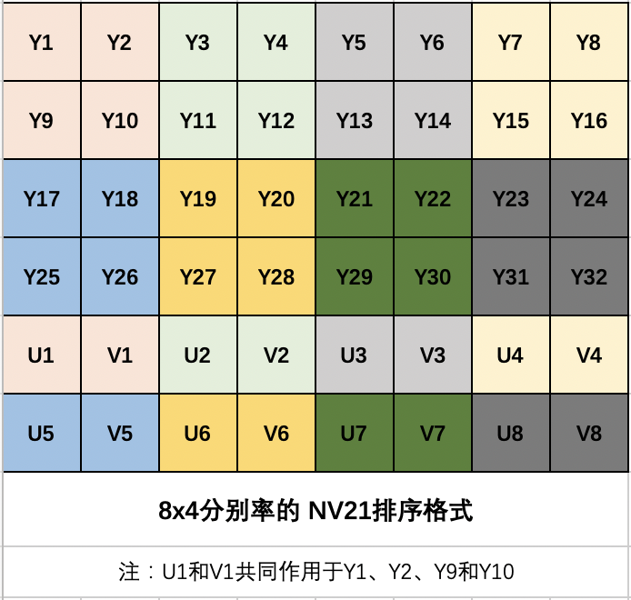

#视频数据源之YUV（1）


### 视频基本概念


一个视频简单点理解就是播放一张张画面。我们就从这里面把视频的相关名词扯出来：①一张画面，一张画面也就一**帧**画面；属性为图像的大小或尺寸称**分别率**；画面的成像组成的方式有：**rgb**和**yuv**；跟计算器关联起来还不是用0101的**比特**来表示②当画面遇上了时间，爱的结晶就出来了：**比特率**、**帧率**和**刷新率**。接下来我们简单介绍一下他们的作用：

- **视频帧：** 常见有I帧（关键帧，含完整画面，所以数据量大）、P帧（前向参考帧，参考前面I帧编码的图像信息）、B帧（双向预测帧，参考前面I帧、前面P帧和后面I帧编码的图像信息）；我们网上看视频时常常会遇到拖动进度条出现回退一两秒的情况吧？因为那个位置的当前帧不是I帧，没有完整的画面。
- **分辨率：** 图像的大小或尺寸。
- **RGB：** 任何彩色图像可由红绿蓝组成。RGB每一个通道占8位，1个字节内存。每个像素包含一个RGB，占3个字节（如果加上透明度RGBA则占32位，总共4个字节）。如：1920 x 1080内存大小=1920 x 1080 x 3=5.9M。
- **YUV(YCbCr)：** Y：亮度；UV：色度和饱和度；[wiki YCbCr](https://zh.wikipedia.org/wiki/YCbCr) 介绍。目前大多数都是使用yuv格式来表示视频帧的裸流数据。具体详情请往下阅读。
- **比特率(码率)：** 单位时间内播放媒体（包括视频和音频）的比特数量（bit的数量）。文件大小计算公式：

> 文件大小（b）= 码率（b/s）x 时间（s）

- **帧率(帧数)：** 画面每秒传输帧数，单位：fps（frame per second）或者 “赫兹”（Hz）。对于人眼感官常用范围在15~75fps之间。
- **刷新率：** 屏幕在每秒刷新（画面）的次数。单位：赫兹（Hz）。

### YUV基本介绍

人类视觉系统（HVS）对亮度比彩色更敏感，所以把Y和UV单独抽出来，每一个像素点都有一个Y，4个Y和一组UV（UV数量不定）共同绘制4个像素点，而Y和UV的比例不一样就分了多种 **取样格式**。


#### YUV与RGB的相互转化

-  RGB转YUV：

> Y = 0.299R + 0.587G + 0.114B
> U = 0.564(B - Y)
> V = 0.713(R - Y)

- YUV转RGB：

> R = Y + 1.402V
> B = Y + 1.772U
> G = Y - 0.344U - 0.714V

#### YUV取样格式

常见的取样格式有以下3种


- **4：4：4** 每4个素位置都有4个YUV，内存计算：1920 x 1080 = 1920 x 1080 x 3=5.9M；
- **4：2：2** 每4个Y像素具有2个U和2个V；内存计算：1920 x 1080 = 1920 x 1080 x (1 + 2/4 + 2/4)=3.9M；
- **4：2：0** 每4个Y像素具有1个U和1个V，使用在视频领域中应用最广泛。内存计算：1920 x 1080 = 1920 x 1080 x (1 + 1/4 + 1/4)=2.8M；

#### YUV数据排列格式

在这里介绍两种格式，一种是Android平台特有NV21（又称YUV420SP），另一种则是其他大部分平台同样的I420（又称YUV420P），这两个取样格式都是4:2:0，所以说他们两种的数据完全一样，只是放到内存里面的顺序变了。（我们要实现把从Android采样NV21数据转成I420然后推送到服务器。）

- **NV21：** ①先把Y数据全部排序完；②UV数据交替排序完；



- **I420：** ①先把Y数据全部排序完；②U数据排序完；③V数据排序完；


### YUV初步实战

#### 手写分离YUV分量以及对其进行播放

请前往 [视音频数据处理入门：RGB、YUV像素数据处理](https://blog.csdn.net/leixiaohua1020/article/details/50534150) 进行学习。对“前人种树，后人乘凉”感触颇深，只是太可惜了！

#### YUV数据源的采集（Android端）


```java
//1.相机权限

//2.获取相机，有后置摄像头：Camera.CameraInfo.CAMERA_FACING_BACK和前置摄像头：Camera.CameraInfo.CAMERA_FACING_FRONT
Camera camera = Camera.open(cameraId);

//3、Parameters这里封装着当前摄像头所能提供的参数（真实宽高等）
Camera.Parameters parameters = camera.getParameters();
//根据parameters.getSupportedPreviewSizes()提供的宽高尺寸挑选一个设置进去
parameters.setPreviewSize(width, height);
//设置预览数据为nv21（注意：仅仅是预览的数据，通过onPreviewFrame回调的仍没有发生变化）
parameters.setPreviewFormat(ImageFormat.NV21);
//设置预览角度，通过WindowManager.getDefaultDisplay().getRotation()参数查看。（因为android手机厂商安装摄像头传感器方向不统一，所以数据可能是旋转过的，所以要回正）
camera.setDisplayOrientation(degrees);
//设置修改过的数据，使得生效
camera.setParameters(parameters);

//4、设置数据监听，我们会在onPreviewFrame(byte[] data, Camera camera)处理回调的数据，这里的数据就是每一帧原始数据流。我们会先把数据按照角度回正（注意回正后的宽高可能是调换的），然后转成I420就行编码发送。
camera.setPreviewCallbackWithBuffer(this);

//5、启动预览画面
camera.setPreviewDisplay(holder);
camera.startPreview();  
```

#### NV21数据旋转

比如NV21数据以及顺时针旋转90度后的对比：


实现顺时针和逆时针旋转90度的代码：

```c
/**
 *yuv_n21_rotation("assets/yuv_nv21_800x480_back.yuv",800,480,90,"output/out_nv21_480x800_back.yuv");
 * 从android摄像机获取到的nv21格式数据，进行旋转
 */
int yuv_n21_rotation(const char *url_in, int width, int height, int rotation, const char *url_out) {
    FILE *pIn = fopen(url_in, "rb+");
    FILE *pOut = fopen(url_out, "wb+");
    int yuvSize = width * height * 3 / 2;
    unsigned char *simple = (unsigned char *) malloc(yuvSize);
    unsigned char *simpleOut = (unsigned char *) malloc(yuvSize);

    fread(simple, 1, yuvSize, pIn);
    //顺时针旋转90
    if (rotation == 90) {
        //宽高取反，把竖变行
        int k = 0;
        //宽高取反，把竖变行
        //y数据
        for (int w = 0; w < width; w++) {
            for (int h = height - 1; h >= 0; h--) {
                simpleOut[k++] = simple[h * width + w];
            }
        }
        //uv数据 height*width -> 3/2height*width
        for (int w = 0; w < width; w+=2) {
            for (int h = height / 2 - 1; h >= 0; h--) {
//                *(simpleOut + k) = simple[width * height + h * width + w];
                // u
                simpleOut[k++] = simple[width*height + width * h + w];
                // v
                simpleOut[k++]  = simple[width*height + width * h + w + 1];
            }
        }
    } else if(rotation == -90){
        //宽高取反，把竖变行
        int k = 0;
        //宽高取反，把竖变行
        //y数据
        for (int w = width -1; w >= 0; w--) {
            for (int h = 0; h < height; h++) {
                simpleOut[k++] = simple[h * width + w];
            }
        }
        //uv数据 height*width -> 3/2height*width
        for (int w = 0; w < width; w+=2) {
            for (int h = height / 2 - 1; h >= 0; h--) {
//                *(simpleOut + k) = simple[width * height + h * width + w];
                simpleOut[k++] = simple[width*height + width * h + w];
                simpleOut[k++] = simple[width*height + width * h + w + 1];
            }
        }
    }
    fwrite(simpleOut, 1, yuvSize, pOut);
    return 0;
}
```

#### NV21数据格式转I420数据格式

```c
//nv21_to_i420("assets/yuv_nv21_800x480_back.yuv",800,480,"output/out_yuv_i420_800x480_back.yuv");
int nv21_to_i420(const char *url_in, int width, int height, const char *url_out){
    FILE *pIn = fopen(url_in, "rb+");
    FILE *pOut = fopen(url_out, "wb+");
    int ySize = width * height;
    int uvSize = ySize /2;
    int yuvSize = ySize * 3 / 2;

    unsigned char *simple = (unsigned char *) malloc(yuvSize);
    unsigned char *simpleOut = (unsigned char *) malloc(yuvSize);
    fread(simple,yuvSize,1,pIn);
    //y
    memcpy(simpleOut, simple, ySize);
    for (int i = 0; i < uvSize/2; i++) {
        //u
        *(simpleOut + ySize + i) = *(simple + ySize + i * 2);
        //v
        *(simpleOut + ySize + i + uvSize/2) = *(simple + ySize + i * 2 + 1);
    }

    fwrite(simpleOut,yuvSize,1,pOut);
    fclose(pIn);
    fclose(pOut);
    return 0;
}
```

### 参考

- [wiki  YCbCr](https://zh.wikipedia.org/wiki/YCbCr)
- [视音频数据处理入门：RGB、YUV像素数据处理](https://blog.csdn.net/leixiaohua1020/article/details/50534150) 
- 新一代视频压缩编码标准-H.264_AVC(第二版) （书）
- 音视频开发进阶指南：基于Android与iOS平台的实践（书）
- Android 音视频开发_何俊林（书）