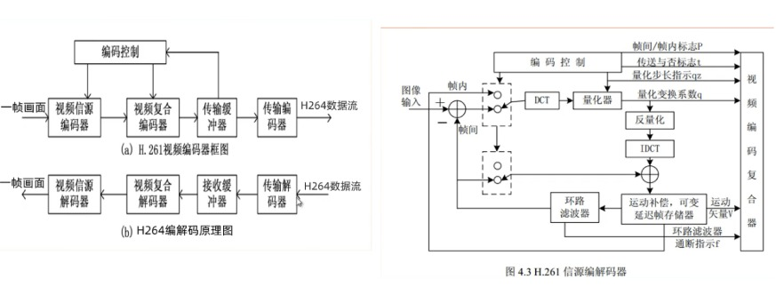
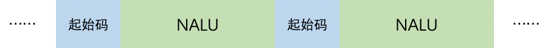
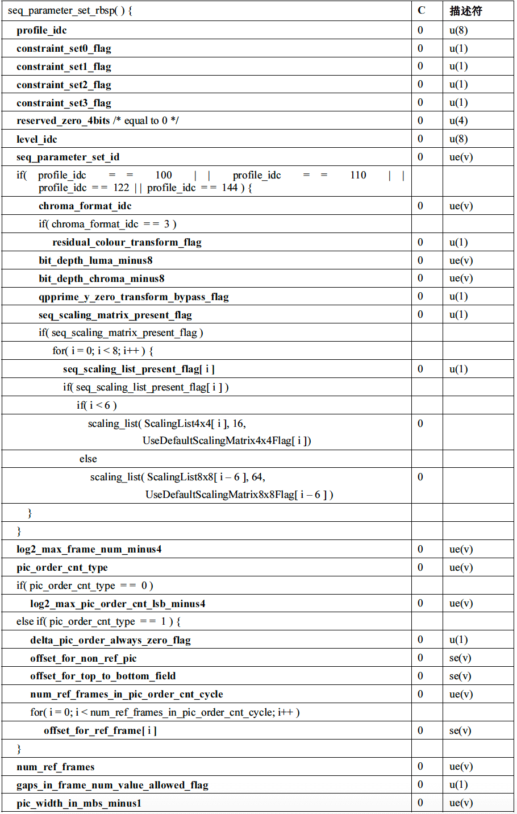
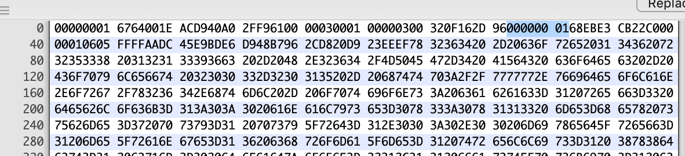
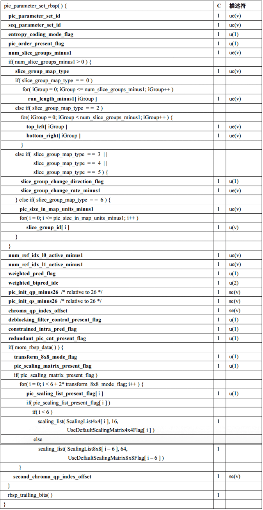

#视频编码之H.264（3）


### 简单说说编码

当我们把摄像头采集画面直接写入到文件中时，我们会发现没一会文件已经非常大了。这导致很不适合保存和传输，所以需要编码，把画面数据进行压缩。视频编码标准有很多，而我们这里讲的是H.264编码。其他请看：[视频编码标准汇总及比较](https://blog.csdn.net/leixiaohua1020/article/details/84483343) 。

### H.264编码

制订H.264的主要目标有两个：

（1）视频编码层(VCL，全称：Video Coding Layer)：得到高的视频压缩比。

（2）网络提取层(NAL，全称：Network Abstraction Layer)：具有良好的网络亲和性，即可适用于各种传输网络。而NAL则是以NALU（NAL Unit）为单元来支持编码数据在基于包交换技术网络中传输的。

#### H.264编码器



上面是H264的编码器原理图，编码时进行帧内编码和帧间编码。用相机录像举例，当相机录像过程帧出现一帧帧画面，没有压缩之间都是可以单独作为一张完整的照片，经过H264编码器后会出现：

- 1.SPS、PPS：生成图片的一些参数信息，比如宽高等。一般是开启编码器后的第一次I帧前输出一次。

- 2.I帧：编码后第一个完整帧，包含一张图片的完整信息，但是也是压缩的。主要是进行帧内压缩，把一帧图片划分为很多`宏块`，如：16x16、8x16、8x8、4x4等等，记录宏块顶部和左侧像素点数据，以及预测的方向。

- 3.B帧：叫双向预测帧。编码器遇到下一帧画面与前面帧变化非常非常小（相似度在95%之内），比如在录像中的人在发呆，当遇到变化略微有点大的P帧才停止，这会出现多张B帧，为了尽可能的存储更少的信息，将参考前面的I和后面的P帧，把中间变化的数据存储下来，这样编码记录运动矢量和残差数据即可。所以编码器当遇到这些帧时，先等待P帧编码结束后才进行编码B帧，因此输出顺序在P帧之后。

- 4.P帧：有了I帧作为基础，P就有参考的对象。跟前面I帧的变化非常少（相似度70%之内）。

- 5.GOF：按上面说录像人在发呆场景时，将一组数据相差较小的图片进行编码，这就有了GOF，即：`group of picture`，即一组图片，也叫一个场景的一组图片。是从一个I帧开始到下一个I帧前的一组数据。接着编码就是这样的一个个GOF的轮回。


如果不追求其中的细节，把他看成一个"黑盒"的话，编码成了：


解码成了：


编解码器工作具体细节我们可以不用深究，但是输入和输出的结果一定要知道，因为我们根据这个可以做很多事情，比如：

> 直播是过多的输出B帧会有什么影响？会出现延迟！！！


#### 编码的输入与输出

一张张画面通过以H.264编码标准的编码器(如x264)编码后，输出一段包含N个NALU的数据，每个NALU之间通过`起始码`来分隔，如图：



- **起始码：** 0x00 00 01 或者 0x00 00 00 01。

在网络传输（如RTMP）或者一些容器中（如FLV），通常会把NALU整合到视频区域的数据中。如下图的flv格式：


所以这篇文章主要学习NALU的基本知识，学会如何去分析一段NALU数据。

#### NALU（NAL 单元）

NALU(NAL Unit，NAL 单元)的组成部分如下图。其中，f(0)占1bit，u(2)占2bit，u(5)占5bit，文中如有出现类似描述符请看[H.264描述符](./h264-descriptor.md) 。


`forbidden_zero_bit`：禁止位，初始为0。当客户端接受到该位为1时，则会丢弃该NAL单元的解码，表示异常数据。

`nal_ref_idc`：优先级，越大优先级越高。比如：I帧优先级大于B帧，DPS芯片会优先解码重要性高的。

从上图可以看出来，当前NAL单元属于什么样的类型，这取决于RBSP具体是什么样的类型，而RBSP的类型是根据`nal_unit_type`的值来定义的。
①当`nal_unit_type`为1~5时：RBSP为切片类型（有5种切片类型）；整个NAL单元类型为VCL NAL单元，VCL是上面说的视频编码层，里面有编码后画面数据。
②当`nal_unit_type`为其他时：RBSP为序列参数集类型、图像参数集类型等等；整个NAL单元类型为非VCL NAL单元。
具体的`nal_unit_type`所对应的RBSP类型如下表所示：

| nal_unit_type | NAL 单元和 RBSP 语法结构的内容                               |
| ------------- | ------------------------------------------------------------ |
| 0             | 未指定                                                       |
| 1             | 一个非IDR图像的编码条带<br />slice_layer_without_partitioning_rbsp( ) |
| 2             | 编码条带数据分割块A<br />slice_data_partition_a_layer_rbsp( ) |
| 3             | 编码条带数据分割块B<br />slice_data_partition_b_layer_rbsp( ) |
| 4             | 编码条带数据分割块C<br />slice_data_partition_c_layer_rbsp( ) |
| 5             | IDR图像的编码条带<br />slice_layer_without_partitioning_rbsp( ) |
| 6             | 辅助增强信息 (SEI)<br />sei_rbsp( )                          |
| 7             | 序列参数集（SPS）<br />seq_parameter_set_rbsp( )             |
| 8             | 图像参数集(PPS)<br />pic_parameter_set_rbsp( )               |
| 9             | 访问单元分隔符<br />access_unit_delimiter_rbsp( )            |
| 10            | 序列结尾<br />end_of_seq_rbsp( )                             |
| 11            | 流结尾<br />end_of_stream_rbsp( )                            |
| 12            | 填充数据<br />filler_data_rbsp( )                            |
| 13            | 序列参数集扩展<br />seq_parameter_set_extension_rbsp( )      |
| 14..18        | 保留                                                         |
| 19            | 未分割的辅助编码图像的编码条带<br />slice_layer_without_partitioning_rbsp( ) |
| 20..23        | 保留                                                         |
| 24..31        | 未指定                                                       |

### SPS（序列参数集）

SPS全称 `Sequence parameter set`(序列参数集)，当`nal_unit_type`=7时，RBSP就是SPS类型，也可以说NAL单元为SPS的NAL单元。SPS主要包含的是针对一连续编码视频序列的参数，如帧数、图像尺寸等；详见下表 *序列参数集RBSP 语法*：



上面中的主要参数的含义：

####profile_idc

- **profile_idc** 档次（H.264编码标准有几个档次，等级越高视频越清晰）：

| 值（十进制）    |       表示的意义     |
| ------------ | ------------------ |
| *66*         | Baseline（直播）   |
| *77*         | Main（一般场景）   |
| *88*         | Extended           |
| *100*        | High (FRExt)       |
| *110*        | High 10 (FRExt)    |
| *122*        | High 4:2:2 (FRExt) |
| *144*        | High 4:4:4 (FRExt) |


####level_idc

- **level_idc**  最大支持码流范围：

标识当前码流的Level。编码的Level定义了某种条件下的最大视频分辨率、最大视频帧率等参数，码流所遵从的level由level_idc指定。

|   值(十进制)            |       表示最大支持每秒码流大小                                    |
| --------------------- | ------------------------------------------------------------ |
| *10*                  | 1    (supports only QCIF format and below with 380160 samples/sec) |
| *11*                  | 1.1  (CIF and below. 768000 samples/sec)                     |
| *12*                  | 1.2  (CIF and below. 1536000 samples/sec)                    |
| *13*                  | 1.3  (CIF and below. 3041280 samples/sec)                    |
| *20*                  | 2    (CIF and below. 3041280 samples/sec)                    |
| *21*                  | 2.1  (Supports HHR formats. Enables Interlace support. 5 068 800 samples/sec) |
| *22*                  | 2.2  (Supports SD/4CIF formats. Enables Interlace support. 5184000 samples/sec) |
| *30*                  | 3    (Supports SD/4CIF formats. Enables Interlace support. 10368000 samples/sec) |
| *31*                  | 3.1  (Supports 720p HD format. Enables Interlace support. 27648000 samples/sec) |
| *32*                  | 3.2  (Supports SXGA format. Enables Interlace support. 55296000 samples/sec) |
| *40*                  | 4    (Supports 2Kx1K format. Enables Interlace support. 62914560 samples/sec) |
| *41*                  | 4.1  (Supports 2Kx1K format. Enables Interlace support. 62914560 samples/sec) |
| *42*                  | 4.2  (Supports 2Kx1K format. Frame coding only. 125829120 samples/sec) |
| *50*                  | 5    (Supports 3672x1536 format. Frame coding only. 150994944 samples/sec) |
| *51*                  | 5.1  (Supports 4096x2304 format. Frame coding only. 251658240 samples/sec) |

####seq_parameter_set_id

- **seq_parameter_set_id** 标识符，本序列的id号，会被PPS引用。

####chroma_format_idc

- **chroma_format_idc**  与亮度取样对应的色度取样 

 chroma_format_idc 的值应该在 0到 3的范围内（包括 0和 3）。**当 chroma_format_idc不存在时，应推断其值为 1（4：2：0的色度格式）。** 

色度采样结构

|  chroma_format_idc  |  色彩格式  |   SubWidthC  | SubHeightC   |
|---------------------|-----------|-------------|---------------|
|0                    | 单色       |-            | -            |
|1                    | 4:2:0     |2            | 2            |
|2                    | 4:2:2     |2            | 1            |
|3                    | 4:4:4     |1            | 1            |


####num_ref_frames

规定了可能在视频序列中任何图像帧间预测的解码过程中用到的短期参考帧和长期参考
帧、互补参考场对以及不成对的参考场的最大数量。num_ref_frames 字段也决定了 8.2.5.3 节规定的滑动窗口操作
的大小。num_ref_frames 的取值范围应该在 0 到 MaxDpbSize （参见 A.3.1 或 A.3.2 节的定义）范围内，包括 0 和
MaxDpbSize 。

####pic_width_in_mbs_minus1

- **pic_width_in_mbs_minus1** 加1是指以宏块为单元的每个解码图像的宽度。
> 本句法元素加 1 后指明图像宽度，以宏块为单位：PicWidthInMbs = pic_width_in_mbs_minus1 + 1
> 通过这个句法元素解码器可以计算得到亮度分量以像素为单位的图像宽度：
>                         PicWidthInSamplesL = PicWidthInMbs * 16
> 从而也可以得到色度分量以像素为单位的图像宽度：
>                         PicWidthInSamplesC = PicWidthInMbs * 8
> 以上变量 PicWidthInSamplesL、 PicWidthInSamplesC 分别表示图像的亮度、色度分量以像素为单位的宽。
>
> H.264 将图像的大小在序列参数集中定义，意味着可以在通信过程中随着序列参数集动态地改变图像的大小，甚至可以将传送的图像剪裁后输出。
>
> ```cpp
> frame_width = 16 × (pic_width_in_mbs_minus1 + 1);
> ```

#### pic_height_in_map_units_minus1

- **pic_height_in_map_units_minus1** 加1表示以条带组映射为单位的一个解码帧或场的高度。

> 本句法元素加 1 后指明图像高度：
>                         PicHeightInMapUnits = pic_height_in_map_units_minus1 + 1
>                         PicSizeInMapUnits = PicWidthInMbs * PicHeightInMapUnits
> 图像的高度的计算要比宽度的计算复杂，因为一个图像可以是帧也可以是场，从这个句法元素可以在帧模式和场模式下分别计算出出亮度、色度的高。值得注意的是，这里以 map_unit 为单位， map_unit的含义由后文叙述。
>
> ```cpp
> PicHeightInMapUnits = pic_height_in_map_units_minus1 + 1;
> frame_height = 16 × (pic_height_in_map_units_minus1 + 1);
> ```

####手撕SPS

下面为从一个只放h.264视频编码文件的一段（SPS）：



ue(v)和se(v)的计算公式见 [H.264描述符](./h264-descriptor.md) 。

```shell
# 00000001 6764001E ACD940A0 2FF96100 00030001 00000300 320F162D 96
00000001 #起始码
#NAL单元头---0x67 0110 0111 --------------
0... .... # forbidden_zero_bit -->u(1)
.11. .... # nal_ref_idc -->u(2) -->HIGHEST
...0 0111 # nal_unit_type -->u(5) -->SPS
64 # profile_idc=103 -->u(8) 
#---0x00 0000 0000 --------------
0... .... #constraint_set0_flag
.0.. .... #constraint_set1_flag
..0. .... #constraint_set2_flag
...0 .... #constraint_set3_flag
.... 0000 #reserved_zero_4bits
1E # level_idc -->u(8) --> 30
#-----------0xAC 1010 1100 --------------
1... .... # seq_parameter_set_id --> ue(v) --> 0
.010 .... # log2_max_frame_num_minus4 --> ue(v) --> 1
.... 1... # pic_order_cnt_type --> ue(v) -->1 执行else if( pic_order_cnt_type == 1 )
.... .1..#delta_pic_order_always_zero_flag -->u(1)
#----------0xACD9 (1010 11)00 1101 1001 ====== 括号里面的bit上面已使用
.... ..00 110. .... #offset_for_non_ref_pic -->se(v)->codeNum=5->value=3
.... .... ...1 .... #offset_for_top_to_bottom_field -->se(v)->codeNum=0->value=0
.... .... .... 1... #num_ref_frames_in_pic_order_cnt_cycle -->ue(v)->0
#----------0xD940 (1101 1)001 0100 0000 ====== 括号里面的bit上面已使用
.... .001 01.. .... #num_ref_frames -->ue(v)->4
.... .... ..0. .... #gaps_in_frame_num_value_allowed_flag -->u(1)->0
#----------0x40A0 (010)0 0000 1010 0000 ====== 括号里面的bit上面已使用
...0 0000 1010 00.. #pic_width_in_mbs_minus1 -->ue(v)->32-1+8=39 --> 视频宽 = (宏块 + 1) X 16 = (39 + 1)X16 = 640
#----------0xA02F (1010 00)00 0010 1111 ====== 括号里面的bit上面已使用
.... ..00 0010 111. #pic_height_in_map_units_minus1 -->ue(v)->16-1+7=22--> 视频高 = (宏块 + 1) X 16 = (22 + 1)X16 = 368
…………就到这里了，偷个懒，有兴趣大家自己分析下去，哈哈

```


### PPS（图像参数集）

PPS全称`picture parameter set`(图像参数集)，当`nal_unit_type`=8时，RBSP就是PPS类型，也可以说NAL单元为SPS的NAL单元。一个序列中某一幅图像或者某几幅图像，其参数如标识符pic_parameter_set_id、可选的seq_parameter_set_id、熵编码模式选择标识、片组数目、初始量化参数和去方块滤波系数调整标识等；详见下表 *图像参数集RBSP 语法*：




### 其他常见名称缩写

|   名词缩写               |                   中文含义                        |
| ---------------------  | ------------------------------------------------------------ |
| *CABAC*                | 基于上下文的自适应二进制算术编码 |
| *CAVLC*                | 基于上下文的自适应变长编码                     |
| *CBR*                  | 恒定比特率                   |
| *CPB*                  | 编码图像缓存区                    |
| *DPB*                  | 解码图像缓存区                    |
| *DUT*                  | 被测解码器 |
| *FIFO*                 | 先进先出 |
| *HRD*                  | 假想参考解码器 |
| *HSS*                  | 假想码流调度器 |
| *IDR*                  | 即时解码刷新（I帧） |
| *LSB*                  | 最低有效位 |
| *MB*                   | 宏块 |
| *MBAFF*                | 宏块自适应帧－场编码 |
| *MSB*                  | 最高有效位 |
| *NAL*                  | 网络抽象层 |
| *RBSP*                 | 原始字节序列载荷 |
| *SEI*                  | 补充的增强信息 |
| *SODB*                 | 数据比特串 |
| *UUID*                 | 通用唯一性标识符 |
| *VBR*                  | 可变比特率 |
| *VCL*                  | 视频编码层 |
| *VLC*                  | 变长编码 |


### X264

这是国际好评的H.264协议标准的编码工具，这里简单介绍一下如何使用。

（1）下载：https://www.videolan.org/developers/x264.html

（2）编译（android的交叉编译，平台：Mac）

```shell
#!/bin/sh
##########脚本忘记是参考哪位大神的了##########
#ndk的路径
NDK=/Users/Qincji/Desktop/develop/android/source/sdk/ndk/android-ndk-r17c
API=17 #最低支持Android版本
#编译平台darwin-x86_64为mac，linux-x86_64为linux
HOST_PLATFORM=darwin-x86_64
function build_x264 { 
  OUTPUT=$(pwd)/"android"/"$CPU"
  ./configure \
  --prefix=$OUTPUT \
  --cross-prefix=$CROSS_PREFIX \
  --sysroot=$SYSROOT \
  --host=$HOST \
  --disable-asm \
  --disable-shared \
	--enable-static \
  --disable-opencl \
  --enable-pic \
  --disable-cli \
  --extra-cflags="$EXTRA_CFLAGS" \
  --extra-ldflags="$EXTRA_LDFLAGS" 
   make clean 
   make install
   echo "编译结束，路径如下："
   echo "$OUTPUT"     
 }
 
CPU="armeabi-v7a"
CROSS_PREFIX=$NDK/toolchains/arm-linux-androideabi-4.9/prebuilt/darwin-x86_64/bin/arm-linux-androideabi-
SYSROOT=$NDK/platforms/android-$API/arch-arm/
EXTRA_CFLAGS="-D__ANDROID_API__=$API -isysroot $NDK/sysroot -I$NDK/sysroot/usr/include/arm-linux-androideabi -Os -fPIC -marm"
EXTRA_LDFLAGS="-marm"
HOST=arm-linux
build_x264
```

（3）把编译生成的静态库移入android studio


在CMakeList.txt文件中添加：

```cmake
...
include_directories(include)
...
target_link_libraries(
        ...
        x264
        )
```

（4）API简单使用

```c++
/**
关键步骤，来自雷神：https://blog.csdn.net/leixiaohua1020/article/details/42078645
x264_param_default()：设置参数集结构体x264_param_t的缺省值。
x264_picture_alloc()：为图像结构体x264_picture_t分配内存。
x264_encoder_open()：打开编码器。
x264_encoder_encode()：编码一帧图像。
x264_encoder_close()：关闭编码器。
x264_picture_clean()：释放x264_picture_alloc()申请的资源。
 
存储数据的结构体如下所示。
x264_picture_t：存储压缩编码前的像素数据。
x264_nal_t：存储压缩编码后的码流数据。
*/
int X264Rtmp::encode(const char *url, int width, int height, int bitRate, int fps) {
    //计算一帧等信息
    int ySize = width * height;
    int uvSize = ySize / 4;
    FILE *fp_src = fopen(url, "rb");

    //初始化VLC图片编码层的参数
    x264_picture_t *pic_in = (x264_picture_t *) malloc(sizeof(x264_picture_t));
    x264_t *videoCodec = 0;

    x264_param_t param;
    x264_param_default(&param);
    //根据应用场景设置编码速度，以及编码质量。2：x264_preset_names，3：x264_tune_names
    x264_param_default_preset(&param, x264_preset_names[0], x264_tune_names[7]);
    //输入数据格式， yuv 4:2:0
    param.i_csp = X264_CSP_I420;
    param.i_width = width;
    param.i_height = height;

    //base_line 3.2 编码规格，影响网络带宽，图像分辨率等。 -- https://en.wikipedia.org/wiki/Advanced_Video_Coding
    param.i_level_idc = 32;
    //两张参考图片间b帧的数量
    param.i_bframe = 0;
    //参数i_rc_method表示码率控制，CQP(恒定质量)，CRF(恒定码率)，ABR(平均码率)
    param.rc.i_rc_method = X264_RC_ABR;
    //比特率(码率, 单位Kbps)
    param.rc.i_bitrate = bitRate / 1000;
    //瞬时最大码率
    param.rc.i_vbv_max_bitrate = bitRate / 1000 * 1.2;
    //设置了i_vbv_max_bitrate必须设置此参数，码率控制区大小,单位kbps
    param.rc.i_vbv_buffer_size = bitRate / 1000;
    //帧率（每秒显示多少张画面）
    param.i_fps_num = fps;
    param.i_fps_den = 1;
    param.i_timebase_den = param.i_fps_num;
    param.i_timebase_num = param.i_fps_den;
//    param.pf_log = x264_log_default2;
    //用fps而不是时间戳来计算帧间距离
    param.b_vfr_input = 0;
    //帧距离(关键帧)  2s一个关键帧
    param.i_keyint_max = fps * 2;
    // 是否复制sps和pps放在每个关键帧的前面 该参数设置是让每个关键帧(I帧)都附带sps/pps。
    param.b_repeat_headers = 1;
    //多线程
    param.i_threads = 1;

    x264_param_apply_profile(&param, "baseline");
    //打开编码器
    videoCodec = x264_encoder_open(&param);

    x264_picture_alloc(pic_in, X264_CSP_I420, width, height);

    //编码：h264码流
    while (!feof(fp_src)) {
        //y数据
        fread(pic_in->img.plane[0], ySize, 1, fp_src);         //Y
        fread(pic_in->img.plane[1], uvSize, 1, fp_src);     //U
        fread(pic_in->img.plane[2], uvSize, 1, fp_src);     //V
        //编码出来的数据  （帧数据）
        x264_nal_t *pp_nal;
        //编码出来有几个数据 （多少帧）
        int pi_nal;
        x264_picture_t pic_out;
        x264_encoder_encode(videoCodec, &pp_nal, &pi_nal, pic_in, &pic_out);
        //如果是关键帧 3
        int sps_len;
        int pps_len;
        uint8_t sps[100];
        uint8_t pps[100];
        // chroma_format_idc
        for (int i = 0; i < pi_nal; ++i) {
            x264_nal_t &nal = pp_nal[i];
            if (nal.i_type == NAL_SPS) {
            } else if (nal.i_type == NAL_PPS) {
            } else {
            }
        }
    }
}
```

### 参考

- [视频编码标准汇总及比较](https://blog.csdn.net/leixiaohua1020/article/details/84483343)
- [H.264-AVC-ISO_IEC_14496-10](http://103.23.20.16/srs/trunk/doc/H.264-AVC-ISO_IEC_14496-10.pdf)
- 新一代视频压缩编码标准-H.264_AVC(第二版)
- H.264官方中文版.pdf
- https://stackoverflow.com/questions/28421375/usage-of-start-code-for-h264-video/29103276
- https://blog.csdn.net/engineer_james/article/details/81750864
- [x264流程](https://blog.csdn.net/leixiaohua1020/article/details/42078645)
- [x264参数注释](https://www.lagou.com/lgeduarticle/76946.html)
