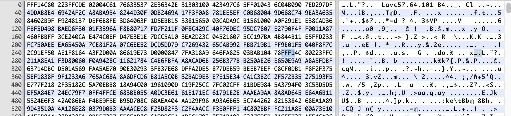
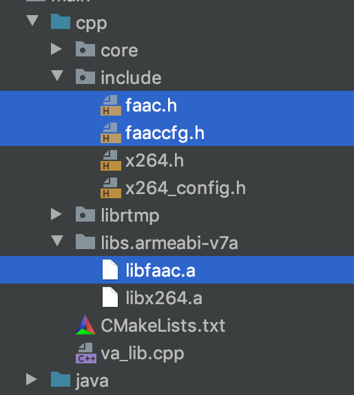

#音频编码之AAC（4）


### 回顾

还记得我们采集到的PCM原始数据流（俗称裸流）吗？由于PCM裸流过大，不便于储存与传输，于是就出现了针对于PCM裸流的压缩编码标准，包含AAC，MP3，AC-3 等等（[wiki audio file format](https://en.wikipedia.org/wiki/Audio_file_format)）；而AAC则是当前的主流。这里的AAC指的是一套编码标准（协议），而faac是一个开源的AAC编解码工具。

### 简述

AAC：高级音频编码(Advanced Audio Coding)，基于MPEG-2的音频编码技术，目的是取代MP3格式。2000年，MPEG-4标准出现后，AAC重新集成了其特性，为了区别于传统的MPEG-2 AAC又称为MPEG-4 AAC。

### AAC的音频文件格式

AAC的音频文件格式有两种ADIF和ADTS。这两种格式主要区别：ADIF只有一个文件头，ADTS每个包前面有一个文件头。而我们重点讲解的是ADTS格式。

#### ADIF

Audio Data Interchange Format 音频数据交换格式。这种格式的特征是可以确定的找到这个音频数据的开始，不需进行在音频数据流中间开始的解码，即它的解码必须在明确定义的开始处进行。故这种格式常用在磁盘文件中。编码格式如下：


在MPEG-2 AAC中ADIF语法规则如下：


#### ADTS

Audio Data Transport Stream 音频数据传输流。这种格式的特征是它是一个有同步字的比特流，解码可以在这个流中任何位置开始。也就是说ADTS的每一帧都有一个header和aac音频数据，这可以在网络传输的时候进行实时解码。

下图为ADTS的组成部分以及在**MPEG-2** AAC的语法结构：


下图为ADTS的组成部分以及在**MPEG-4** AAC的语法结构：


 注：ES：全称elementary stream，这里意为编码后的音频数据。

**adts_fixed_header**关键参数如下：

- **syncword** 恒为 '1111 1111 1111'，也就是0xFFF。作为每个adts_freme的分割。

- **ID** 使用那个MPEG版本。0：MPEG-4，1：MPEG-2。

- **layer** 应该恒 为‘00’。

- **protection_absent** 是否使用error_check()。0：使用，1：不使用。

- **profile(MPEG-4:profile_ObjectType)** 见下表（左边是MPEG-2版本；右边是MPEG-4版本，Profile_ObjectType的值）：

  

- **sampling_frequency_index** 采样率的数组下标，即：sampling frequeny[sampling_frequency_index] ：

  

- **private_bit**  私有位，编码时设置为0，解码时忽略。

- **channel_configuration** 声道数。

- **original_copy** 编码时设置为0，解码时忽略。

- **home** 编码时设置为0，解码时忽略。

**adts_variable_header**关键参数如下：

- **copyright_identification_bit** 72位版权标识字段中的一位。
- **copyright_identification_start** 一位表示 该音频帧中的copyright_identification_bit是 72位版权标识的第一位。如果不 版权标识已传输，此位应 保持为'0'。'0'在 此音频帧“ 1”开始在 此音频帧。
- **frame_length(MPEG-4:aac_frame_length)** 帧的长度，包括header和以字节为单位的error_check。
- **adts_buffer_fullness** 固定0x7FF，表示比特流是可变速率比特流。
- **number_of_raw_data_blocks_in_frame** 在ADTS帧中有number_of_raw_data_blocks_in_frame + 1个AAC原始数据块。number_of_raw_data_blocks_in_frame == 0 表示说ADTS帧中有一个AAC原始数据块。

下图为一个ADTS格式的文件开头部分



我们来数一个第一个frame的header

```shell
####adts_fixed_header()
#-------FFF1---------
1111 1111 1111 .... #0xFFF; syncword的值
.... .... .... 0... #ID=0;使用MPEG-4
.... .... .... .00. #layer
.... .... .... ...0 #protection_absent，不使用error_check()
#-------4C80---------
01.. .... .... .... #Profile_ObjectType=AAC MAIN
..00 11.. .... .... #sampling_frequency_index=3,采样率为48000
.... ..0. .... .... #private_bit
.... ...0 10.. .... #channel_configuration=2（声道数）
.... .... ..0. .... #original_copy
.... .... ...0 .... #home
####adts_variable_header()
#-------(4C8)0---------
.... .... .... 0... #copyright_identification_bit
.... .... .... .0.. #copyright_identification_start
#-------(4C8)0 223F--------
..00 0010 0010 001. .... #aac_frame_length=0x111=273字节-->下一帧到上图的FFF14C
#-------(22)3F FC--------
...1 1111 1111 11.. #adts_buffer_fullness=0x7FF
#-------(F)C--------
..00 #number_of_raw_data_blocks_in_frame
```

### faac开源库

（1）下载

https://nchc.dl.sourceforge.net/project/faac/faac-src/faac-1.29/faac-1.29.9.2.tar.gz

（2）编译生成静态库（这里是android的交叉编译脚本，ndk21，平台mac）

```shell
#!/bin/bash

PREFIX=`pwd`/android/armeabi-v7a
NDK_ROOT=/Users/Qincji/Desktop/develop/android/source/sdk/ndk/android-ndk-r21
# 注意：Mac为darwin-x86_64，linux为linux-x86_64；一定要确保路径真实有效
TOOLCHAIN=$NDK_ROOT/toolchains/llvm/prebuilt/darwin-x86_64
CROSS_COMPILE=$TOOLCHAIN/bin/arm-linux-androideabi

#在android studio中新建一个NDK项目，并且保持NDK版本与这里的一致。该FLAGS从build.ninja文件中拷贝。
FLAGS="-g -DANDROID -fdata-sections -ffunction-sections -funwind-tables -fstack-protector-strong -no-canonical-prefixes -D_FORTIFY_SOURCE=2 -march=armv7-a -mthumb -Wformat -Werror=format-security   -Oz -DNDEBUG  -fPIC"

export CC=$TOOLCHAIN/bin/armv7a-linux-androideabi21-clang
export CXX=$TOOLCHAIN/bin/armv7a-linux-androideabi21-clang++
export CFLAGS="$FLAGS"
export PATH=$PATH:$TOOLCHAIN/bin
	

./configure \
--prefix=$PREFIX \
--host=arm-linux-androideabi \
--with-pic \
--enable-shared=no  

make clean
make install
```

（3）移入项目中



并且配置CMakeList.txt文件

```cmake
...
include_directories(include)
...
target_link_libraries(
        ...
        faac
        )
```

（4）API简单使用

```c++
//1.打开编码器，获取inputSamples和maxOutputBytes的值，用于后面编码
//1：采样率；2：声道数；3：单次输入的样本数；4：输出数据最大字节数
faacEncOpen(unsigned long sampleRate,unsigned int numChannels,unsigned long *inputSamples,unsigned long *maxOutputBytes);

//2.设置编码器参数
faacEncConfigurationPtr config = faacEncGetCurrentConfiguration(faacEncHandle hEncoder);
//指定mpeg4编码标准
config->mpegVersion = MPEG4;
//config->mpegVersion = MPEG2;
//lc 标准
config->aacObjectType = LOW;
//16位
config->inputFormat = FAAC_INPUT_16BIT;
// 编码出原始数据；0 = Raw; 1 = ADTS
config->outputFormat = 1;
faacEncSetConfiguration(faacEncHandle hEncoder, config);

//3.进行编码
//1：FAAC的handle；2：采集的pcm的原始数据；3：从faacEncOpen获取的inputSamples；4：至少有从faacEncOpen获取maxOutputBytes大小的缓冲区；5：从faacEncOpen获取maxOutputBytes
//返回值为编码后数据字节的长度
int encodeLenght = faacEncEncode(faacEncHandle hEncoder, int32_t * inputBuffer, unsigned int samplesInput,
			 unsigned char *outputBuffer,
			 unsigned int bufferSize);
```


### 参考

- [AAC格式简介](https://blog.csdn.net/leixiaohua1020/article/details/11822537)
- [wiki audio file format](https://en.wikipedia.org/wiki/Audio_file_format)
- https://csclub.uwaterloo.ca/~ehashman/ISO14496-3-2009.pdf
