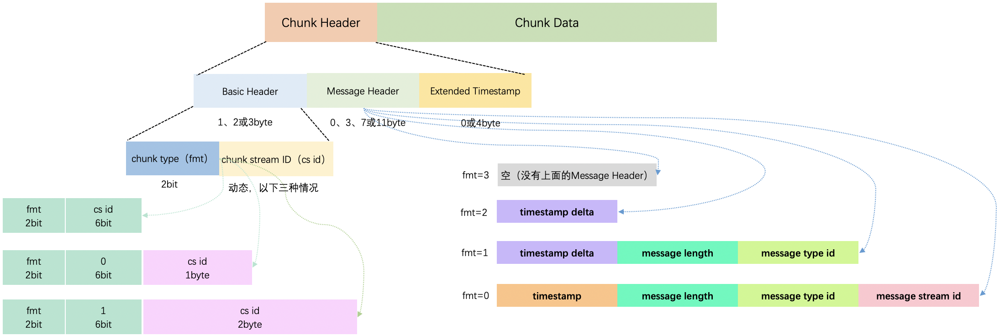
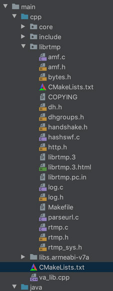

#直播推流编码之RTMP（5）

### 简述

Adobe 公司的实时消息传输协议 (RTMP) 通过一个可靠地流传输提供了一个双向多通道消息服务，意图在通信端之间传递带有时间信息的视频、音频和数据消息流。

### Handshake Diagram（握手流程）


- **Uninitialized (未初始化)：** 客户端发送C0包(1 字节，版本信息)，如果服务器支持这个版本会响应S0和S1，否则终止连接。
- **Version Sent (版本已发送)：** 当服务器接收到版本号后(已发送S0和S1)，客户端等S1，服务器等C1，当都接收后，客户端发送C2，服务器发送S2，然后两者状态变成Ack Sent。
- **Ack Sent (确认已发送)：** 客户端和服务器分别等待 S2 和 C2。
- **Handshake Done (握手结束)：** 客户端和服务器可以开始交换消息了。

### 分块

网络传输过程中，每一个块（每个rtmp包）必须被完全发送才可以发送下一块，而在接收端，这些块被根据 `chunk stream ID` 被组装成消息。分块允许上层协议将大的消息分解为更小的消息，例如，防止体积大的但优先级小的消息 (比如视频) 阻碍体积较小但优先级高的消息 (比如音频或者控制命令)。分块也让我们能够使用较小开销发送小消息，因为块头包含包含在消息内部的信息压缩提示。下面块格式就是一个块的组成。（注意：当连续接收到`chunk stream ID` 相同时，这些快是同一个消息，需要合并。）

#### Chunk Format（块格式）

下图大致的概括了一块的组成，从当前块的 **第一个字节** 大致能分析出该块头的组成信息。 `Extended Timestamp` 和 `Chunk Data`具体计算在下面介绍。



#### Basic Header（块基本头）

cs id保留0和1的值，而2的值保留用于下层协议控制消息和命令；具体如下：

**第一个字节低6bit值>1：** `Basic Header` 为1byte；fmt=2bit；`cs id` =6bit，范围：2-63（也就是6bit最大能支持的范围）。

|  fmt   | cs id  |
| :----: | :----: |
| 高2bit | 低6bit |

如：0100 1010->fmt：01.. ....=2；cs id：..00 1010=10

**第一个字节低6bit值=0：** `Basic Header` 为2byte；fmt=2bit；此时第一个字节中后6bit的值为0，cs id=第2个byte，范围：64 ~ 319（也就是第2个byte的值 + 64）。

|  fmt   |   0    | cs id - 64 |
| :----: | :----: | :--------: |
| 高2bit | 低6bit |    byte    |

如：1000 0000 0001 0001->fmt：10.. ....=2；0：..00 0000；cs id：(0001 0001)+64=17+64=81

**第一个字节低6bit值=1：**  `Basic Header` 为3byte；fmt=2bit；此时第一个字节中后6bit的值为0，cs id=第2个byte，范围：64~65599（(第3个byte) * 256 + (第2个byte) + 64）。

|  fmt   |   1    | cs id - 64 |
| :----: | :----: | :--------: |
| 高2bit | 低6bit |   2byte    |

如：1100 0000 0001 0001 0010 0010->fmt：11.. ....=2；1：..00 0001；cs id：(0010 0010)x256 + (0001 0001)+64=8704 + 17 + 64=8785

#### Message Header（块消息头）

根据块基本头中的 **fmt** 的值来区分块消息头，从0—3共4种，上图标的很明确了，具体如下：

**fmt = 0：** 块消息头为11字节，当前消息的 `timestamp` 在这表示(此时 `Extended Timestamp` 辅助用)，如果用户设置时间戳>=0xFFFFFF时(3字节容不下了)时，`timestamp` 字段就固定为0xFFFFFF。`message length` 是指 `Chunk Data` 的大小。`Extended Timestamp` 字段用4字节表示；

| timestamp | message length | message type id | message stream id |
| :-------: | :------------: | :-------------: | :---------------: |
|   3byte   |     3byte      |      1byte      |       4byte       |

**fmt = 1：** 块消息头为7字节，少了 `message stream id` ，这一块使用前一块一样的流 ID。

| timestamp delta | message length | message type id |
| :-------------: | :------------: | :-------------: |
|      3byte      |     3byte      |      1byte      |

**fmt = 2：** 块消息头为3字节，只有 `timestamp delta` ，计算方式同 **fmt = 0** 时一样处理；流 ID与 **fmt = 1** 相同。

**fmt = 3：** 无块消息头；流 ID与 **fmt = 1** 相同；当一个消息被切割成多块时，除第一块外，其他都应 **fmt = 3**。

#### Extended Timestamp（扩展时间戳）

当块消息头中的 `timestamp` 或者 `timestamp delta` 字段(3字节)容不下时(**fmt = 0，1或2**)，`Extended Timestamp` 才会被使用。

### RTMPDump

tmpdump 是一个用来处理 RTMP 流媒体的工具包，支持 rtmp://, rtmpt://, rtmpe://, rtmpte://, and rtmps:// 等。源码详细api以及流程图请看雷神的[RTMPdump 源代码分析 1： main()函数](https://blog.csdn.net/leixiaohua1020/article/details/12952977) ，这里只是简单介绍，集成到android中使用。因为源码很少，所以直接在as中进行编译生成静态库。

（1）下载：http://rtmpdump.mplayerhq.hu/download/rtmpdump-2.3.tgz

（2）把源码导入到as中，如下图所示：



librtmp/CMakeLists.txt文件配置：

```cmake
cmake_minimum_required(VERSION 3.4.1)
#预编译宏
set(CMAKE_C_FLAGS "${CMAKE_C_FLAGS} -DNO_CRYPTO"  )
#所有源文件放入 rtmp_source 变量
file(GLOB rtmp_source *.c)
#编译静态库
add_library(rtmp STATIC ${rtmp_source} )
```

项目的CMakeLists.txt文件引用编译生成的静态库

```cmake
...
# 引入指定目录下的CMakeLists.txt
add_subdirectory(${CMAKE_SOURCE_DIR}/librtmp)
...
#4、链接到库文件，jni/c/c++可以引入链接到
target_link_libraries(
        rtmp
        ...)
```


### 参考

（1）[rtmp_specification_1.0](https://wwwimages2.adobe.com/content/dam/acom/en/devnet/rtmp/pdf/rtmp_specification_1.0.pdf)

（2）https://www.cnblogs.com/Kingfans/p/7083100.html

（3）https://blog.csdn.net/commshare/article/details/103393461

（4）https://blog.csdn.net/leixiaohua1020/article/details/12952977