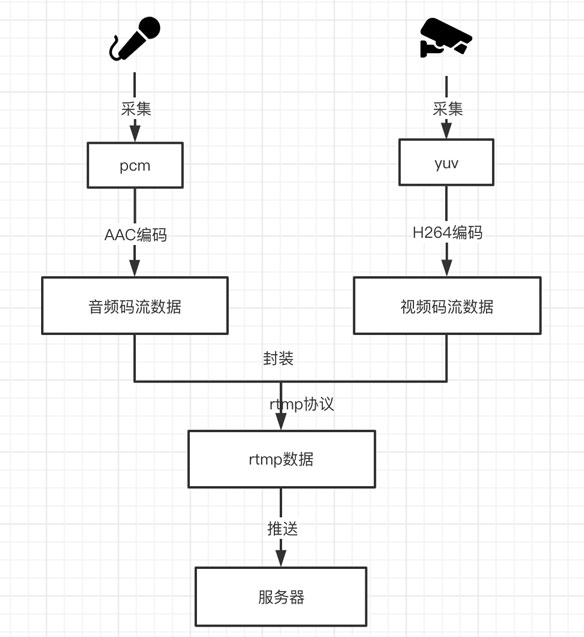

#总纲

**本系列介绍了Android设备RTMP直播推流全过程** [完整的项目地址](https://github.com/xhunmon/RtmpPush)

以下文章是针对每一个情况，介绍音视频相关知识，以及实现的原理，总共分五章：

- 第一章：[视频数据源之YUV（1）](./1-yuv.md)

  RGB或YUV 组成一张画面，很多个的画面就可以组成一个视频，而在视频编解码领域中YUV则是这一切的基础。
  

- 第二章：[音频数据源之PCM（2）](./2-pcm.md)

  音频处理就是对声音特性采集成数字信号后进行处理，而PCM则是最原始采集到的数据，称“裸流”。

  

- 第三章：[视频编码之H.264（3）](./3-h264.md)

  为了减少视频大小，以及改善网络传输，H.264编码在网络传输中可是非常重要。
  
  
- 第四章：[音频编码之AAC（4）](./4-aac.md)

  AAC编码是音频公认的主流编码。
  
  
- 第五章：[直播推流编码之RTMP（5）](./5-rtmp.md)

  结合RTMP分块的特性，把数据较大的视频数据进行分块传输，这必定是直播界的宠儿！
  
  
- 其他：[H.264符号描述](./h264-descriptor.md)

- 其他：[直播优化基础](./6-optimize.md)